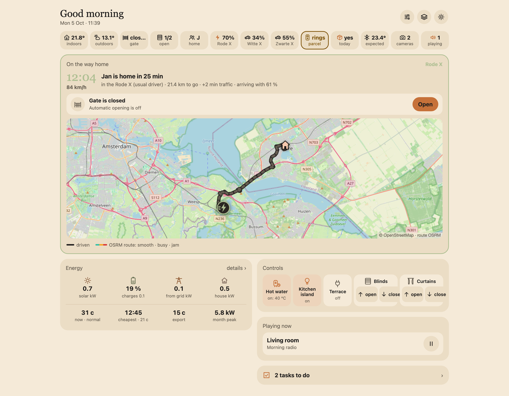
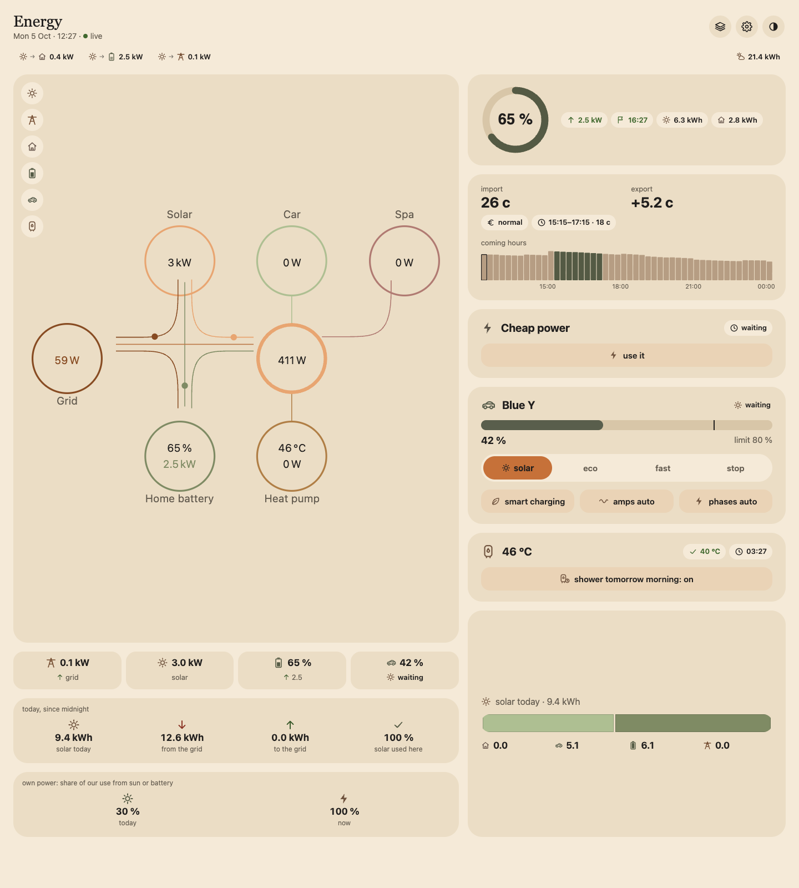
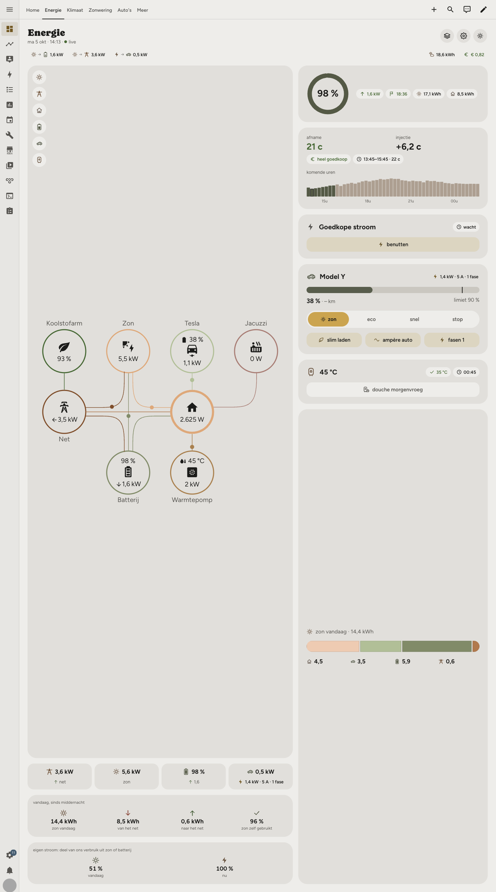
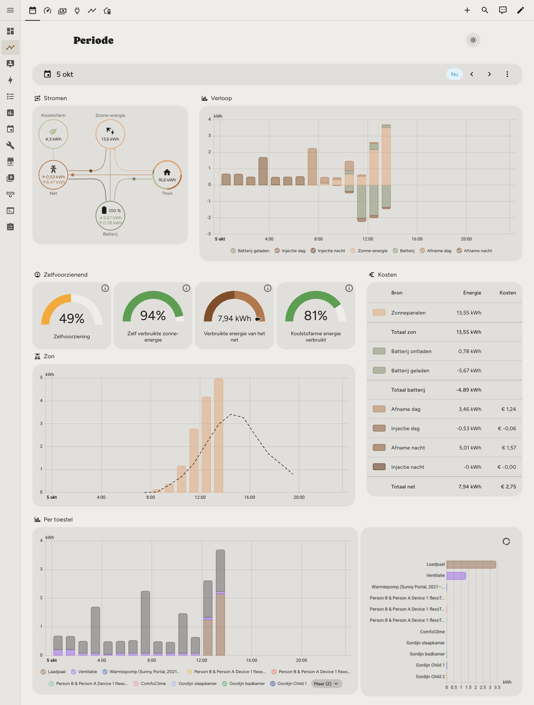

# ha-kit

A Home Assistant setup as a **kit**: modules per function (gate, doorbell, presence, shading, ventilation, …) that work in another house with other devices. You choose the modules that match your hardware, fill in one file per house (`house.yaml`), and the kit renders ready-to-deploy Home Assistant and ESPHome files. No secrets and no personal data live in the repository.

> **Status:** all modules are built and checked by CI, but most have not been tested on a real Home Assistant yet; see [Not yet tested](#not-yet-tested-on-a-real-ha). The per-module status is in the [Modules](#modules) table.

- **Core modules** are brand-free and work on roles (`cover.*`, `climate.*`, sensors you point at in `house.yaml`).
- **Brand adapters** provide the roles a core module needs for one brand (`ventilation-zehnder`, `spa-spanet`, `tesla-*`, …). A second brand is a new adapter; the core stays the same.
- **Region modules** hold country-specific rules (`tariff-be`), so other countries can add their own.
- **Capabilities** connect them: a brand or region module declares `provides: [ev-charger]` (or `tariff`, `heat-pump`, `hot-water-heater`), a core module `depends_on: [ev-charger]`, and any module that provides it will do.

Contributions are welcome: see [CONTRIBUTING.md](CONTRIBUTING.md).

## Screenshots

<table>
<tr>
<td width="50%"><a href="docs/screenshots/kit-demo/home/desktop.png"></a><br><sub>Kit demo (fictional data): <code>home-screen</code></sub></td>
<td width="50%"><a href="docs/screenshots/kit-demo/energy/desktop-screen.png"></a><br><sub>Kit demo (fictional data): <code>energy</code></sub></td>
</tr>
<tr>
<td width="50%"><a href="docs/screenshots/real-house/desktop/dashboard/energy.png"></a><br><sub>Real house (masked, Dutch UI): energy view</sub></td>
<td width="50%"><a href="docs/screenshots/real-house/desktop/energy-analysis/period.png"></a><br><sub>Real house (masked, Dutch UI): energy analysis, period</sub></td>
</tr>
</table>

More in the [screenshot gallery](docs/screenshots/README.md): the kit's own screens with fictional data, and the real house the modules come from (names, places, cameras and maps masked; some views omitted on purpose).

## Quick start

Requirements on your computer: Python 3.11+ and [uv](https://docs.astral.sh/uv/) (`uv run --with-requirements …` installs the pinned jinja2, pyyaml and websockets of `tools/requirements.txt` on the fly; `fill.py` copies that file into the build folder for the deploy scripts). On Home Assistant: HA OS or Supervised with the **File editor** app for the upload (otherwise copy the files yourself), and a long-lived access token of an admin user.

```bash
# 1. choose your modules: answers a few questions about your hardware and writes modules: in house.yaml
uv run --with-requirements tools/requirements.txt python tools/choose.py
#    (house.yaml is created from house.example.yaml when it does not exist; it stays local, see .gitignore)

# 2. fill in the rest of house.yaml (every field is explained in house.example.yaml), then render
uv run --with-requirements tools/requirements.txt python tools/fill.py house.yaml build/

# 3. deploy, module by module, in the build order below
export HA_URL=http://<address-of-your-ha>:8123     # no default: without these two every script stops
#    http:// only on your LAN or over Tailscale/VPN: the admin token travels unencrypted (ha_api.py warns otherwise)
export HA_TOKEN=<long-lived access token>
cd build
uv run --with-requirements requirements.txt python base/deploy.py --dry-run
uv run --with-requirements requirements.txt python base/deploy.py
```

Always start with `base`: it prepares the folders and `configuration.yaml` lines the other modules rely on.

## Choosing modules

- `tools/choose.py` asks per hardware group what you have (Tesla? gate? which doorbell? which ventilation unit?), adds the dependencies and writes `modules:` in `house.yaml`, keeping the rest of the file and its comments. Non-interactive: `--answers answers.yaml` (see `tests/choose.answers.yaml`); `--print` only prints the block.
- `tools/fill.py --list` shows per module what it does, its integrations, hardware, dependencies and status.
- Language: `house.language` (`en` or `nl`, default `en`) picks the texts users see (notifications, cards, spoken sentences, helper names). Every module has them in English and Dutch (see "Status of the translation" below).

## Modules

"Built, not tested on HA" = tested locally (fill in, YAML, templates, `deploy.py --dry-run`, `esphome config`) but not yet deployed on a real Home Assistant; see "Not yet tested on a real HA" below.

| Module                | What                                                                                                  | Depends on                                         | Optional | Status                    |
| --------------------- | ----------------------------------------------------------------------------------------------------- | -------------------------------------------------- | -------- | ------------------------- |
| `base`                | configuration skeleton, packages structure, 5 themes + picker (Organic, Garden, Coast, Heath, Graphite; `base.themes`), `cw-thema.js` (theme button, `<cw-icoon>`, stepper `stap`) | -                                  | no       | built                     |
| `tesla-route`         | route and map of the driving Teslas (`custom:tesla-map-card`), arrival card (`custom:tesla-arrival-card`) | - (gate row on the arrival card only with `gate`) | no       | built                     |
| `gate`                | opens the gate when a Tesla comes home, closes it after leaving, quick buttons                        | -                                                  | no       | built                     |
| `doorbell`            | photo notification with buttons (each person chooses when), description by Gemini, announcement on speakers, TV and screen, visitor list | -                                          | no       | built                     |
| `parcel-service`      | garage opens (or opens ajar) when the camera sees a parcel on an expected parcel day                   | `doorbell` + `gate` (with gate sensor)             | yes      | built                     |
| `presence`            | arrivals, work time, school runs and Superchargers in a calendar; tab "Our week"                      | -                                                  | no       | built, not tested on HA   |
| `shading`             | blinds and curtains per room on a schedule, curtains follow blinds, closed on sun and heat            | -                                                  | no       | built, not tested on HA   |
| `notifications`       | shared notifications to the Companion app (free/negative power price, solar surplus, ventilation filter) | - (filter sensor automatic with `ventilation-zehnder`) | no | built, not tested on HA   |
| `tesla-driveway-lock` | car locks itself after X min on the driveway; garage photo on arrival (optional)                      | `gate`                                             | yes      | built, not tested on HA   |
| `room-sensor`         | ESPHome room sensor (radar, light, temperature, humidity), one firmware file per room                 | -                                                  | no       | built, never flashed      |
| `ventilation-zehnder` | ESPHome firmware for the Zehnder ComfoAir Q over the ComfoNet bus, ComfoClime optional                | -                                                  | no       | built, not tested on HA   |
| `spa-spanet`          | ESP32 on the EXP1 port of a SpaNET SV3 spa                                                            | -                                                  | yes      | built, bench test only    |
| `tariff-be`           | region: Flemish dynamic tariff per quarter hour, price level, cheap window, capacity tariff (provides `tariff`) | -                                           | yes      | built, not tested on HA   |
| `energy-plan`         | export average, surplus, house power, solar left today after house and battery, battery behind (recorder on SQLite) | -                                      | yes      | built, not tested on HA   |
| `energy`              | energy screen (`energy-screen`) and energy-analysis dashboard (`energy-analysis`); blocks hide when a role is missing (HACS: apexcharts-card, power-flow-card-plus) | - (reads `tariff`, `energy-plan`, … when present) | yes | built, not tested on HA |
| `charger-zappi`       | brand adapter myenergi Zappi (custom integration `CJNE/ha-myenergi` through HACS; restart HA after an options change): modes, minimum green level, 1/3 phases (provides `ev-charger`) | - (phase switching only with `ev-charging`) | yes | built, not tested on HA |
| `ev-charging`         | smart charging on surplus, cheap power, month-peak guard, charge plan to a departure (by hand or from a calendar), car current; one writer of the charger | `ev-charger`, `energy-plan` | yes | built, not tested on HA |
| `heat-pump-vaillant`  | brand adapter myVAILLANT: floor band per zone, quick veto, hot-water tank (provides `heat-pump`, `hot-water-heater`) | -                                     | yes      | built, not tested on HA   |
| `hot-water`           | hot-water tank as heat battery: surplus, cheapest hours, shower and bath targets                     | `hot-water-heater`, `energy-plan`                  | yes      | built, not tested on HA   |
| `climate`             | climate screen, indoor forecast (recorder on SQLite), floor mode over several days, free cooling with outside air, ComfoClime boost | - (heat pump, ventilation, shading when present) | yes | built, not tested on HA |
| `appliances-home-connect` | dishwasher, washing machine and dryer (Home Connect, HA 2026.4+): smart start, ready by, door, done, error and maintenance notifications | `notifications` | yes | built, not tested on HA |
| `results`             | savings in EUR, day goals, cost against the invoice, other contracts and last year                   | `tariff`                                           | yes      | built, not tested on HA   |
| `home-screen`         | start screen: a chip or card per installed module, energy tiles and price, controls, arrival card    | - (feature flags from `modules:`)                  | yes      | built, not tested on HA   |
| `e-ink-display`       | touch e-ink wall display: one high-contrast page (weather, agenda, who is home, gate, energy, price), refresh interval as a helper, optional smart charging of the tablet through a relay | - (blocks follow `modules:` and the roles) | yes | built (screen tested in a browser by the source), not tested on the device |

Phase 4 (energy, tariff, charging, heat pump, hot water, climate, appliances, results, home screen) is split and its contracts are fixed in [docs/phase4-contracts.md](docs/phase4-contracts.md). Every phase-4 module is built and offered by `choose.py`; none is tested on a real Home Assistant yet. A core module that needs a capability (`tariff`, `ev-charger`, `heat-pump`, `hot-water-heater`) is only chosen together with a brand or region module you picked yourself.

Every module has the same shape: `module.yaml` (name, dependencies, requirements, questions, defaults), `README.md` (install, test plan), `LOGIC.md` (every decision written out), optional `strings.yaml` (user-facing texts in `en` and `nl`), the files themselves and `deploy.py`. ESPHome modules (`room-sensor`, `ventilation-zehnder`, `spa-spanet`) also have `esphome/` and `secrets.example.yaml`; their `deploy.py` only puts the firmware files in `/config/esphome/`, you flash in the ESPHome Device Builder. `modules/_template/` is a minimal working module to copy.

## Build order

One module at a time, and only continue when the test plan in its `LOGIC.md` passes. Every module's README has the steps in the UI and the `deploy.py` options. You may skip an optional module; the order of the rest stays.

1. **`base`**: folders, `configuration.yaml` lines, the themes (`--default-theme` for the default of `base.default_theme`).
2. **`tesla-route`**: integration `teslemetry_route` (`deploy.py --integration` after the restart) and the cards `tesla-map-card` and `tesla-arrival-card`. Needs one restart of Home Assistant.
3. **`gate`**, **in test mode**: the first `deploy.py` turns test mode on and the master switch off. Drive at least a week in test mode (every arrival is in the logbook with its reason) before turning test mode off. With `gate` in `modules:` the arrival card of `tesla-route` gets a gate row: paste `tesla-route/lovelace/arrival.yaml` again as a card after filling in.
4. **`doorbell`**.
5. **`parcel-service`** (optional): needs `doorbell` and `gate` with a gate sensor. Fill in with `parcel-service` in `modules:` and run `doorbell/deploy.py` and `gate/deploy.py` again too: the ring automation gets the parcel steps and "gate open too long" stays silent during a delivery.
6. **`presence`**: first the two Local Calendars in the UI, then `deploy.py --setup` (creates the zones of `presence.places`) and `--tab` for the tab "Our week". Test `script.presence_log` first.
7. **`shading`**: first delete an existing UI group with the same name as the module's cover groups ("All blinds"/"All curtains", in Dutch "Alle rolluiken"/"Alle gordijnen"; otherwise the new group gets `_2`). Let it run for a week and tune the angle per facade.
8. **`tesla-driveway-lock`** (optional): after `gate`. `deploy.py --setup` creates `zone.driveway` at `house.lat/lon`; drag it onto the driveway. The master switch stays off until the test plan passes.
9. **`ventilation-zehnder`**: firmware via `deploy.py` into `/config/esphome/`, flash the first time over USB. Before `notifications` if you want the filter notification: that reads the filter sensor of this module.
10. **`notifications`**: test `script.send_notification` first. The price notification ahead needs a price sensor with the attributes `starts` and `prices` (see "Contracts between modules"); with `tariff-be` in `modules:` it uses `sensor.power_price_import` / `_export` when the roles are empty (deploy `tariff-be` first).
11. **`room-sensor`**: one firmware file per room with `sensor: true`; build and flash one device first.
12. **`spa-spanet`** (optional, SpaNET SV only): first the bench test from its README, only then on the spa.
13. **Phase 4**, energy and comfort. Turn off an existing hand-made automation of the same function before you deploy its module (two writers fight over the charger, the tank or the floor).
    1. **`tariff-be`**: restart HA once when it meters the quarter itself.
    2. **`energy-plan`**: needs solar and the recorder on SQLite.
    3. **The adapters**: `charger-zappi` (restart HA after an options change of the myenergi integration), `heat-pump-vaillant`.
    4. **`ev-charging`**: after the charger adapter and `energy-plan`. Then fill in again and deploy `notifications` (it leaves its "exporting costs money" notification to ev-charging's cheap window).
    5. **`hot-water`**: after the `hot-water-heater` adapter and `energy-plan` (and `ev-charging` when you have it: the car comes first in the plan).
    6. **`climate`**: after the heat-pump module, `ventilation-zehnder` and `shading` when you have them; `deploy.py --view` writes the climate view.
    7. **`appliances-home-connect`**: after `notifications`, and after `energy-plan`, the tariff module and `presence` when you use them; first the Home Connect developer app (module README).
    8. **`energy`**: the two dashboards; needs apexcharts-card and power-flow-card-plus from HACS.
    9. **`results`**: after the tariff module; savings count from the first event after the deploy.
    10. **`home-screen` last**, after the modules whose chips you want: its chips follow `modules:`, so after adding a module fill in again and run `home-screen/deploy.py` again.
    11. **`e-ink-display`** (optional), after the modules whose blocks you want; like `home-screen`, fill in again and deploy it again after adding a module.

    See "Build order and parallel work" in [docs/phase4-contracts.md](docs/phase4-contracts.md).

In general: when a module is added that extends another one (in the files: `'<module>' in modules`), fill in again and deploy the extended module again as well. Existing settings stay.

## Contracts between modules

What one module provides and another reads. When you rename one of these, change both sides.

| What                                                                                         | Provided by                              | Read by                                                        |
| -------------------------------------------------------------------------------------------- | ---------------------------------------- | -------------------------------------------------------------- |
| `counter.tesla_commands_today` (Tesla commands per day)                                      | `gate`; `ev-charging` when `gate` is not installed | `tesla-driveway-lock` (`depends_on: [gate]`), `ev-charging` (phase 4) |
| price sensor in EUR/kWh with the attributes `starts` and `prices` (same length: start time and price per slot; `prijzen` is still read) | `sensor.power_price_import` / `_export` of a `tariff` module (default when the roles are empty); else an own sensor | `notifications` (`entities.price_import`, `price_export`) |
| filter sensor `sensor.<prefix>_filter_replacement_remaining_days`                            | `ventilation-zehnder` (firmware)         | `notifications`: default when `entities.ventilation_filter_days` is empty |
| `binary_sensor.shading_warm`, `input_boolean.shading_closed_<room>`, `input_boolean.shading_automatic`, `shading_manual_<room>`, `input_number.shading_indoor_warm_from`, `shading_outdoor_warm_from`, `shading_max_cloud_cover` | `shading`                          | `climate` (shading block, optional: no `depends_on`), `results` (count, `shading_closed_<room>`), `home-screen` (shading chip) |
| `script.send_notification` (title, message, extra; `only_home: true` = only the recipients whose person is home), macro `at_home()` | `notifications`         | `ev-charging`, `hot-water`, `climate` (optional: logbook only without it), `appliances-home-connect` (required: `only_home`, `at_home()`) |
| `script.doorbell_reply` with the parcel steps (field `pressed_by`), `script.doorbell_hub`, `script.doorbell_tv`, `input_text.doorbell_visit`, `input_text.doorbell_description`, `input_select.doorbell_<key>_parcel`, macros `targets()` and `names()` in `doorbell.jinja` (who gets a notification); `script.gate_pulse` and `script.gate_close_manual` (field `reason`; the old `reden` is still read), `binary_sensor.gate_open`, notification action `GATE_CLOSE` | `doorbell`, `gate` | `parcel-service` |
| gate row of the arrival card: `binary_sensor.gate_<car>_navigating_home`, `binary_sensor.gate_<car>_away_long_enough`, `binary_sensor.gate_open`, `input_boolean.gate_auto_open_enabled`, `input_boolean.gate_auto_open_dry_run`, `input_datetime.gate_last_auto_open`, `input_number.gate_away_minutes`, `input_number.gate_far_distance`, `script.gate_open_manual`, `script.gate_close_manual` | `gate` | `tesla-route` (`lovelace/arrival.yaml`, only with `gate` in `modules:`) |
| `script.parcel_garage` (running = a delivery holds the gate open), `input_datetime.parcel_expected`, `input_number.parcel_service_ajar`, `input_number.parcel_service_open`, `input_text.parcel_service_ring` | `parcel-service` | `gate` (`gate_open_too_long` stays silent while the script runs), `doorbell` (parcel steps of the ring automation and the buttons) |
| `input_datetime.arrival_<day>` (learned arrival time, `monday` … `sunday`)                    | `presence`                               | `appliances-home-connect` (ready by "auto", optional) |
| entity prefix of an ESPHome device (`tools/partials/_esphome.jinja`)                          | `ventilation-zehnder`, `spa-spanet`      | `notifications`; `climate` (ventilation roles, phase 4)        |
| capability `tariff`: `sensor.power_price_import`, `sensor.power_price_export` (`starts`, `prices`), `sensor.power_price_level`, `binary_sensor.power_price_cheap`, `price_at()`/`reference_price()` in `tariff.jinja`, `window.haKitTariff` (optional `coefficients(hass)`); optional `sensor.capacity_*_kw`; helpers `input_number.tariff_*`, `capacity_start_peak_kw` | `tariff-be` (built, not tested on HA) | `results` (required; `coefficients()` for the contract comparison); `energy`, `ev-charging`, `hot-water`, `appliances-home-connect`, `notifications` (price roles), `home-screen` (`sensor.power_price_*`, `sensor.capacity_month_peak_kw`, `sensor.capacity_quarter_expected_kw`), `e-ink-display` (`sensor.power_price_import` with `starts`, `prices`, `cheapest_2h`) (optional) |
| `sensor.energy_plan_export_avg`, `binary_sensor.energy_plan_surplus`, `sensor.energy_plan_house_power`, `sensor.energy_plan_margin`, `binary_sensor.energy_plan_battery_behind`; extra `sensor.energy_plan_export_kw`, macro `watts()` in `energy_plan.jinja` | `energy-plan` (built, not tested on HA) | `ev-charging`, `hot-water` (required); `energy`, `appliances-home-connect`, `results`, `charger-zappi` (battery behind, phase switching), `home-screen` (surplus, house power in W), `e-ink-display` (`sensor.energy_plan_house_power`, `sensor.energy_plan_margin` attribute `pv_today_kwh`) (optional) |
| capability `ev-charger`: `script.ev_charger_set_mode` (`solar_only`, `solar_min`, `fast`, `stop`; `solar_share`), `sensor.ev_charger_mode`, `_status`, `_power` (W, `state_class: measurement`), `_energy_today`, `_solar_energy_today`, `_phases` (unknown while the charger chooses), `binary_sensor.ev_charger_connected` | `charger-zappi` (built, not tested on HA) | `ev-charging` (only caller of the script), `energy` (calls the script only without `ev-charging`), `results`, `energy-plan` (statistics of `_power`), `home-screen` (`_power`, `_mode`) |
| `sensor.ev_charging_car`, `sensor.ev_charging_available_power(_avg)`, `sensor.ev_charging_energy_needed`, `sensor.ev_charging_status`, `sensor.ev_charging_wanted`, `sensor.ev_charging_cheap_status`, `input_select.ev_charging_owner`, `input_boolean.ev_charging_smart`, `_cheap_enabled`, `_car_amps_auto`, `input_number.ev_charging_car_commands_per_day`, `sensor.ev_plan_<car>` (attribute `target_percent`), `script.ev_charging_manual_mode` (a mode by hand: owner `manual` until unplugged) | `ev-charging` (built, not tested on HA) | `charger-zappi` (phases: `_available_power_avg` in W), `hot-water` (`_energy_needed`), `results` (`_energy_needed`), `energy` (car and cheap power cards, mode buttons through `script.ev_charging_manual_mode`), `home-screen`, `notifications` (`_cheap_enabled`: leaves out "exporting costs money") |
| `counter.tesla_commands_today` read by ev-charging, `ev-charger` + `energy-plan` + (opt) `tariff` entities, `script.send_notification` | `gate` (or `ev-charging` itself without gate), the providers | `ev-charging` |
| capabilities `heat-pump` (`script.heat_pump_set_floor_band`, `script.heat_pump_quick_veto`, `sensor.heat_pump_state`, `sensor.heat_pump_power_estimated`, …) and `hot-water-heater` (`script.hot_water_heat`, `script.hot_water_normal`, `sensor.hot_water_temperature` with `target` and `mode`, `sensor.hot_water_cop`) | `heat-pump-vaillant` (built, not tested on HA) | `climate` (floor, only writer; `sensor.hot_water_temperature` on the screen), `hot-water` (tank, only writer), `results` (`sensor.hot_water_temperature`), `energy`, `home-screen` (`sensor.heat_pump_state`, `sensor.hot_water_temperature`), `e-ink-display` (`sensor.hot_water_temperature`, optional) |
| `input_boolean.hot_water_on_surplus`, `_surplus_active`, `_shower_tomorrow`, `input_number.hot_water_shower` / `_minimum` / `_surplus_max` / `_bath`, `input_datetime.hot_water_bath_check`, `sensor.hot_water_cheapest_hour_before_sunrise`, `sensor.hot_water_session`, `sensor.hot_water_*`; events `ha_kit_result` (`hot_water_solar`, `hot_water_cheap_hour`) and `ha_kit_day_goal` (`morning`, `bath`) | `hot-water` (built, not tested on HA) | `results`, `energy`, `climate` (screen), `home-screen` |
| `sensor.climate_weather_days`, `sensor.climate_indoor_peak` (`day_type`, `floor_advice`), `input_select.climate_floor_mode` | `climate` (built, not tested on HA) | `home-screen`; later `shading` (optional) |
| `binary_sensor.energy_plan_surplus`, `_battery_behind`, `sensor.energy_plan_margin` (`after_sun`, `pv_remaining_kwh`); `sensor.power_price_import` (`starts`, `prices`); `input_datetime.arrival_<day>` | `energy-plan`, a `tariff` module, `presence` (all optional) | `appliances-home-connect` (solar or battery start, cheapest quarter, ready by the arrival) |
| `sensor.results_saving_<kind>` (`hot_water_solar`, `hot_water_cheap_hour`, `ev_solar`) | `results` (built, not tested on HA) | `energy` ("saved today") |
| `binary_sensor.gate_open`, `script.gate_open_manual`, `script.gate_close_manual` (gate tile, only with `entities.gate_sensor`) | `gate` | `e-ink-display` (optional: no `depends_on`) |
| `script.doorbell_reply` (fields `button`: `at_door`, `coming`, `parcel_service`, and `ring`), `input_text.doorbell_visit`, `input_text.doorbell_description`; `script.parcel_expected` (field `day`), `input_datetime.parcel_expected`, `input_number.parcel_service_ajar` / `_open`; `binary_sensor.gate_open`, `script.gate_close_manual` (field `reason`); `custom:tesla-arrival-card` (same config as `tesla-route/lovelace/arrival.yaml`) | `doorbell`, `parcel-service`, `gate`, `tesla-route` | `home-screen` (chips and info sheets, each only with its module in `modules:`) |

Full list of phase-4 contracts, entity ids, helpers, events and the rules for building those modules in parallel: [docs/phase4-contracts.md](docs/phase4-contracts.md).

## Privacy & external services

The kit runs in your Home Assistant, but some modules use a cloud service. This is what leaves the house, and how to stop it. Every module README has a short "Privacy" paragraph that points here.

| Module                                    | What data                                                                                                  | Which service                                                                                        | How to switch it off                                                                                                                       |
| ----------------------------------------- | ---------------------------------------------------------------------------------------------------------- | ---------------------------------------------------------------------------------------------------- | ------------------------------------------------------------------------------------------------------------------------------------------ |
| `doorbell`, `parcel-service`              | doorbell and package-camera photos of whoever is at the door, with a prompt                                | the first `ai_task` entity, e.g. Google Gemini through Google Generative AI: **by default, when such an integration exists, the photos ARE sent** | `doorbell.ai_task: none`: no photo is sent; the notification has no description and parcel-service never opens the gate by itself |
| `doorbell`                                | the spoken sentence ("someone is ringing")                                                                 | Google Translate text-to-speech                                                                      | `doorbell.speakers: []` and no `nest_hub`: no announcement                                                                                 |
| `tesla-driveway-lock`                     | garage photo when a car parks (only with `garage_photo: true`)                                             | the first `ai_task` entity (e.g. Google Gemini), unless `ai_task` names another                      | `tesla_driveway_lock.garage_photo: false` (the default) or `ai_task: none`                                                                 |
| `tesla-route`                             | position of the car, its destination and home, from **every browser** that opens the cards                 | Mapbox (tiles, routes, place names) with a token, else OpenStreetMap tiles and the public OSRM server | card config `routing: none`: no route or place-name requests (tiles still load); leave `mapbox_token` out to use no Mapbox at all          |
| `tesla-route`                             | Leaflet (map library) is downloaded by the browser                                                         | cdnjs (Cloudflare)                                                                                   | pinned with Subresource Integrity; host it yourself under `/local/` if you want no CDN                                                     |
| `presence` (`backfill.py`, by hand only)  | positions where a car charged, to name the Supercharger                                                   | OpenStreetMap Overpass API (overpass-api.de)                                                         | `backfill.py --no-osm`                                                                                                                     |
| `tariff-be`, `energy-plan`, `ev-charging` | nothing personal: day-ahead prices are fetched                                                             | Nord Pool, through the Home Assistant integration                                                     | remove the module (no dynamic tariff)                                                                                                      |
| `appliances-home-connect`                 | state and programs of the dishwasher / washing machine, start commands                                      | Home Connect cloud (BSH), through the Home Assistant integration                                     | remove the module or the integration                                                                                                       |
| `heat-pump-vaillant`, `hot-water`         | heat pump state, temperatures and setpoints                                                                 | myVAILLANT cloud, through the Home Assistant integration                                             | remove the module or the integration                                                                                                       |
| `tesla-route`, `gate`, `tesla-driveway-lock`, `presence`, `energy` | car position, navigation, charging and lock state; commands (gate: charge cable, lock)            | Teslemetry (and Tesla), through the Home Assistant integration                                       | remove the Teslemetry integration; the modules then do nothing                                                                             |
| `base` (and every screen that uses its fonts, e.g. `e-ink-display`) | IP address and browser of **every browser** that opens a dashboard, when it loads the fonts Figtree and Caprasimo | Google Fonts (fonts.googleapis.com; no Subresource Integrity possible) | host the fonts yourself or drop them, then `base/deploy.py --no-fonts`: `modules/base/README.md`, section Privacy |

**Mapbox token.** The token sits in the card config, so **every Home Assistant user can read it** (and every browser that opens the dashboard sends it to Mapbox). Mapbox URL restrictions do not work here (Home Assistant sends `referrer: same-origin`). So: create a **separate public token** (`pk.…`, only the default public scopes) used for nothing else, set a usage alert or limit in your Mapbox account, and **rotate it** (Account > Tokens) as soon as you see use you do not recognise.

**On the LAN.** Some things are not encrypted on your own network: the TvOverlay doorbell snapshot (doorbell README, "Privacy"), the deploy scripts when `HA_URL` is `http://` (only on the LAN or over Tailscale/VPN; `ha_api.py` warns otherwise), and the device web page of `ventilation-zehnder` when you turn it on (`ventilation.web_server: true`, with a password).

Found a security problem? See [SECURITY.md](SECURITY.md).

## Tools

| Tool                    | What                                                                                                    |
| ----------------------- | ------------------------------------------------------------------------------------------------------- |
| `tools/choose.py`       | questions about your hardware → `modules:` in `house.yaml`                                              |
| `tools/fill.py`         | renders the chosen modules for one house into a build folder (`--list`: the module table)               |
| `tools/check.py`        | the whole test suite in one command (also in CI); see CONTRIBUTING.md                                   |
| `tools/scan.py`         | secrets and personal data scan; runs as pre-commit hook after `sh tools/install-hooks.sh`               |
| `tools/ha_api.py`       | shared Home Assistant access for the `deploy.py` scripts (copied into the build folder)                 |

## Not yet tested on a real HA

Tested locally: filling in with the example, a minimal and an all-modules house (the last in `en` and in `nl`), valid YAML (also the HA and ESPHome tags), every HA template compiles, renders of the main templates with a mocked HA, the doorbell's "who gets a notification" macro against the cases in `tests/doorbell-targets.yaml`, `esphome config` on the firmware, `deploy.py --dry-run` per module, scan without hits. Not yet checked on a real Home Assistant:

| Point                                       | Module(s)                                    | What to check                                                                                                     |
| ------------------------------------------- | -------------------------------------------- | ----------------------------------------------------------------------------------------------------------------- |
| trigger `event.received`                    | doorbell, parcel-service                     | new trigger form (`target` + `options.event_type`): from which HA version, and does it fire on `ring` and `detected` |
| `is_state` as a test                        | gate                                         | `selectattr('charge_cable', 'is_state', 'on')` in `script.tesla_unlock_charge_cable`                                  |
| `context.user_id` in scripts                | gate                                         | filled when a quick button starts from the app or a widget, so only the person who pressed gets the notification  |
| entity id after `zone/create` + rename      | gate, presence, tesla-driveway-lock          | `--setup` creates the zone under a technical name and renames it; expects `zone.gate_approach`, `zone.<key>`, `zone.driveway` |
| `schedule/create` format                    | presence                                     | days as `monday: [{from: "07:45:00", to: "09:15:00"}]` over the websocket; does the helper get those windows?      |
| `reject('in', …)`                           | presence                                     | test `in` with a list as argument in the HA sandbox (`pers.keys() \| reject('in', ns.away)`)                       |
| dicts and lists in `variables:`             | presence, shading, tesla-driveway-lock       | lookup tables as automation variables (JSON/YAML mapping): do they stay dicts in the templates?                    |
| templated `timeout`, `delay` and `for:`     | gate, notifications, tesla-driveway-lock     | minutes from a helper (`for: minutes: "{{ states(...) \| int }}"`), `timeout: "{{ 1 if test else 60 }}"`          |
| `this.attributes.last_triggered`            | notifications                                | pause between two surplus notifications; is it a datetime or a string, and `none` before the first time?          |
| YAML cover groups next to UI groups         | shading                                      | with an existing UI group of the same name the new one becomes `cover.all_blinds_2` (Dutch: `cover.alle_rolluiken_2`); `deploy.py` reports it |
| `weather.get_forecasts` (hourly)            | shading                                      | hourly forecast with `cloud_coverage` of your weather integration; without it the cloud rule drops out           |
| English Teslemetry names                    | gate, tesla-route, tesla-driveway-lock       | the column "English" in the table Entity names is derived, not seen; also `teslemetry.lock`; check per car         |
| who pressed a notification button           | parcel-service                               | `sourceDeviceID` / `sourceDeviceName` in `mobile_app_notification_action` carry the key, name or phone of the person as a whole word, so `pressed_by` finds who pressed (`gate_notification_action` matches on substrings) |
| `input_select` after a changed label        | doorbell                                     | an option that no longer exists after a new `house.language` falls back to the first option (Always), as expected |
| `condition: user` in a conditional card     | doorbell                                     | the cards "My doorbell notifications" and the overview show only for the user ids in `people[].user_id`         |
| disable a new automation once               | parcel-service                               | `deploy.py` looks up the automation `doorbell_parcel_left` (alias "Doorbell: parcel left") by `attributes.id` and turns it off when it is new |
| `set_defaults` on real helpers              | every module with `defaults:`                | only new helpers get their start value; a second `deploy.py` leaves them alone                                    |
| room sensor never flashed                   | room-sensor                                  | firmware only validated with `esphome config`; wiring and enclosure not built yet                                 |
| ComfoClime control over the bus             | ventilation-zehnder                          | RMI writes to node 12 compiled and tested on the computer, not flashed yet; 22/1/21 (`hpStandby`) is a hypothesis |
| spa bench test only                         | spa-spanet                                   | flashed and tested against an SV3 simulator; scale of the raw fields and voltage level on a real spa              |
| derived filter sensor                       | notifications, ventilation-zehnder           | the firmware names it "Filter Replacement Remaining Days" (checked with `esphome config`, same in en and nl); does HA really give `sensor.ventilatie_filter_replacement_remaining_days` (example house)? |
| trigger-based template entities with `action:` and `default_entity_id` | energy-plan, ev-charging, hot-water, climate, results | HA 2025.4+; does the state survive a restart and a template reload as the modules expect (car on the charger, the arbiter, the plans, the hot-water session) |
| change by hand vs the kit's own call         | ev-charging, charger-zappi                   | a mode change more than 150 s after the kit's last `script.ev_charger_set_mode` counts as manual; the cloud lag of the Zappi decides whether 150 s is enough. A screen button goes through `script.ev_charging_manual_mode` (event `ha_kit_ev_charging_manual`) |
| recorder scripts on SQLite                   | energy-plan, climate                         | read-only access to `/config/home-assistant_v2.db` from a command_line sensor; statistics ids and the 5-minute / hourly tables |
| `home_connect.start_selected_program`        | appliances-home-connect                      | HA 2026.4+; `start_in` / `finish_in` with a selected program and remote start on; the device found with `device_id()` of the program select |
| dashboards written by `deploy.py`            | energy, climate, results, appliances-home-connect, home-screen, e-ink-display | `lovelace/config/save` on a storage dashboard (backup first); new dashboards with a hyphen in the url_path; resources under `/local/ha-kit/<module>/` (restart once when `/config/www` did not exist) |
| e-ink page on a real tablet                  | e-ink-display                                | `numeric_state` with an `input_number` as limit, the fail-safe on `last_changed`, and the page on a real e-ink tablet (refresh mode, ghosting, touch); see its `LOGIC.md` |

## Status of the translation

Everything is English: structure, `house.yaml` keys and fixed values, tools, contributor docs, module docs (`README.md`, `LOGIC.md`) and helper, entity, script and automation ids. The texts users see come from each module's `strings.yaml` in `en` and `nl` (`house.language`); `tools/check.py` fills in every module in both languages.

- Every module that renamed ids has a section "Migrating" in its README with a table old → new and the steps for an existing installation. `deploy.py` names leftovers of the old version where it can.
- ESPHome modules: the entity names of `room-sensor` and `spa-spanet` follow `house.language`; with `nl` they are the names of the earlier versions, so existing entity ids stay. `ventilation-zehnder` takes its names from the upstream firmware (yoziru), the same in every language.
- Renamed secrets: `kamersensor_api_encryption_key` → `room_sensor_api_encryption_key`, `ventilatie_api_encryption_key` → `ventilation_api_encryption_key`, `jacuzzi_api_encryption_key` → `spa_api_encryption_key`. Add the new key with the same value to `/config/esphome/secrets.yaml` before you install again (`deploy.py` reports a missing key).
- Old Dutch `house.yaml` values that still work: notification kinds `stroomprijs`/`overschot`. The compass sides (`NO O ZO Z ZW`) and place kinds (`werk afzetpunt familie`) stop filling in with a hint to the new value.

## License

[MIT](LICENSE).
