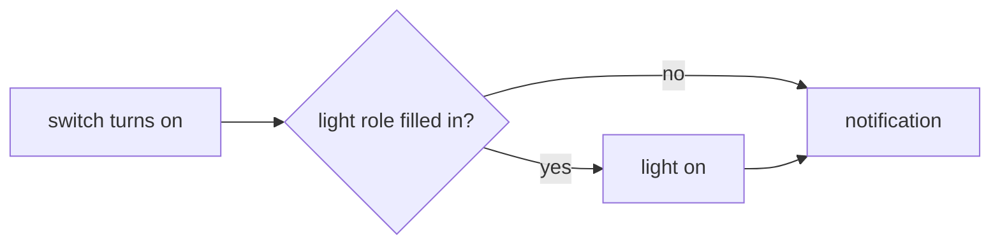

# Logic: <@ module.name @>

## In one sentence

When `input_boolean.ha_kit_template_enabled` turns on, the light (if any) turns on and a notification greets the first person.

## Flow chart

## Triggers

| Trigger | Why |
| ------- | --- |
| `input_boolean.ha_kit_template_enabled` to `on` | the only entry point |

## Conditions and decisions

None.

## Settings

| Helper | Default | Meaning |
| ------ | ------- | ------- |
| `input_boolean.ha_kit_template_enabled` | off (module.yaml `defaults:`) | the switch |

## Edge cases

- No light in `house.yaml`: only the notification.

## What it does not do

- Turn the light off again.

## Test plan

1. `deploy.py --dry-run`: shows the target paths, no connection.
2. `deploy.py`: the helper exists and is off.
3. Turn the helper on: a persistent notification appears (and the light turns on when set).
