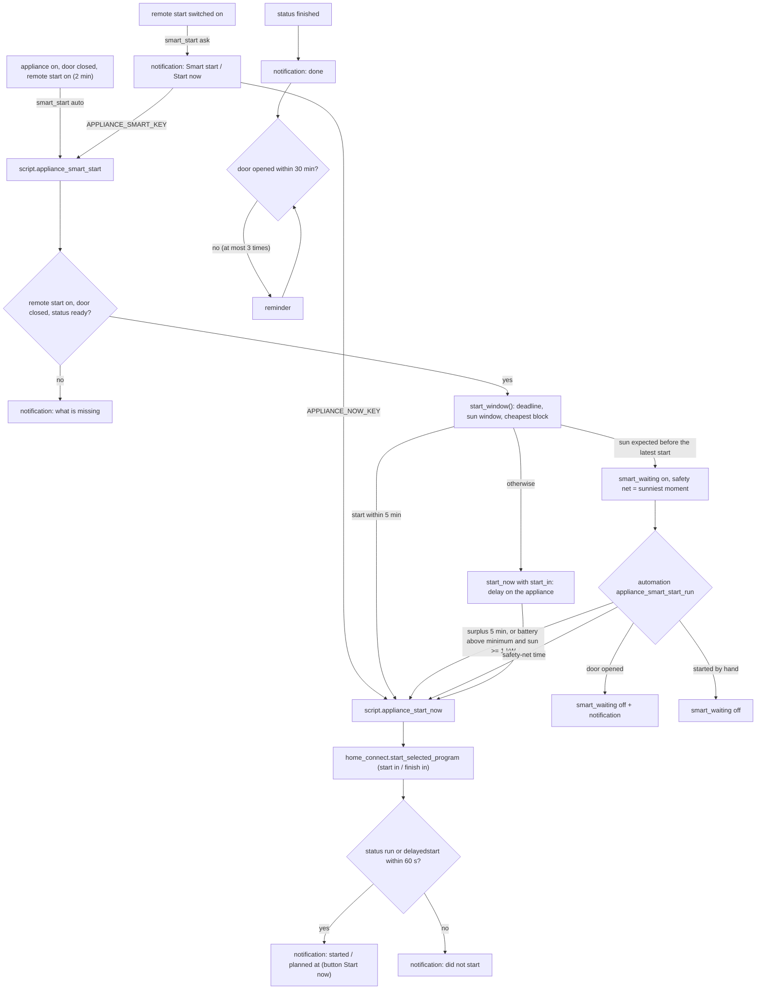

<% from '_appliances.jinja' import apps, has_energy, has_tariff, has_presence, has_battery with context %>
<!-- <% set built_for = ('energy-plan ' ~ ('yes' if has_energy else 'no') ~ ', battery ' ~ ('yes' if has_battery else 'no') ~ ', tariff ' ~ ('yes' if has_tariff else 'no') ~ ', presence ' ~ ('yes' if has_presence else 'no')) %> -->
# Logic: <@ module.name @>

This house: <@ apps | map(attribute='key') | join(', ') @>; built with <@ built_for @>.

## In one sentence

When an appliance is ready to start (switched on, door closed, remote start on), the module plans the program you selected on it so that it is done by the ready-by time, waiting for solar surplus or a full home battery when sun is expected, otherwise on the cheapest quarter (or as late as possible), and it reports a door left open, the end of the program (with reminders while the door stays closed), errors and maintenance.

## Flow chart

## Triggers

| Automation | Trigger | Why |
| ---------- | ------- | --- |
| `appliance_smart_start_offer` | `smart_start: auto`: power switch on, door closed or remote start on, each for 2 min; `ask`: remote start off → on | the moment the appliance is loaded and ready |
| `appliance_smart_start_run` | surplus on for 5 min; battery above the minimum with sun ≥ 1 kW for 2 min; every 5 min; smart waiting off → on (with energy-plan); the planned time of each appliance; door open; status run or delayedstart; Home Assistant start | start on sun, the safety net, cancel, a missed moment |
| `appliance_notification_buttons` | `mobile_app_notification_action` with `APPLIANCE_SMART_{KEY}` or `APPLIANCE_NOW_{KEY}` | the buttons of the notifications |
| `appliance_door_open_running` | door open for 2 min | a door left open stops the program |
| `appliance_error` | status → error, actionrequired, aborting (not from unavailable/unknown) | the appliance needs you |
| `appliance_done_reminder` | status → finished (not from unavailable/unknown) | take the load out |
| `appliance_maintenance` | a maintenance sensor or program aborted → present (not from unavailable/unknown) | refill salt, rinse aid, i-Dos; machine care |

"Not from unavailable/unknown": a reconnect of the cloud does not repeat a notification.

## Conditions and decisions

### When does the module plan by itself (`appliance_smart_start_offer`)

- `auto`: the status is `ready` or `inactive`, the appliance is not waiting already, its power switch is not off, the door is closed and remote start is on. Any of the three triggers can be the last of the three to become true, so the plan comes 2 minutes after the last one.
- `ask`: remote start switched on while the status is `ready`/`inactive` and nothing waits: a notification "start?" with the buttons. Nothing is planned until a button is pressed.

### Ready to start (`script.appliance_smart_start`)

1. Already waiting, or the status is `run`, `delayedstart` or `pause`: stop without a word (a second trigger a few seconds after the first; the script runs queued, so the second call sees the first one's result).
2. Remote start not on, door not closed, or status not `ready`/`inactive`: a notification that names the first thing that is missing, and stop.
3. Otherwise the start window (below), then one of three branches:

| Branch | When | What |
| ------ | ---- | ---- |
| start now | the chosen start is less than 5 min away | `appliance_start_now` without a delay |
| wait for sun | sun is expected before the latest start | `smart_waiting` on; notification "waits for the sun" with the planned safety net, the deadline and the button Start now |
| delayed start | otherwise | `appliance_start_now` with `start_in`: the appliance waits itself |

`input_datetime.appliance_<key>_smart_start` gets the chosen start in every branch (the dashboard shows it).

### The start-time optimizer (`start_window()` in `custom_templates/appliances.jinja`)

Brand-free: it gets a duration, a ready-by value and the fallback time, reads the energy, tariff and presence entities that exist, and returns the start as JSON. Order of priorities: **sun or battery first, then the deadline, then the price.**

1. **Deadline.** `ready_by` an hour (`HH:MM`): today at that hour, or tomorrow when the program cannot be done by then today (a fixed hour means exactly that hour). `ready_by: auto`: the learned arrival of today (`input_datetime.arrival_<weekday>` of presence); passed already: tomorrow's. Without presence, or while an arrival helper has no time: `auto_time` (default 17:00). An arrival closer than the program duration: deadline = now + duration (`by: asap`, start right away).
2. **Latest start** = deadline − duration (`input_number.appliance_<key>_duration_h`).
3. **Sun window** (only with energy-plan). Today when the sun has not left the panels (`after_sun` of `sensor.energy_plan_margin` false), the sun is up or still has to rise today, and the solar still expected today (`entities.solar_forecast_remaining_today`, else `pv_remaining_kwh` of the margin) is at least `input_number.appliances_solar_minimum_kwh` (default 10 kWh): the window starts now (sun up) or at sunrise + 90 min. Otherwise tomorrow from sunrise + 90 min with `entities.solar_forecast_tomorrow` (no role: no window tomorrow). **Sun** = the window starts at least 30 min before the latest start and enough is expected.
4. **Start with sun**: wait for real surplus (automation run); the safety net is the program centred on `input_datetime.appliances_solar_peak` (default 15:00) of the window's day, never before the window and never after the latest start. Why not the cheapest quarter: with a home battery the surplus comes late in the afternoon (the battery charges first); a price-based safety net around noon starts on the grid while the battery is still charging.
5. **Start without sun**, with a tariff module: the block of `ceil(duration / slot)` slots of `sensor.power_price_import` (`starts`, `prices`, 15 min) with the lowest mean price that starts between now (the running slot counts) and the latest start; when that block began already, start now. No prices, or no block fits (prices known for 24 h): start at the latest start (`latest`: done just in time). Latest start not in the future: now (`too_tight`).

Returned: `start`, `start_ts`, `deadline`, `by` (`arrival`, `auto_time`, `hour`, `asap`), `sun`, `sun_from`, `kwh`, `reason` (`sun`, `cheapest`, `latest`, `too_tight`), `mean_price`.

### Waiting for sun (`appliance_smart_start_run`)

- **Start on sun**: `binary_sensor.energy_plan_surplus` on, or (with a battery role) the battery above `input_number.appliances_battery_minimum` (default 60 %) while `entities.solar_power_w` gives ≥ 1 kW (read in W or kW with `watts()`) and `binary_sensor.energy_plan_battery_behind` is off. Checked on the triggers and every 5 minutes.
- **One at a time**: the first waiting appliance in the order of `appliances` starts; the next one only when no appliance of the module has been running for less than 15 min (not two heating up on the same surplus). The 5-minute check picks it up later.
- **Safety net**: at `input_datetime.appliance_<key>_smart_start` a waiting appliance starts anyway (reason "safety net").
- **Restart**: at Home Assistant start, a waiting appliance whose planned moment passed starts now.
- **Cancel**: the door of a waiting appliance opens: waiting off + notification. Started on the appliance itself (status `run`/`delayedstart`): waiting off, no notification.

### Starting (`script.appliance_start_now`, the only caller of Home Connect)

1. The device: `device_id()` of the appliance's program select. None: notification "appliance not found" and stop.
2. Smart waiting off. Power switch off: switch it on, wait 5 s.
3. Start now while the appliance has a delayed start: press its stop button, wait until `ready`/`inactive` (60 s), and select the program again when the appliance fell back to its default program (some dishwashers do).
4. `home_connect.start_selected_program` with `device_id`, plus a delay: `start_in_relative` = `start_in` (dishwashers, `delay_option: start`) or `finish_in_relative` = `start_in` + duration (washers and dryers, `delay_option: finish`: they know "finish in", not "start in").
5. Wait up to 60 s for `run` or `delayedstart`. Not reached: logbook line + notification with the status ("check door and remote start") and stop with an error. Reached: logbook line and a notification "started" or "planned at HH:MM" (with the button Start now).

### Notifications

Every notification goes through `script.appliance_notify` → `script.send_notification` with `only_home: true` when somebody is home (the `at_home()` macro of notifications), else to everyone, so a message about the dishwasher reaches the people at home and never gets lost when nobody is. The `tag` replaces the previous notification of the same appliance and kind (`<key>_start`, `<key>_door`, `<key>_error`, `<key>`, the maintenance sensor), the group is `appliances`.

| Notification | Text |
| ------------ | ---- |
| done | "Dishwasher is done", "Auto 2 finished at HH:MM. Time to take out the dishes." (name, program and contents per appliance) |
| reminder | every 30 min while the door stays closed, at most 3 times; the door opening stops it |
| door open | after 2 min open while `run`, `pause` or `delayedstart` |
| error | status `error`, `actionrequired`, `aborting` with a hint per status |
| maintenance | the name of the sensor (salt, rinse aid, …) or "program aborted" |

## Settings

| Setting | Default | Where | Used by |
| ------- | ------- | ----- | ------- |
| `input_select.appliance_<key>_ready_by` | `auto` | Appliance settings | deadline |
| `input_number.appliance_<key>_duration_h` | `appliances[].duration_h`, else 3 | Appliance settings | latest start; finish in |
| `input_number.appliances_battery_minimum` | 60 % | Appliance settings > Planning | start on the battery |
| `input_number.appliances_solar_minimum_kwh` | 10 kWh | Appliance settings > Planning | sun expected |
| `input_datetime.appliances_solar_peak` | 15:00 | Appliance settings > Planning | safety net while waiting |
| `appliances[].smart_start` | `ask` | house.yaml | plan by itself or ask |
| `appliances[].auto_time` | 17:00 | house.yaml | `auto` without a learned arrival |
| `appliances[].delay_option` | `start` (dishwasher), `finish` (washer, dryer) | house.yaml | the Home Connect option for a delay |
| `home_connect.language` | `house.language` | house.yaml | entity names |

Start values are set once by `deploy.py` (no `initial`): after that the value is yours. Put the program duration a little above the real duration of the program you use most (the plan finishes by the deadline with that duration). Put the sunniest moment where your surplus is highest on a sunny day (with a battery: later in the afternoon).

## Edge cases

| Case | What happens |
| ---- | ------------ |
| Home Connect cloud offline | status `unavailable`: no plan (status not ready); transitions from `unavailable` do not notify |
| Remote start off at the appliance | a smart start notifies "switch on remote start"; the start fails with "did not start" when it went off later |
| Door opened while waiting | waiting cancelled and notified; close it and plan again (auto: the door trigger plans again after 2 min) |
| Door opened during a delayed start | the appliance itself usually cancels; the door notification comes after 2 min |
| Two triggers seconds apart | the smart start runs queued and the second call stops silently (busy) |
| Two appliances waiting, one surplus | the first starts; the second after 15 min of the first, if the sun is still there; otherwise at its safety net |
| Restart during the wait | the safety-net time trigger survives (helper); a moment missed during the restart starts at once |
| Arrival too close | starts at once ("as soon as possible") |
| Fixed hour already passed or too close | tomorrow at that hour |
| Prices for tomorrow not known yet | only blocks within the known prices; nothing fits: as late as possible |
| No forecast roles | today's sun from `pv_remaining_kwh` of energy-plan; no window tomorrow (the plan uses the price) |
| Start now on a delayed start | the delay is cancelled with the stop button, the program selected again when needed, then started |
| An appliance without a power switch | the power steps are skipped (an entity that does not exist is never "off") |
| Maintenance sensor that does not exist | its trigger never fires; enable the disabled entities (README) |
| Nobody home | notifications go to everyone |
| A key with `_` | the notification action is `APPLIANCE_NOW_{KEY}` with the `_` kept; the automation reads the key back from its trigger id |

## What it does not do

- It does not choose the program or its options: you select them on the appliance (or in the Home Connect app) before you close the door.
- It does not switch remote start on: Home Connect does not allow that.
- It does not know the real program duration in advance: the plan uses the duration helper.
- It does not plan around the capacity tariff peak; an appliance draws about 2 kW for a short time.
- It does not handle ovens, fridges, coffee machines or cooktops.
- It does not record savings (no `ha_kit_result` events yet).

## Test plan

Until this passed on a real Home Assistant, the status stays "built, not tested on HA". Use a cheap program (rinse) and an empty appliance where you can.

1. `deploy.py --dry-run`: the uploads, reloads, defaults (with the duration per appliance), 3 scripts and 7 automations; no connection. `--dry-run --live`: no missing entities, every device found.
2. `deploy.py --tab`: no configuration error; the helpers exist with their start values; the views Appliances and Appliance settings show every appliance.
3. Developer tools > Template: `{{ start_window(2.5, 'auto', '17:00') }}` gives JSON with a start in the future and the deadline you expect.
4. Ready by a fixed hour 2 hours from now, duration 1.5 h, a cloudy moment: `script.appliance_smart_start` gives a delayed start on the appliance (status `delayedstart`), a notification "planned at" with Start now; the dashboard says "Starts at HH:MM".
5. Tap Start now in that notification: the delay is cancelled, the same program starts (`run`), notification "started".
6. On a sunny morning, ready by `auto`: the notification "waits for the sun", `smart_waiting` on, the planned start is the safety net; with surplus (or the battery above the minimum and ≥ 1 kW sun) the appliance starts within 5 minutes with reason "solar surplus" or "battery full".
7. While waiting, open the door: waiting off, notification "smart start cancelled".
8. `smart_start: auto`: switch the appliance on and close the door: 2 min later a plan, without a notification asking for it.
9. `smart_start: ask`: switch remote start on: notification with Smart start and Start now; each button does what it says.
10. Remote start off, `script.appliance_smart_start`: notification "switch on remote start", nothing planned.
11. Open the door during a program for 2 min: notification "door open".
12. Let a program finish and keep the door closed: notification "done", then after 30 min a reminder; open the door: no more reminders.
13. Error: take the water off (or another safe way to get `actionrequired`): notification with the hint.
14. Maintenance: confirm on the appliance that the salt/rinse aid sensor went `present` (after enabling the entities): notification with the sensor name.
15. Restart Home Assistant while an appliance waits past its planned moment: it starts after the restart.
16. Nobody home: a notification reaches everyone; somebody home: only them.
