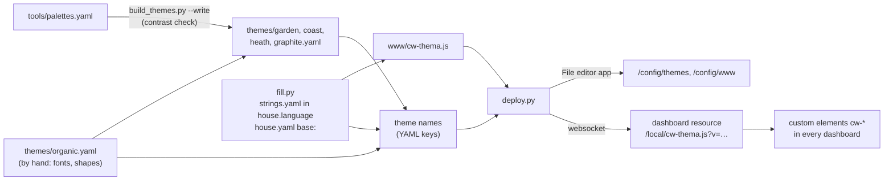

# Logic: <@ module.name @>

## In one sentence

Five themes with the same tokens and one set of small building blocks, so every screen of the kit (and the regular HA views) looks the same in light and dark, in the style each user picks.

## Flow chart

## Triggers

None: this module has no automations. `deploy.py` runs when you start it; the components run in the browser.

## The themes (`themes/*.yaml`)

- Five themes: Organic (cream and sand, terracotta and sage), Garden (sage and moss, clay), Coast (mist blue, sea water, sand), Heath (lavender, plum, sage), Graphite (stone, graphite, ochre). Same tokens, fonts and shapes; only the colours differ, so every screen works in every theme.
- **Organic is tuned by hand** (`themes/organic.yaml`) and is the source of the fonts and shapes. **The other four are generated** by `tools/build_themes.py` from `tools/palettes.yaml`: 14 colours per mode, from which the script derives every `cw-*` token and every HA variable the way Organic does (e.g. `primary-color` = the ink tone in light, because HA also uses it as text; `text-primary-color` white only where white reaches 4.5:1 on the fill). The generated files are committed, so a user without Python has them.
- **Contrast check** (the same script, without `--write`): text, muted text, `cw-accent-ink`, status colours, HA state colours, sidebar, text on HA's fills and the energy palette as icons (through `ink()`, like the screens) at least 4.5:1 on card, page and raised surface, for every theme and mode. It also fails when a committed file differs from its palette, or a theme has no name in `strings.yaml` or is missing in `_themes.jinja`.
- **Names follow `house.language`.** The YAML key of each file is `t('theme_name_<id>')`; the file name is the id. HA stores a user's choice by theme name, so a Dutch-language house keeps the names of the Dutch original (Tuin, Kust, Heide, Grafiet) and nobody loses their choice; an English house gets English names. The price: changing the language renames the themes (edge case 5). The other option, English names everywhere, would make every Dutch user pick again and leave Dutch names out of a Dutch UI; HA has no translatable theme names.
- Two modes in one theme (`modes: light / dark`). HA picks the mode from the device, or from the user's choice.
- **Design tokens `cw-*`** are the only source of colour for the own cards. A card uses `var(--cw-accent)` and never a fixed colour. One change to the theme thus changes every screen at once.

| Token                                                                               | Use                                                          |
| ----------------------------------------------------------------------------------- | ------------------------------------------------------------ |
| `cw-bg`, `cw-card`, `cw-raised`, `cw-line`                                          | background, card, raised surface (sheet, popover), lines     |
| `cw-text`, `cw-muted`                                                               | text and secondary text                                      |
| `cw-accent`, `cw-on-accent`                                                         | action colour (fills) and the text on it                     |
| `cw-accent-ink`                                                                     | accent for icons and small text, at least 4.5:1              |
| `cw-good`, `cw-warn`, `cw-bad`                                                      | status: good, attention, problem                             |
| `cw-zon`, `cw-batterij`, `cw-net`, `cw-huis`, `cw-injectie`, `cw-wagen`, `cw-water` | energy palette, also passed on to HA's `energy-*` colours     |

- The theme also sets the regular HA variables (`primary-color`, card background, sidebar, switches), so standard cards and settings pages follow along.
- Corners: cards 24 px, dialogs 28 px, buttons and badges fully round.
- The energy palette is the same in every theme (a flow keeps its colour whoever is looking). In dark mode `cw-injectie` and `cw-water` get a lighter tint: the dark tones of light mode do not reach 3:1 on a dark card.
- "Off", closed and unavailable devices use the muted text colour (`state-inactive-color`, `disabled-color`, `state-unavailable-color`) instead of HA's light grey (1.4:1).
- The token names (`cw-zon`, `cw-huis`, …) and the element and attribute names below are Dutch and stay that way: other modules' cards use them. Changing them means changing every card at once.

## The components (`www/cw-thema.js`)

One file, loaded as a dashboard resource. It defines custom elements the other modules use:

| Element / card                                          | What it does                                                              |
| ------------------------------------------------------- | ------------------------------------------------------------------------- |
| `<cw-kop>`                                              | page header: title + one line of explanation left, round action buttons right |
| `<cw-knop>`                                             | round icon button (44 px tap target)                                      |
| `<cw-thema-knop>`, `custom:cw-thema-kiezer`             | button with the current mode; menu Style (themes with `cw-*` tokens, swatch + name) and Appearance (Automatic / Light / Dark) |
| `<cw-status>`, `custom:cw-status`                       | row of status chips; every user picks which chips and in which order       |
| `<cw-chip>`, `<cw-metric>`, `<cw-toggles>`, `<cw-info>` | small building blocks inside cards; a tap opens an info sheet             |
| `<cw-toggles>` item `stap`                              | a − value + row in the item's info sheet that sets an `input_number`       |
| `<cw-icoon naam maat kleur vul>`                        | one icon of the shared set in another module's screen (light DOM)         |

## Conditions and decisions

- **Theme choice per HA user.** The button fires HA's own `settheme` event with the style and the mode. HA keeps the choice in the frontend user data (so on every device of that user) and in `localStorage` (for a fast first render).
- **Which themes the button offers.** Every HA theme with `cw-bg` in both its light and dark mode, the default first, then alphabetical in `house.language`. A theme without the tokens (HA's default, a theme of your own) is not offered: the screens would lose their colours. With fewer than two such themes the Style list is left out.
- **Default style.** A user without a choice (or with a theme the button does not offer) counts as the light default of `base.default_theme`; picking only a mode then applies that style. `deploy.py --default-theme` sets the same default on the server (light and dark separately).
- **The stepper (`stap`).** Bounds are the item's own `min`/`max`, never outside the helper's range; every tap calls `input_number.set_value` right away, rounded to 0.01. The value shown follows the tap, not the next state update.
- **Chip choice per user** in the frontend user data under `cw-status-<key>`, the same way.
- **Fallback:** when the `cw-*` tokens are missing (another theme is active), the components use the regular HA variables.
- **Texts in one language per build.** Every user-facing text comes from `strings.yaml` and is filled in by `fill.py` in `house.language`. Texts with a variable part (the "saved for" line, the chip count, "move … up") keep their `{placeholders}` through `fill.py`; `fmt()` in the browser fills them with values that are already escaped.
- **Number format** of the chip values follows `number_locale` in `strings.yaml` (`en-GB`: 21.5, `nl-BE`: 21,5).
- **Cache.** `deploy.py` registers the resource as `/local/cw-thema.js?v=…` with the `VERSION` of the file (number + language); the number goes up with every change, so browsers fetch the new file.

## Settings

| Setting                      | Where                       | Default | Why                                                      |
| ---------------------------- | --------------------------- | ------- | -------------------------------------------------------- |
| `house.language`             | `house.yaml`                | `en`    | language of every text of the components                  |
| `base.themes`                | `house.yaml`                | all five | which theme files `deploy.py` uploads                    |
| `base.default_theme`         | `house.yaml`                | `organic` | default per mode (`{light, dark}` or one id) for `--default-theme` and the button |
| `--default-theme`            | `deploy.py` option          | off     | the default theme for every user without an own choice    |
| theme per user               | HA Profile > Theme          | -       | each user picks                                           |
| chips per user               | long press on a status row  | all calm chips that fit in 2 rows | each user picks                   |

No helpers, so no `defaults:`.

## Edge cases

1. **First upload to `/config/www`.** `/local/` only works when the folder existed when HA started: restart once after the first `deploy.py`.
2. **An older `cw-thema.js` in the browser cache.** The `?v=` of the resource changes with `VERSION`; a hard refresh helps when an app still shows the old texts.
3. **Language changed.** Fill in and deploy again. The language is part of the version (`?v=28-en`, `?v=28-nl`), so browsers load the new texts.
4. **Another theme active.** The components still work on the regular HA variables, with HA's colours. The button shows the default style as current; picking a mode switches to it.
5. **Language changed.** The themes are renamed (Tuin becomes Garden); the files are overwritten, so the old names disappear after the reload. A user who picked an old name falls back to HA's default theme until they pick again: run `--default-theme`.
6. **A theme left out of `base.themes` later**, or an old theme file of another install: `deploy.py` does not delete files; it names every theme with `cw-*` tokens that is not part of the build. Delete the file yourself (README, "Migrating").
7. **Two files with the same theme name** (e.g. the old `claude.yaml` next to the kit files): HA keeps one without an error. Delete the old file.

## What it does not do

- Fonts: `deploy.py` registers the Google Fonts stylesheet (Figtree and Caprasimo) as a css resource. Without internet everything falls back to `system-ui`.
- It does not change `configuration.yaml`; `deploy.py` only reports what is missing.
- It does not translate per user: the language is the one of the build (`house.language`), not the HA user's language.

## Test plan

| #   | Test           | How                                                                 | Expected                                                                    |
| --- | -------------- | ------------------------------------------------------------------- | --------------------------------------------------------------------------- |
| 1   | Dry run        | `deploy.py --dry-run`                                               | target paths printed, no connection                                         |
| 2   | Upload         | `deploy.py`                                                         | no error; resource `/local/cw-thema.js?v=…` in Settings > Dashboards > Resources |
| 3   | Themes         | Profile > Theme: each theme of `base.themes`, switch light/dark      | names in `house.language`; colours follow, cards stay readable              |
| 4   | Theme button   | card `custom:cw-thema-kiezer`                                       | Style (swatch per theme, current ticked) + Automatic / Light / Dark (Dutch with `nl`); the choice is kept on a second device |
| 4b  | Default        | `deploy.py --default-theme`, a user without a choice                | the theme of `base.default_theme` in light and in dark                      |
| 4c  | Stepper        | a `cw-toggles` item with `stap: {label, entity, min, max}`, long press | − / + change the helper; buttons disabled at the bounds                   |
| 5   | Status picker  | long press on a `cw-status` row with `bewaar`                      | "saved for <user>" line, count of visible chips and rows, arrows move a chip |
| 6   | Language       | fill in with `language: nl`, deploy, hard refresh                   | the same screens in Dutch; chip values with a decimal comma                  |
