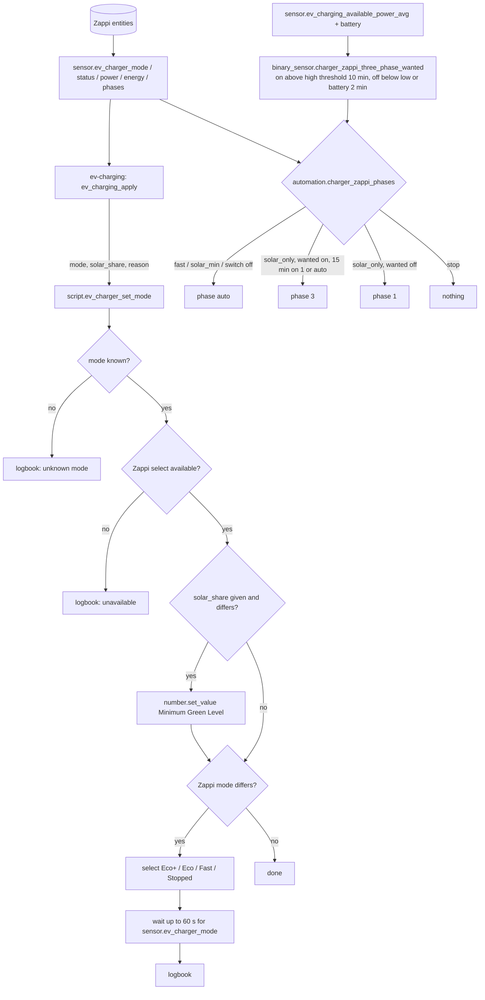

# Logic: <@ module.name @>

## In one sentence

`ev-charging` asks for a normalised mode through `script.ev_charger_set_mode`, this adapter translates it into the Zappi's charge mode and Minimum Green Level, reports the Zappi back as `sensor.ev_charger_*`, and in `solar_only` picks 1 or 3 phases so the car can charge on the surplus that is really there.

## Flow chart

## Triggers

| Trigger                                                                                             | Why                                                                   |
| --------------------------------------------------------------------------------------------------- | --------------------------------------------------------------------- |
| call of `script.ev_charger_set_mode` (only by `ev-charging`)                                        | the single entry point for the charge mode and Minimum Green Level    |
| state of the Zappi entities                                                                         | the template sensors follow them                                      |
| every minute (`sensor.ev_charger_energy_today` without a Zappi daily counter)                       | power x 1 min added up, back to 0 on a new day                        |
| available-power average, battery behind, battery power, the two thresholds, every minute           | re-evaluate `binary_sensor.charger_zappi_three_phase_wanted`          |
| `binary_sensor.charger_zappi_three_phase_wanted`, `sensor.ev_charger_mode`, the phase switch, every 5 min, HA start | `automation.charger_zappi_phases` (the 5 min check lets the 15 min hold run out) |

## Conditions and decisions

### Mode mapping (script)

| `mode`       | Zappi    | Meaning                                                                                   |
| ------------ | -------- | ----------------------------------------------------------------------------------------- |
| `solar_only` | Eco+     | only surplus: the Zappi starts when the surplus covers the Minimum Green Level and pauses otherwise |
| `solar_min`  | Eco      | surplus, topped up from the grid to the minimum charge power (about 1.4 kW on 1 phase)   |
| `fast`       | Fast     | full power                                                                                |
| `stop`       | Stopped  | no charging                                                                               |

- `solar_share` 0-100 becomes the **Minimum Green Level** (clamped to the number's own min and max; myenergi: 0-100). Written before the mode, so the Zappi starts in the new mode with the right level. Not given: the level stays as it is. `ev-charging` decides the value (e.g. 100 % while the battery is behind); the adapter never changes it on its own.
- Only on a difference: a mode or level that is already set is not sent again (fewer cloud calls, nothing in the logbook).
- Unknown mode or the Zappi select `unavailable` (cloud dropped out): a logbook line and stop, no error to the caller (the caller is an automation that must keep running).
- After a mode change it waits until `sensor.ev_charger_mode` shows the new mode, at most 60 s (the integration polls the cloud), then logs "mode set" or "sent, not confirmed" and returns.
- Script mode `restart`: a second call stops the wait of the first and applies its own mode. The newest wish wins.

### Normalised sensors

- `sensor.ev_charger_mode`: Eco+ / Eco / Fast / Stopped → `solar_only` / `solar_min` / `fast` / `stop`; anything else `unknown`. Attributes `brand_mode` and `solar_share` (current Minimum Green Level).
- `sensor.ev_charger_status`, first match wins: status Fault or Hot or plug Fault → `fault`; plug EV Disconnected (or empty) → `disconnected`; status Charging/Boosting/Diverting, plug Charging or power ≥ 100 W → `charging`; status Completed → `complete`; status Paused → `waiting` (plugged in, held back by the mode or the surplus); else `connected`. `unavailable` only when both the status and the plug are unavailable.
- `binary_sensor.ev_charger_connected`: plug not EV Disconnected.
- `sensor.ev_charger_power`: W; a kW source is multiplied by 1000.
- `sensor.ev_charger_energy_today` / `solar_energy_today`: kWh from the Zappi's daily counters (Wh converted). Without the energy role: estimated from the power every minute; a trigger-based template keeps its value over a restart and starts at 0 on the first minute of a new day (it compares its own `last_changed` with today, so a missed midnight still resets).
- `sensor.ev_charger_phases`: phase setting `1` or `3` as is; `auto` in Fast = the phases of the connection (`ev_charging.phases`); `auto` otherwise = unknown (the Zappi chooses itself), attribute `setting`.

### Phase switching (adapter-internal)

Why: a Zappi on 3 phases charges at least 3 × 6 A ≈ 4.1 kW, on 1 phase at least 6 A ≈ 1.4 kW. In Eco+ it waits for Minimum Green Level × that minimum. On 3 phases with a level of 50 % it waits for about 2.1 kW of surplus; a sunny afternoon with 1.5 to 2 kW then goes to the grid instead of the car. In `auto` the Zappi jumps to 3 phases by itself as soon as it sees a high surplus for a moment, and then pulls the home battery down to reach 4.1 kW. So in `solar_only` the adapter holds the Zappi on 1 phase and only allows 3 when the surplus is clearly and steadily large enough.

Rendered only when `ev-charging` is in `modules:` (its `sensor.ev_charging_available_power_avg` is the input), a phase select is known and `ev_charging.phases` is 3. It never changes the charge mode, so the single-writer rule holds: `ev-charging` decides whether and when, the adapter only how.

`binary_sensor.charger_zappi_three_phase_wanted` (room for 3 phases), from `sensor.ev_charging_available_power_avg` (10 min mean of charge power + export − import − battery discharge; battery charging does not count, so the battery goes first):

| Situation                                                                          | Result           |
| ---------------------------------------------------------------------------------- | ---------------- |
| no average yet, battery behind (`binary_sensor.energy_plan_battery_behind`), or the battery discharges more than 300 W | off (after 2 min) |
| average above `input_number.charger_zappi_three_phase_from_w` (4600 W)             | on (after 10 min) |
| average below `input_number.charger_zappi_one_phase_below_w` (3800 W)              | off (after 2 min) |
| in between                                                                          | unchanged        |

Hysteresis, and why:

- **In power**: on above 4600 W, off below 3800 W, unchanged in between. 4600 W leaves about 500 W above the 3-phase minimum of 4.1 kW, so a passing cloud does not immediately starve the car. 3800 W is below that minimum: from there the car would need the battery or the grid on 3 phases. The 800 W gap stops the state from flipping around one value.
- **In time**: on only after 10 min (on top of the 10 min average: a short sunny spell does not count), off after 2 min (a discharging battery has to stop quickly, but a single spike does not). Trigger-based, so the state survives a restart and a restart does not drop a 3-phase session to 1.
- **Between switches**: 3 phases only when the phase has been 1 or auto for at least 15 min. A phase switch interrupts the charging session for about a minute, so at most one switch up per 15 min. Down to 1 phase is not held: protecting the battery goes first, and the 15 min on 1 phase that follow already prevent a quick switch back.
- **The 300 W battery threshold**: on 3 phases at the minimum the car takes 4.1 kW; a battery that gives up to 300 W is noise of the 10 min average, more than that for 2 min means the car is really charging from the battery.

`automation.charger_zappi_phases`, first match wins (only while `input_boolean.charger_zappi_phase_auto` is on, except the moment it turns off):

| Situation                                                           | Action           |
| ------------------------------------------------------------------- | ---------------- |
| mode `fast` or `solar_min`, or the switch just turned off; phase not auto | phase `auto` (the Zappi takes all phases it can for a plan or cheap window) |
| mode `solar_only`, room for 3 phases, phase 1 or auto for 15 min    | phase `3`        |
| mode `solar_only`, no room, phase not 1                              | phase `1`        |
| mode `stop` or `unknown`                                             | nothing          |

## Settings

<!-- Defaults: module.yaml defaults: (set once by deploy.py, then yours). -->

| Helper                                           | Default | Meaning                                                    |
| ------------------------------------------------ | ------- | ---------------------------------------------------------- |
| `input_boolean.charger_zappi_phase_auto`         | on      | phase switching on; off = the phase setting is yours       |
| `input_number.charger_zappi_three_phase_from_w`  | 4600 W  | 3 phases above this available power (10 min)               |
| `input_number.charger_zappi_one_phase_below_w`   | 3800 W  | back to 1 phase below this available power                 |

Fixed in the files (change them in your copy if you must): the 300 W battery threshold, 10 min on / 2 min off, the 15 min hold, 60 s wait for the cloud, 100 W for "charging" in the status.

`house.yaml`: `charger_zappi.prefix` or `entities.charger_*` (see README), `ev_charging.phases`, `entities.battery_power_w` with `energy.battery_power_sign`.

## Edge cases

- **Cloud lag**: a command shows up after the next poll (up to the `scan_interval`). The script waits 60 s for confirmation, then returns; the logbook says "not confirmed". `ev-charging` sees the real mode in `sensor.ev_charger_mode` either way.
- **Integration down** (after an options change it needs a restart): every sensor becomes `unavailable` or `unknown`, the script logs "unavailable" and sends nothing, the phase automation does nothing (its condition needs the phase select).
- **Mode changed in the myenergi app**: `sensor.ev_charger_mode` follows; deciding what that means (manual owner) is `ev-charging`'s job.
- **Phase set by hand while the switch is on**: the automation sets it back on its next run. Turn `input_boolean.charger_zappi_phase_auto` off first; turning it off puts the phase on auto once, after that the setting is yours.
- **No car plugged in**: the phase switching still follows the surplus; switching without a car costs nothing and the phase is right when a car arrives.
- **Coming from fast or solar_min** (phase auto) into `solar_only` with room for 3 phases: the phase stays auto until the 15 min have passed, then 3; without room: 1 at once (in auto the Zappi might jump to 3 by itself).
- **No average yet** (`ev-charging` not deployed, statistics restarting): no room for 3 phases, so 1 phase in `solar_only`: the safe side, the car can start from 1.4 kW.
- **No battery role**: the battery conditions are left out; "battery behind" is simply off without `energy-plan`'s battery.
- **No energy-today entity**: estimated from the power (once a minute; good to a few percent for a 30 s polled value).
- **Single-phase connection** (`ev_charging.phases: 1`): no phase helpers, sensor or automation.

## What it does not do

- Decide when or whether to charge, or which mode: that is `ev-charging` (single writer of the mode, through the script).
- Set the Minimum Green Level by itself (the live setup put it on 100 % when the battery was behind; in the kit `ev-charging` passes that as `solar_share`).
- Set the car's charge current (that is `ev-charging`'s car-amps automation) or touch the car at all.
- Use Boost, the Zappi's own schedules, the lock or the Harvi; the Harvi (a CT sender) is not needed.
- Reload the myenergi integration after an options change (it cannot; restart HA).

## Test plan

On a real Home Assistant, in this order. Until it passed, the status says "not tested on HA".

1. `deploy.py --dry-run`: two uploads, the reloads, the defaults, script `ev_charger_set_mode`, and automation `charger_zappi_phases` (or "remove" without phase switching).
2. `deploy.py`. Developer tools > States: `sensor.ev_charger_mode` shows the current mode with `brand_mode`, `sensor.ev_charger_status`, `binary_sensor.ev_charger_connected`, `sensor.ev_charger_power`, `sensor.ev_charger_energy_today` have values; the three helpers have 4600 / 3800 / on.
3. Run `script.ev_charger_set_mode` with `mode: stop`, `reason: test`. Within about a minute the Zappi shows Stopped in the myenergi app, `sensor.ev_charger_mode` is `stop`, the logbook of `sensor.ev_charger_mode` says "mode stop (Stopped) · test".
4. Run it with `mode: solar_only`, `solar_share: 60`: Minimum Green Level 60 %, mode Eco+, two logbook lines. Run the same again: nothing sent, no new logbook line.
5. Run it with `mode: nonsense`: logbook "unknown mode", nothing changes.
6. Plug in a car: `binary_sensor.ev_charger_connected` on, status `connected`, `waiting` or `charging`; while charging `sensor.ev_charger_power` matches the myenergi app.
7. Phase switching (with ev-charging): in Eco+ with phase `auto`, the phase goes to `1` within 5 min. Set `input_number.charger_zappi_three_phase_from_w` below the current `sensor.ev_charging_available_power_avg`: after 10 min `binary_sensor.charger_zappi_three_phase_wanted` is on, 15 min after the last switch the phase becomes `3` and the logbook says why. Raise it again and set `charger_zappi_one_phase_below_w` above the average: within about 2 min back to `1`.
8. `mode: fast` through the script: the phase goes to `auto`. `mode: stop`: the phase is left alone.
9. Turn `input_boolean.charger_zappi_phase_auto` off: phase to `auto` once; set `1` by hand: it stays.
10. Restart HA during a 3-phase session: the phase stays `3` (the wanted sensor is restored).
