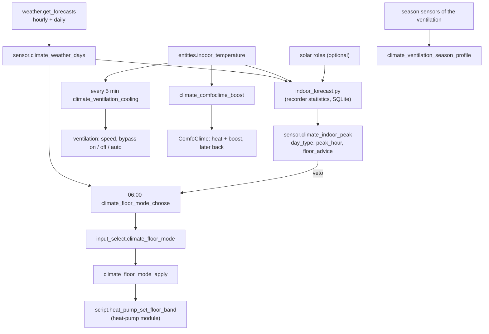

# Logic: <@ module.name @>

<!-- Filled in by tools/fill.py (kept in a comment so a markdown formatter leaves it alone).
<% from '_climate.jinja' import feat, loud_start, loud_end, boost_below, boost_hours, target, comfort_low, comfort_high, forecast_days with context %>
-->

## In one sentence

Once a day the house picks a floor mode for the coming days (heating, neutral or cooling, slowly and always through neutral), every five minutes it decides whether cool outside air can cool the house through the ventilation bypass, and every fifteen minutes it forecasts today's indoor peak from the sun and the outdoor air it learned from the last weeks.

## Flow chart

## Triggers

| Automation | Triggers |
| --- | --- |
| `climate_floor_mode_choose` | 06:00 |
| `climate_floor_mode_apply` | `input_select.climate_floor_mode` changes (by the 06:00 decision or by hand); a band helper of the active mode changed and stayed 20 s |
| `climate_ventilation_cooling` | every 5 min; indoor temperature; `climate_ventilation_cooling_from` or the switch; start and end of the loud hours |
| `climate_ventilation_season_profile` | heating season or cooling season of the ventilation turns on |
| `climate_comfoclime_boost` | indoor drops below the boost threshold (start); every 5 min and at HA start (check whether a boost is over) |
| `sensor.climate_weather_days` (template) | every 30 min, HA start, template reload |
| `sensor.climate_indoor_peak` (command_line) | every 15 min |

## Conditions and decisions

### Weather days

`sensor.climate_weather_days` calls `weather.get_forecasts` hourly and daily. State: the warmest forecast hour still to come today. Attributes: `hours`, `hour_temp`, `hour_cloud` (36 h), `outdoor_mean_until_18` (mean of the forecast hours until 18:00), `days`, `day_max`, `day_min`, `day_condition` (5 days, today first). The macro `cloud_cover(from_hour, to_hour)` in `custom_templates/climate.jinja` gives the mean forecast cloud cover of the hours still to come today between two hours (100 when none are left).

### Indoor forecast (the model)

`indoor_forecast.py` reads the hourly long-term statistics (`statistics` table: mean and max per hour) of the indoor temperature, the solar power and the outdoor temperature of the last <@ forecast_days @> days, read-only from the SQLite recorder database. For the current hour H (between 05:00 and 19:00) it builds one sample per past day:

- **rise** = highest indoor hourly maximum between H and 21:00 minus the indoor mean at H (a day counts only when at least 80 % of those hours have data);
- **solar** = solar energy after H until 21:00 (kWh; a power sensor in W is converted to kW, so a mean over one hour is kWh);
- **dt** = mean outdoor temperature from H until 18:00 minus the indoor temperature at H.

It fits **rise = a + k × solar + b × dt** with least squares. The full model is used only with at least 6 days and plausible values (0 ≤ k ≤ 0.5 °C per kWh, −0.2 ≤ b ≤ 0.6); otherwise a + k × solar (k plausible), otherwise a + b × dt, otherwise the mean rise; fewer than 4 days = the mean rise. Without a solar role the k term drops out, without an outdoor role the b term (attribute `terms`).

The forecast uses the solar forecast still to come today, scaled by how today has gone so far: factor = measured solar so far / (forecast today − forecast left), limited to 0.5-1.5, only once more than 1 kWh should have been produced. dt comes from `outdoor_mean_until_18`. **Peak** = indoor now + max(a + k × solar_left × factor + b × dt, 0); after 21:00 the rise is 0. `peak_hour` = the median hour of the peak on the past sunny days (solar after H > 10 kWh; every day without solar).

A second fit for 08:00 (`morning_model`) gives the root-mean-square error of the morning model, to judge the model.

**Kind of day** (`day_type`): `cool` when the peak < comfort low (<@ comfort_low @>), `warm` when > comfort high (<@ comfort_high @>), `sunny_fresh` when it is below the target (<@ target @>) now and the peak reaches it, else `normal`.

**Floor advice** (`floor_advice`), from the forecast day maxima of +1, +2, +3: `cooling` when all three are at or above `input_number.climate_floor_cooling_from_outdoor_max`, `heating` when all three are below `input_number.climate_floor_heating_below_outdoor_max`, else `neutral`.

### Floor mode (cooling strategy)

The floor is slow (hours to a day), so it never switches day by day. **Daily cooling is done only by the ventilation (and the ComfoClime); the floor cools only preventively in a multi-day warm spell.**

At 06:00, with `input_boolean.climate_floor_mode_auto` on:

1. day maxima = `day_max` of the weather days (today, +1, +2, +3); fewer than 3: nothing happens;
2. warm spell = today..+2 or +1..+3 all ≥ "warm day from" (default 24 °C); cool spell = three in a row all < "cool day below" (default 17 °C);
3. wanted = `cooling` on a warm spell (only when the floor may cool, `climate.floor_cooling`, and the forecast does not advise `heating`), `heating` on a cool spell (unless the forecast advises `cooling`), else `neutral`. An unavailable forecast is no veto;
4. heating ↔ cooling always passes through neutral: wanted cooling while heating gives neutral first (and the other way round);
5. a mode stays at least 3 days (`input_datetime.climate_floor_mode_since`, also after a choice by hand): too early = a logbook line, no change.

`climate_floor_mode_apply` writes the band of the new mode (`input_number.climate_floor_<mode>_low/high`) through `script.heat_pump_set_floor_band` (the heat-pump module writes only the values that differ and only cools zones that may cool), stores the moment in `climate_floor_mode_since` and writes the logbook (with "(by hand)" when a user changed it). Tuning a band of the active mode writes it after 20 s without a new change, without resetting the 3 days.

| Mode | Default band (heats below / cools above) | Meaning |
| --- | --- | --- |
| heating | 20.5 / 26 | the coming days are cool; cooling is practically off |
| neutral | 19.5 / 26 | neither heats nor cools in practice; daily peaks are for the ventilation |
| cooling | 18 / 23 | preventive cooling for a warm spell (never below the dew point: 23 °C is the lowest default) |

### Cooling with outside air

Every 5 minutes, with the indoor temperature above 5 °C, the outdoor temperature above −30 °C and the away mode of the ventilation off. Inputs: indoor, outdoor (the ventilation's outdoor sensor, else `entities.outdoor_temperature`), "cool from" (`climate_ventilation_cooling_from`, default 21.5 °C), the current state.

| Order | Condition | State |
| --- | --- | --- |
| 1 | switch off, or heating season (the ventilation's own season sensor; without it: floor mode heating) | `auto` |
| 2 | (indoor ≥ cool from, or already cooling and indoor > cool from − 0.5) and (outdoor at least 2 °C cooler, or already cooling and at least 1 °C) | `cooling_high` when indoor ≥ cool from + 1, at least 4 °C cooler outside and within the loud hours; else `cooling_medium` |
| 3 | indoor ≥ cool from − 1 and outdoor ≥ indoor − 0.5 (outside not cooler) | `bypass_closed` |
| 4 | indoor < cool from − 1.5 (getting cool inside) | `bypass_closed` |
| 5 | otherwise | `auto` |

**High only in the loud hours** (<@ loud_start @>-<@ loud_end @>, `climate.loud_hours`; a window may cross midnight): high is loud, so during the day the fan stays on medium even when high would cool faster; the logbook says "high only <@ loud_start @>-<@ loud_end @>".

Actions: cooling = speed medium/high + bypass open (1 h); bypass closed = automatic speed (or "low" without the auto switch) + bypass closed (1 h); auto = automatic speed + bypass automatic. Because the bypass buttons hold for 1 hour, the command is repeated after 50 minutes in the same state (`input_datetime.climate_bypass_renewed`). The state goes to `input_select.climate_ventilation_state` and the logbook only when it changes. The hysteresis (stay cooling down to cool from − 0.5 and 1 °C difference) prevents switching every 5 minutes.

### Season profile

When the ventilation's own season detection reports the heating season, the temperature profile goes to its heating value (Zehnder: Normal); in the cooling season to its cooling value (Cool). Not on a change from unavailable (restart).

### ComfoClime boost

When the indoor temperature drops below <@ boost_below @> °C and the ComfoClime is in `cool`, `off` or `fan_only` and no boost runs: store "mode|preset|until" in `input_text.climate_comfoclime_previous`, set the ComfoClime to `heat` with preset `boost` (when it offers it), write the logbook and (with `notifications`) send a notification. The air warms up in minutes; the floor would take hours. Every 5 minutes and at HA start a check ends a boost whose until (<@ boost_hours @> h later) has passed: when the ComfoClime is still in `heat`, it goes back to the stored mode and preset; when someone changed it by hand in the meantime, that is left alone. The helper is emptied either way. With the ComfoClime of the ventilation firmware the boost stops early (logbook line) while the switch "ComfoClime: allow writes" is off.

## Settings

| Helper | Default | Meaning |
| --- | --- | --- |
| `input_boolean.climate_floor_mode_auto` | on | the 06:00 decision may change the floor mode |
| `input_select.climate_floor_mode` | neutral | heating / neutral / cooling |
| `input_datetime.climate_floor_mode_since` | - | set on every mode change |
| `input_number.climate_floor_<mode>_low` / `_high` | see the band table | band per mode |
| `input_number.climate_floor_cooling_from_outdoor_max` | 24 | a day counts warm from this forecast maximum |
| `input_number.climate_floor_heating_below_outdoor_max` | 17 | a day counts cool below this forecast maximum |
| `input_boolean.climate_ventilation_cooling` | on | cooling with outside air |
| `input_number.climate_ventilation_cooling_from` | 21.5 | indoor temperature from which it cools |
| `input_select.climate_ventilation_state` | auto | written by the automation only |
| `input_datetime.climate_bypass_renewed` | - | last bypass command |
| `input_text.climate_comfoclime_previous` | empty | state before a boost |

`house.yaml`: `climate.target`, `comfort`, `floor_mode`, `floor_cooling`, `ventilation_cooling`, `season_profile`, `loud_hours`, `comfoclime_boost` (`below`, `hours` or false), `ventilation_values`, `forecast_days`, `view_path`; the roles under `entities:` (block "climate" of `house.example.yaml`).

## Edge cases

1. **Not SQLite, or no statistics**: the forecast prints an error, `sensor.climate_indoor_peak` is unavailable, the screen shows a "forecast" chip with the reason; the floor decision works without the veto.
2. **Few days of history** (new install): below 4 days the forecast is "indoor now + mean rise"; the model improves by itself.
3. **Solar forecast unavailable** while solar statistics exist: the solar left counts as 0, the forecast is too low that day.
4. **Forecast with fewer than 3 days**: no floor change.
5. **A mode chosen by hand** stays 3 days like an automatic one; switch `climate_floor_mode_auto` off to keep it longer.
6. **Restart during a boost**: the until is in the helper; the check at start or within 5 minutes ends it.
7. **Someone changes the ComfoClime during a boost**: the end leaves that choice alone.
8. **Away mode of the ventilation**: the cooling does nothing while it is on.
9. **Loud hours across midnight** (23:00-06:00) and within one day (13:00-15:00) both work; at the end the next run drops high to medium.
10. **The heat-pump cloud is slow or refuses**: the apply automation continues (`continue_on_error`); the heat-pump module logs what it wrote.
11. **ventilation.mac_suffix**: the roles cannot be derived; fill them in or set `climate.ventilation_cooling: false` (fill.py stops with a message otherwise).
12. **Another ventilation brand**: fill in the roles and `climate.ventilation_values` (option names of its selects).

## What it does not do

- No daily floor cooling, never a quick switch heating ↔ cooling.
- No quick veto by itself on sunny cool days (the live proposal's "layer 2"); the screen offers the quick veto by hand when the heat-pump module has it.
- No control of humidity, no ComfoClime fine regulation beyond the boost, no energy-plan layer (heat on surplus).
- No shading logic: the shading module decides; this screen only shows it.
- No filter notification: that is the kind `filter` of `notifications`.

## Test plan

On a real Home Assistant (until it passed, the status says "not tested on HA"):

1. `deploy.py --view`; `sensor.climate_weather_days` has `day_max` with 5 values; `sensor.climate_indoor_peak` has a value and `days` > 0 (else read `error`).
2. Screen: every tab renders, blocks of missing providers are absent, no bare "–".
3. Floor: set `climate_floor_mode` by hand to cooling: the heat-pump logbook shows the band 18/23 written; `climate_floor_mode_since` is now. Set it back to neutral.
4. Floor decision: run `climate_floor_mode_choose` (Run actions) on a warm forecast with `climate_floor_mode_since` older than 3 days: mode becomes cooling (or neutral from heating); with a recent since: the logbook says it stays.
5. Ventilation: lower `climate_ventilation_cooling_from` below indoor on a cool evening: within 5 minutes the bypass opens and the speed goes to medium (high only in the loud hours); raise it again: back to auto or bypass closed.
6. Season profile: watch the profile at the next season change (or toggle the season sensor in Developer tools > States).
7. ComfoClime boost: with "allow writes" on, set the boost threshold above indoor (house.yaml, fill, deploy) or wait for a cold dip: heat + boost, helper filled; after the hours (or by setting the until in the helper to the past) it goes back.
8. Restart HA during a boost: it still ends.
