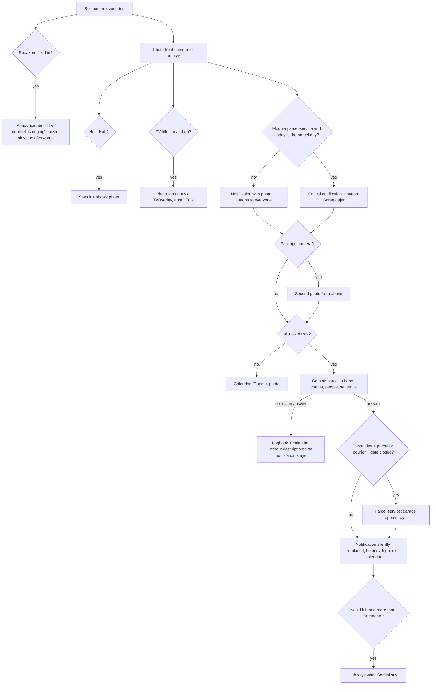

# Logic: <@ module.name @>

## In one sentence

Whether you are at home or away, you see within two seconds who is ringing, can reply with one button on the screen of the doorbell, and know a few seconds later whether it is a courier with a parcel, without anyone having to guess a name.

## Flow chart

The branches with "parcel service" only exist when that module is chosen (see `parcel-service/LOGIC.md`).

## Triggers

| Trigger                                               | Entity role                | Why                                                                                         |
| ----------------------------------------------------- | -------------------------- | ------------------------------------------------------------------------------------------- |
| `event.received`, event_type `ring`                   | `entities.doorbell_button` | the only reliable signal of a real ring (person detection gives too much noise)             |
| `mobile_app_notification_action` `DOORBELL_AT_DOOR`   | button in the notification | reply "Leave it at the door"                                                                |
| `mobile_app_notification_action` `DOORBELL_COMING`    | button in the notification | reply "I'm coming"                                                                          |

The dashboard (and later the home screen) fires the same events or calls `script.doorbell_reply` directly. The action names and the `button` values (`at_door`, `coming`, and with the parcel service `garage`, `parcel_service`) are therefore a fixed interface: do not rename them.

## Conditions and decisions

| Situation                                                  | What happens                                                                                                            | Configurable                           |
| ---------------------------------------------------------- | ----------------------------------------------------------------------------------------------------------------------- | -------------------------------------- |
| Ring                                                       | photo to `/media/doorbell/archive/YYYYMMDD-HHMMSS-ring.jpg`, notification (time-sensitive, tag `doorbell`)              | `doorbell.recipients`                  |
| Speakers filled in                                         | announce: the voice comes over the music, which then plays on at the old volume                                        | `doorbell.speakers`, `doorbell.volume` |
| A speaker is offline                                       | HA skips it (`continue_on_error`), the rest goes on                                                                     | -                                      |
| Nest Hub filled in                                         | says "The doorbell is ringing", shows the photo; after Gemini once more the outcome (not for "Someone" or "Nobody in view") | `doorbell.nest_hub`                 |
| TV filled in and not off                                   | 15 rounds: fresh photo to TvOverlay, first "The doorbell is ringing", then what Gemini saw                              | `doorbell.tv`, `doorbell.tv_ip`        |
| Gemini sees a parcel in someone's hand                     | "Someone with a parcel" (or "Courier with parcel"), title "Parcel at the door"                                          | -                                      |
| Gemini or Protect (< 15 min) sees a parcel on the ground   | title "Parcel at the door", sentence "There is also a parcel on the ground." (not when the description already says so) | -                                     |
| Nobody in view                                             | "Nobody in view"                                                                                                        | -                                      |
| Gemini fails, limit or time-out                            | first notification stays, calendar "Rang" without description, logbook "no description"                                 | -                                      |
| No `ai_task` exists                                        | the Gemini step is skipped, calendar "Rang"                                                                             | `doorbell.ai_task`                     |
| Button "Leave the parcel at the door" / "I'm coming"       | text on the LCD for 3 min, then the previous text back                                                                  | `doorbell.lcd_default`                 |
| After 3 min there is another text (a later button)         | the previous text does not come back: the last button wins                                                              | -                                      |

Short outcome (`input_text.doorbell_visit`, label first so that a chip "14:32" does not read as a number): Courier with parcel · Someone with a parcel · Courier · N people · Someone · Nobody in view, followed by " · HH:MM".

The examples are the English texts; with `house.language: nl` the Dutch ones from `strings.yaml` (e.g. "Iemand met een pakje"). Gemini gets its instructions in the same language and is asked to answer in it.

## Settings

| Helper / field                       | Default             | Unit   | Effect                                                                         |
| ------------------------------------ | ------------------- | ------ | ------------------------------------------------------------------------------ |
| `input_text.doorbell_visit`          | empty               | text   | written by the automation; the visit list refreshes when it changes            |
| `input_text.doorbell_description`    | empty               | text   | Gemini's sentence, for chips and info sheets                                   |
| `doorbell.volume`                    | 50                  | %      | volume of the announcement, only during the announcement                       |
| `doorbell.lcd_default`               | (in `house.yaml`)   | text   | text after a reply when the previous text was unknown or itself a reply        |
| archive sensor ("Doorbell archive")  | hourly              | photos | deletes photos older than 31 days and counts the rest                          |
| visit list `days`, `limit`           | 31, 8               | -      | period and number of rows before "Show all N"                                  |
| `house.language`                     | `en`                | -      | language of every text, of the spoken sentence (TTS `language`) and of Gemini's answer |

The entity id of the archive sensor follows its name in your language on the first install (`sensor.doorbell_archive` or `sensor.deurbel_archief`); nothing reads it.

## Edge cases

- **Speaking through the doorbell is silent.** Text-to-speech to the speaker of a UniFi Protect doorbell does start (HA asks for a talkback session, the stream runs without error), but nothing can be heard at the door. Known, open bug in the HA integration (home-assistant/core#176698; probably Opus 24 kHz while Protect expects 22 kHz). That is why the kit replies with **text on the LCD** and has no "Speak" button. Live talking works in the UniFi Protect app. On an HA update: check the release notes for "unifiprotect talkback" and test again.
- **Google Translate TTS instead of Nabu Casa.** The cloud TTS fails as soon as the Nabu Casa subscription expires ("Invalid subscription"), and then the speaker says nothing either. Google Translate TTS is free and needs no account.
- **Children and parcels in a hand.** On the front photo you sometimes only see a finger or a bit of a child's face, and not the parcel. That is why a second photo from the package camera (from above) goes to Gemini as well. Tested: with both photos Gemini saw the box in a child's hand, with only the front photo it did not.
- **Notify first, then look.** Gemini takes 3 to 10 s (sometimes 18). The first notification does not wait for it; the description replaces it silently (same `tag`, `interruption-level: passive`).
- **Buttons only after a long press.** iOS shows the buttons of a notification only after a long press (or swipe left > View). The parcel notification says so.
- **Photos in `/media`, not in `/www`.** `/local/` (= `www`) can be reached without a login; `/media/local/` needs a login, which the Companion app sends by itself. The visit list asks for a signed link per photo.
- **The TV shows no http images.** TvOverlay (Android) does not load an `http://` image, and on the LAN HA is usually only reachable over http. That is why `tvoverlay/doorbell.py` scales the photo down and sends it as base64. The 15 rounds of about 2 s take about 70 s in practice.
- **The Nest Hub has no announce.** Whatever is playing is interrupted. The script waits until the sentence has been spoken (max. 10 s) and then shows the photo.
- **More than one `ai_task`.** With `doorbell.ai_task` empty (or `auto`) the automation takes the first one. When a second AI integration is added, fill in the entity id. `doorbell.ai_task: none` = no photo goes to an AI service at all.
- **Snapshot fails.** Then the Gemini step fails on "does not exist" and the normal notification stays; the calendar gets "Rang" without description.
- **Ground sentence.** "There is also a parcel on the ground." is left out when Gemini's own sentence already mentions the ground (the words in `ground_words` of `strings.yaml`, e.g. ground, floor, mat).
- **Language of the LCD.** The texts on the LCD follow `house.language`, except "Leave in garage" for the parcel service: English on purpose, couriers often do not speak the local language.
- **Privacy.** The photo of every visitor goes to Google. On the free tier Google may keep those images and use them to improve its models (including human review). A paid key (a few cents a month with normal use) changes that; nothing has to change in HA. The instructions forbid names and identification; a cloud model does not name people anyway.

## What it does not do

- **No names.** Face recognition by name is not possible this way: the Protect API passes no name to HA and cloud models refuse to identify people. That needs a local system (e.g. Frigate on an x86 device), outside this kit.
- No live view in the notification: a tap opens the camera view (or `doorbell.tap_url`).
- No speech through the doorbell (see Edge cases).
- No cleanup of the calendar: events stay, the photos disappear after 31 days (the list then shows an empty photo).
- Gemini decides nothing in the house: in this module it only describes. Only the module parcel-service makes a decision (garage open) depend on the outcome.

## Test plan

Without anyone at the door:

1. Developer tools > Actions > `script.doorbell_reply`, `button: at_door`: text on the LCD; back after 3 min.
2. `script.doorbell_hub` with `text: Test doorbell` (when filled in): the Nest Hub says it.
3. `script.doorbell_tv` with the TV on (when filled in): the photo appears top right and refreshes for a minute.
4. Test Gemini on its own: Actions > `ai_task.generate_data` with a photo from `/media/doorbell/archive/` as attachment (`media-source://media_source/local/doorbell/archive/<file>.jpg`). An answer without an error = key and model work.

With ringing:

5. Without anything in your hand: notification with photo on every phone, then "Someone · HH:MM" with a sentence.
6. With a box in your hand: "Someone with a parcel", title "Parcel at the door".
7. Let a child ring with a small parcel (with package camera): Gemini has to see the parcel.
8. On the phone long-press > "I'm coming": text on the LCD.
9. Visit list on the dashboard: new rows with photo, tap = large.
10. Language: fill in with the other `house.language`, deploy, ring: notification, spoken sentence, LCD texts and Gemini's sentence are in that language.
11. Something wrong: Traces of "Doorbell: someone is ringing" and the logbook at "Doorbell visit".
