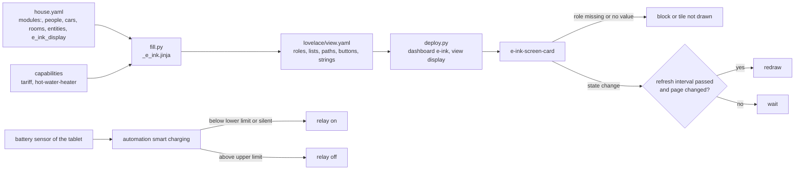

# Logic: <@ module.name @>

## In one sentence

One e-ink page that shows, for every installed module and role and nothing else, a large black-on-white block or
tile, redraws only as often as you allow and only when something changed, and keeps the wall tablet's battery between
two levels with a relay.

## Flow chart

## Triggers

### The page

| Trigger | What happens |
| ------- | ------------ |
| any state change (`hass` set) | a redraw is scheduled: at once while the fast window runs, else at the earliest `input_number.e_ink_display_refresh` seconds after the last one |
| every minute | the same scheduling (clock in the header, "today" in the agenda) |
| every 15 minutes | the agenda is fetched again (calendar API, today and tomorrow) |
| forecast update (websocket `weather/subscribe_forecast`, hourly and daily) | stored; the first one is drawn at once |
| a tap | fast window of 8 s (redraws at once), then the action |
| window resize or rotation | redraw with the other layout |

### Smart charging (only with `e_ink_display.charger_relay`)

| Trigger | Why |
| ------- | --- |
| battery below `input_number.e_ink_display_charge_on_below` | charge |
| battery above `input_number.e_ink_display_charge_off_above` | stop |
| battery sensor `unavailable` or `unknown` for 30 min | fail-safe |
| every 15 min, HA start, a change of one of the three helpers | catch up when a crossing was missed (restart, a changed limit) |

## Conditions and decisions

### Redraw

- At most every `input_number.e_ink_display_refresh` seconds (5 to 600, default 30; 30 when the helper is missing).
  Every redraw of an e-ink panel flashes or leaves ghosting, so fewer is better.
- The page is built as text first; when it is the same as the last one the DOM is left alone, so the panel does not
  redraw at all. The clock shows the minute, so an unchanged page redraws at most once per minute.
- After a tap the page redraws at once for 8 s, so the screen answers the finger.

### Layout

| Window | Layout |
| ------ | ------ |
| wider than high | 1600 x 1200: weather and agenda left, home and energy right; a column without blocks takes one from the other; one block = one column |
| higher than wide | 1200 x 1600: one column (weather, home, energy, agenda); the buttons under the date; 4 tiles per row |

The page is zoomed (`zoom`) to fit the window without scrolling.

### Blocks and tiles

| Block or tile | Needs | Shows | Tap |
| ------------- | ----- | ----- | --- |
| buttons | `paths` (defaults from the modules, see README) | up to 6: home, energy, climate, shading, cars, our week, results | navigate |
| weather | `entities.weather` or `outdoor_temperature` | icon (moon at night), outdoor temperature (the sensor, else the weather entity), name, today's low and high, every 2nd hour for 12 h with rain (mm, or chance ≥ 30 %), the next 3 days | more-info of the weather entity |
| agenda | `e_ink_display.calendars` | today and tomorrow, all-day events and events that started less than 1 h ago, at most 6; "Nothing today or tomorrow." | path `presence` |
| person | `people[]` (person entity has a state) | home, away, or the zone name without the person's own name ("Work Jan" -> "work") | more-info |
| gate | `gate` + `entities.gate_sensor` | closed / OPEN (red border, red word) | first tap arms ("tap again", "open?" / "close?"), a second tap within 5 s runs `script.gate_open_manual` or `script.gate_close_manual` (with `reason`) |
| doorbell | `doorbell` + `entities.doorbell_button` | RINGS (red, 5 min), the time of today's last ring, or quiet | more-info of the camera |
| blinds | `shading` + rooms with a blind | open / closed / n closed | path `shading`, else more-info of the first blind |
| indoor | `entities.indoor_temperature` | temperature | path `climate`, else more-info |
| hot water | capability `hot-water-heater` | `sensor.hot_water_temperature` | more-info |
| car (one per car) | `tesla-route` | battery % and the car name; while charging the charger icon (another shape) and the title "<name>, charging" | path `cars`, else more-info |
| own tiles | `e_ink_display.tiles` | the state, with its unit (temperatures as °) | more-info |
| energy | any of the roles below, or a price | solar, house, grid (to or from), home battery (% + charging or discharging) | path `energy` |
| house power | `entities.house_power_w`, else `sensor.energy_plan_house_power` (energy-plan), else solar + grid + battery discharge when the grid is measured | kW | |
| today line | `e_ink_display.solar_today_kwh` (else attribute `pv_today_kwh` of `sensor.energy_plan_margin`), `solar_forecast_today`, `grid_import_today_kwh` | each part only when its meter has a value | |
| price | `entities.price_import`, else `sensor.power_price_import` (tariff) | now in EUR/kWh, bars for the next 12 h (mean per hour of `prices` at `starts`), the `cheapest_2h` window on a yellow band (only while it has not ended) | |

Power roles are read in W or kW by their unit. `energy.battery_power_sign` says which sign means discharging. At most
12 tiles (4 rows of 3); the order is the order of the table.

### Colour

Text is black on white. Accents (≥ 4.5:1 on white, so they also hold in grayscale): sun `#8A4B00`, grid `#1F4E99`,
battery and a charging car `#2E6B1F`, warning `#B3261E`. A warning is never colour alone: a thicker border and a
capital word (OPEN, RINGS). Yellow `#FFE36E` only as a fill behind black. Lines at least 3 px, smallest text 26 px.

### Smart charging

| Battery | Relay | Action |
| ------- | ----- | ------ |
| below the lower limit (default 30 %) | off | on |
| no value (sensor unavailable or unknown) | off | on (fail-safe) |
| not changed for 3 h | off | on (fail-safe: the app stopped reporting) |
| above the upper limit (default 80 %) | on | off (not while the sensor has no value) |
| in between | any | nothing (hysteresis) |

Only while `input_boolean.e_ink_display_smart_charging` is on. The relay is switched with `homeassistant.turn_on/off`,
so a switch, a light or an input_boolean works. Every switch writes a logbook line.

## Settings

| Setting | Where | Default | Meaning |
| ------- | ----- | ------- | ------- |
| `input_number.e_ink_display_refresh` | helper | 30 s (module.yaml `defaults:`) | seconds between redraws, 5 to 600 |
| `input_number.e_ink_display_charge_on_below` | helper (with a relay) | 30 % | charger on below |
| `input_number.e_ink_display_charge_off_above` | helper (with a relay) | 80 % | charger off above |
| `input_boolean.e_ink_display_smart_charging` | helper (with a relay) | on | master switch of the automation |
| `e_ink_display.dashboard`, `view_path` | house.yaml | `e-ink`, `display` | where the page lives |
| `e_ink_display.calendars` | house.yaml | none | agenda block |
| `e_ink_display.battery`, `charger_relay` | house.yaml | none | smart charging (the relay needs the battery) |
| `e_ink_display.tiles` | house.yaml | none | own tiles |
| `e_ink_display.paths` | house.yaml | from the modules | buttons and taps; an empty value removes a default |
| `e_ink_display.solar_today_kwh`, `grid_import_today_kwh` | house.yaml | none | the "today" line |

## Edge cases

- **No weather entity and no outdoor sensor**: no weather block; the other column gives a block, or the page has one column.
- **Weather entity without an hourly forecast**: no hours row; the daily row stays.
- **A calendar that does not answer**: counts as empty; the block says "Nothing today or tomorrow".
- **Gate without a gate sensor**: no gate tile (the page cannot know whether a tap opens or closes).
- **Gate tapped once**: nothing moves; after 5 s the tile goes back to its state.
- **Two people with the same zone name part**: only the person's own name is removed from the zone name.
- **More than 12 tiles**: the last ones are dropped (own tiles first); use `paths` and other screens for the rest.
- **Negative price**: the bar goes down from the zero line, which moves up.
- **The tablet dies anyway** (relay off, app stopped): the fail-safe turns the charger on after 3 h of silence; the
  relay goes off again at the upper limit once the app reports.
- **Battery sensor stuck at one value while charging**: the relay stays on (no "off" without a value change above the limit).
- **Relay removed from house.yaml later**: the package has no charging helpers any more and `deploy.py` names the old
  automation; delete it by hand.
- **More-info dialogs look grey**: the tablet's HA user has a dark theme; give it a light one (README, setup).

## What it does not do

- It does not drive an ESPHome e-ink panel or make screenshots; it is a dashboard page.
- It does not turn the screen off at night or wake it on motion (do that in the kiosk app if you want it).
- No notification when the tablet battery runs low or the relay fails.
- It does not set the refresh mode of the device; that is a setting of the tablet.

## Test plan

| # | Test | How | Expected |
| - | ---- | --- | -------- |
| 1 | Dry run | `deploy.py --dry-run`, then `--dry-run --live` | plan, roles, buttons; diff shows only the view of this module; helpers named new or existing |
| 2 | Deploy | `deploy.py` | package and helpers (refresh 30 s), resource `/local/ha-kit/e-ink-display/e-ink-screen.js?v=…`, dashboard `e-ink` not in the sidebar, view `display` |
| 3 | Page | open `/e-ink/display` in a browser, then on the tablet in landscape and portrait | every installed module with a value has its block or tile; nothing overflows; no block of a missing module |
| 4 | Refresh | set the helper to 120 s, change a sensor | the page redraws within 2 min, not before; a tap redraws at once |
| 5 | No change | leave the page alone for 10 min with the helper at 5 s | at most one redraw per minute (clock) |
| 6 | Gate | tap the gate tile once, wait 6 s; tap twice | once: red "tap again", then back, nothing moves; twice: the gate moves, the script is in the logbook (close with the reason) |
| 7 | Taps | tap a person, the blinds, the energy block, a button | more-info dialog in a light theme; the path opens |
| 8 | Charging | set the lower limit above the battery level | relay on, logbook line; upper limit below the level: relay off |
| 9 | Fail-safe | close the app on the tablet (sensor unavailable) for 30 min | relay on |
| 10 | Language | fill in with `language: nl`, deploy, reload | every text Dutch, decimal comma, Dutch dates |
| 11 | Ghosting | a day on the wall with the device's balanced mode | readable from a few metres; tune the refresh helper and the device mode |
