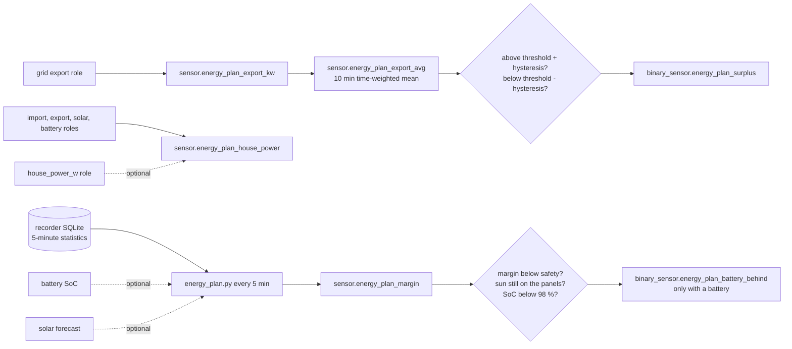

# Logic: <@ module.name @>

## In one sentence

From the grid, solar and battery power and five to ten days of recorder statistics, the module keeps five shared signals current (export average, surplus on/off, house consumption, solar left today after the house and the battery, battery behind) so that the modules that switch things all decide on the same numbers.

## Flow chart

## Triggers

| What | When | Why |
| ---- | ---- | --- |
| `sensor.energy_plan_export_kw`, `energy_plan_house_power` | every state change of their roles (state-based templates) | live values |
| `sensor.energy_plan_export_avg` | every change of the export, and when samples age out of the 10-minute window | statistics integration |
| `binary_sensor.energy_plan_surplus` | every change of the average or of its two helpers | |
| `sensor.energy_plan_margin` | every 5 minutes (`scan_interval: 300`); `deploy.py` forces one run | the script reads statistics that change every 5 minutes; more often adds nothing |
| `binary_sensor.energy_plan_battery_behind` | every change of the margin, the SoC or its two helpers | |

There are no automations: nothing is switched.

## Conditions and decisions

### Export average

The export role is turned into kW first (`sensor.energy_plan_export_kw`, with the unit of the role, negative values count as 0), then averaged over 10 minutes by a statistics sensor with `average_step`: time-weighted, so a value that stood for 9 minutes weighs 9 times more than one that stood for 1 minute (a plain `mean` of samples overweights the moments the meter sends often). `keep_last_sample` keeps a steady value (0 at night) instead of going unknown.

### Surplus with hysteresis

The same band as Home Assistant's threshold helper with `upper` and `hysteresis`, so a setup that used one behaves the same:

| Average export | Surplus |
| -------------- | ------- |
| above threshold + hysteresis (1.5 + 0.3 = 1.8 kW) | on |
| below threshold − hysteresis (1.2 kW) | off |
| in between | keeps its state (after a restart: off until it crosses 1.8 kW) |
| no value | off |

Why a band: a cloud passing over turns a plain threshold on and off within minutes, and a charger or a boiler that follows it starts and stops with it. Why off without a value: consumers read "on" as permission to use solar power; no information is no permission.

### House consumption

With `entities.house_power_w`: that sensor, in W. Otherwise: import − export + solar + battery discharge − battery charge (the sign from `energy.battery_power_sign`), at least 0 (meters do not update at the same moment, so the sum can dip below 0 for a second). The car is included: it is a consumer of the house. With an `ev-charger` module the attribute `without_car` subtracts `sensor.ev_charger_power`.

### The battery-full model (`energy_plan.py`, `sensor.energy_plan_margin`)

Question: will the battery be full by the time the sun leaves the panels, and how much solar energy is left for others after that? Inputs: the 5-minute means (`statistics_short_term`) of solar, import, export, battery and charger (or the house role) of the last `history_days` days, read-only from SQLite; the SoC and the forecast as arguments.

1. **A usable history day** has at least 240 of 288 solar slots (gaps and restarts are skipped) and at least one slot at or above `sun_end_w`.
2. **Sun end.** Per history day: the last slot with solar at or above `sun_end_w` (150 W), minus that day's astronomical sunset (NOAA approximation from `house.lat/lon`) = the offset. Today's sun end = today's sunset + the median offset. Trees, roofs and the panels' orientation make it earlier than sunset; the median ignores a single dark evening.
3. **Solar left, history.** Per history day the ratio solar after / solar before this time of day (only days with more than 0.3 kWh before). With more than 0.5 kWh of solar today so far: today so far × the median ratio, capped at 1.3 × the best afternoon of the history. Before that (early morning): the median afternoon of the history.
4. **Solar left, forecast** (only with both forecast roles). Forecast.Solar (free) refreshes once an hour. At the refresh moment: factor = solar actually produced until then / forecast for that part of the day, bounded to 0.5-1.5 and 1 while less than 1 kWh was forecast. Forecast left = remaining forecast × factor − the solar produced since the refresh. Without that last subtraction the remaining forecast stays the same for an hour while the sun keeps producing, and the margin falls in a saw-tooth of up to several kWh every hour. The refresh moment is `solar_forecast_updated`, or else the moment the remaining forecast last changed.
5. **Solar left = the lower of 3 and 4.** The forecast sees today's clouds but not the evening shade on the panels; the history sees the shade but not today's weather. When in doubt the battery gets priority. `source` says which one won.
6. **House left**: the median, over the history days, of the house consumption without the car from this time of day to that day's own sun end.
7. **Battery needed** = (100 − SoC) % × usable kWh / charge efficiency; 0 without a battery.
8. **Margin** = solar left − house left − battery needed, in kWh, two decimals. Negative: the battery will not be full. After the sun end (`after_sun: true`) solar and house left are 0, so the margin is −battery needed: always a number, because Home Assistant rejects a non-numeric state on a sensor with a unit.
9. **No value** (sensor unavailable): no usable history day, the battery role set but the SoC not a number, the database not readable (not SQLite), or no statistics for solar or for the house consumption (import/export or the house role). Missing battery or charger statistics only give `error: warning: …` with a value: the plan is then less exact, but not too optimistic about the battery.

### Battery behind (only with a battery)

| Condition | Battery behind |
| --------- | -------------- |
| SoC ≥ 98 %, or the margin has no value, or `after_sun` | off |
| was off, margin < safety (0.5 kWh) | on |
| was on, margin < safety + hysteresis (1.0 kWh) | stays on |
| was on, margin ≥ safety + hysteresis | off |

Why the safety margin: the plan is an estimate; at 0 kWh the battery would just make it on paper. Why the one-sided hysteresis: once a charger has given the battery priority, it should not hand the sun back at the first optimistic estimate (that made the charger toggle). Why never at 98 %: a full battery cannot be behind, whatever the estimate.

## Settings

| Helper | Default | Meaning |
| ------ | ------- | ------- |
| `input_number.energy_plan_surplus_kw` | 1.5 kW | centre of the surplus band |
| `input_number.energy_plan_surplus_hysteresis_kw` | 0.3 kW | half the width of the band |
| `input_number.energy_plan_battery_safety_kwh` | 0.5 kWh | battery behind turns on below this margin (with a battery) |
| `input_number.energy_plan_battery_hysteresis_kwh` | 0.5 kWh | ... and off only above safety + this (with a battery) |

The defaults are in `module.yaml` (`defaults:`), set once by `deploy.py`; the templates fall back to the same values until then. No `initial`.

| `house.yaml` | Default | Meaning |
| ------------ | ------- | ------- |
| `energy_plan.sun_end_w` | 150 W | solar power below which the sun counts as gone from the panels |
| `energy_plan.charge_efficiency` | 0.95 | battery charge efficiency in "battery needed" |
| `energy_plan.history_days` | 10 | days of 5-minute statistics; more needs a higher `recorder: purge_keep_days` |

Fixed in the script (constants at the top of `energy_plan.py`): 240 slots for a usable day, 0.3 kWh before now for a ratio, 0.5 kWh today before the ratio is trusted, the 1.3 cap, the forecast factor bounds 0.5-1.5. Fixed in the template: 98 % for "full".

## Edge cases

- **First day after installing**: the roles usually already have statistics (HA keeps them since the sensor exists), so the plan works at once. A brand-new solar sensor: unavailable until one full day is recorded.
- **Restart of Home Assistant**: the margin is unavailable until the first run (at most 5 minutes); battery behind is off meanwhile, surplus off until the average crosses the upper edge.
- **Daylight saving time**: history days are compared by local time of day; the change day has 276 or 300 slots and may be skipped (fewer than 240 solar slots is rare, so mostly not).
- **Snow on the panels, a broken inverter**: today's solar so far is low, so the history estimate is low too; the lower one wins. A day of 0 solar in the history counts in the medians.
- **A charger without `ev-charger` module**: its power counts as house load in the history, so the house left is too high on days after charging: conservative.
- **Forecast with more planes**: sum them in a helper first (README).
- **Forecast refresh unknown** (`solar_forecast_updated` empty and the remaining forecast did not change since a restart): the solar since the restart is subtracted, a slightly too high forecast part; the lower of the two still applies.
- **Polar day or night** (far north or south): the sunset formula is clamped; the median offset still follows the panels.
- **Battery reported in kW or W**: the script converts with the unit of the statistic; the templates with the unit of the state.

## What it does not do

- Switch anything: chargers, the boiler and appliances are switched by `ev-charging`, `hot-water` and `appliances-home-connect`.
- Control the home battery (the battery in the source setup is not controllable).
- Forecast tomorrow: the plan is for today until the sun end; the charge plan uses `solar_forecast_tomorrow` itself.
- Work with MariaDB or PostgreSQL as recorder (only the margin and battery behind need SQLite).
- Know the car's own charging plan, the price or the capacity tariff (`tariff-be`, `ev-charging`).

## Test plan

Until this passed on a real Home Assistant, the status stays "built, not tested on HA".

1. `deploy.py --dry-run`: shows the five uploads, the reloads, the defaults and the statistic ids, without a connection.
2. `deploy.py`: no configuration error; the helpers exist with their defaults; `check recorder statistics` lists no missing ids; `sensor.energy_plan_margin` has a number and `error` is null.
3. Developer tools > States: `sensor.energy_plan_export_kw` equals the export role in kW; `sensor.energy_plan_house_power` is plausible (compare with the energy dashboard; with the role set it equals the role).
4. Surplus: set `input_number.energy_plan_surplus_kw` just below the current average minus the hysteresis: on within a minute; set it far above: off. Set it so the average is inside the band: the state stays what it was.
5. Margin on a sunny morning: `sun_end` is in the late afternoon or evening, before `sunset`; `days` ≥ 5; `source` is `forecast` or `history`; `pv_remaining_kwh` is the lower of the two. Note the margin at :10, :12 and :20: no jump of more than ~0.5 kWh at the forecast refresh (saw-tooth correction).
6. With a battery: when the margin goes below 0.5 kWh, battery behind turns on; it goes off only from 1.0 kWh; it is off at 98 % and after `sun_end`.
7. After the sun end: `after_sun: true`, the margin equals −`battery_needed_kwh`, battery behind off.
8. Without a forecast (empty both forecast roles, fill in, deploy): `pv_remaining_forecast_kwh` null, `source: history`, a value all the same.
9. Unavailable on purpose: fill in a solar role without statistics (a sensor without `state_class`), fill in and deploy: the sensor is unavailable; the command in the Terminal app prints `no statistics for …`. Put the right role back.
