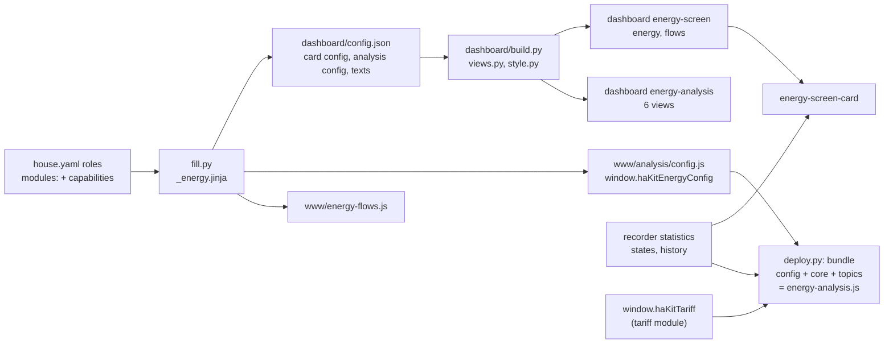

# Logic: Energy screens

## In one sentence

Show what the house does with its energy, now and over time, from the roles in `house.yaml` and the entities of the installed energy modules, without deciding anything itself.

## Flow chart

## Triggers

The module has one automation and three scripts, all for the energy-flows view:

- `energy_flows_follow_today`: at 00:00:05 and at HA start. When the chosen date (`input_datetime.energy_flows_date`) is yesterday, today, empty or in the future, it moves to today; an older date stays.
- `energy_flows_day_back` / `energy_flows_day_forward` / `energy_flows_today`: one day back, one day forward (never past today), today.

Everything else runs in the browser: the energy screen re-renders on a state change of an entity it reads (at most every 5 s, at once for 10 s after a tap), reloads today's totals every 5 minutes; the charts redraw on their `update_interval` (5 min to 1 h) or when their helper changes.

## Conditions and decisions

### Which block needs what

Nothing is drawn without its role or module; `features:` in the card config and in `config.json` holds the flags.

| Block | Shown when |
| ----- | ---------- |
| screen: grid tile, today strip, house sheet, flow diagram (grid, house) | always (required roles) |
| screen: solar in the diagram, solar tile, sun bar, "own power", solar sheet | `entities.solar_power_w` |
| screen: battery ring and chips, battery tile and sheet | `entities.battery_soc`; the battery in the diagram also needs `battery_power_w` |
| screen: day-plan chips (full by sun end, solar and house left), margin rows | `energy-plan` in modules (and a battery) |
| screen: price card, coming quarters, level, peak chips | a module that provides `tariff` |
| screen: cheap power card | `ev-charging` with a tariff module (`input_boolean.ev_charging_cheap_enabled`); the reason is `sensor.ev_charging_cheap_status`, while the assist runs `sensor.ev_charging_status` |
| screen: charger card, car tile, car in the diagram | a module that provides `ev-charger`; car name, battery and limit with `ev-charging` |
| screen: phase toggle | `charger-zappi` |
| screen: hot water card | a module that provides `hot-water-heater`; target, shower button and plan with `hot-water` |
| screen: heat pump in the diagram and sheet | a module that provides `heat-pump` (estimated power, labelled as such) |
| screen: consumers in the diagram | `energy.consumers` with `power_w` (at most 4 individuals: charger and heat pump first) |
| screen: forecast chip | `solar_forecast_tomorrow` |
| screen: fossil share | `co2_fossil_percent` |
| screen: "saved today" | `results` (its savings of the installed producers) |
| screen: settings gear | at least one of energy-plan, ev-charging, charger-zappi, hot-water (their helpers, by their own names) |
| analysis `period` | always (HA energy cards); gauges with solar or battery, carbon gauge with `co2_fossil_percent` |
| analysis `power`: base load, month peak, peaks above target | always |
| analysis `power`: chips | month peak and quarter: `grid_month_peak_kw` / `grid_quarter_kw` or the tariff module; average peak: tariff module |
| analysis `power`: base-load cost per year, target-limit cost, capacity cost | tariff module |
| analysis `power`: per phase, cause | `entities.grid_phases` |
| analysis `power`: ventilation in the base load | `ventilation_power_w`, or derived from `ventilation-zehnder` |
| analysis `tariff` (whole view) | tariff module; variable/fixed series and the advantage chart need `tariff.compare` |
| analysis `consumers`: split and starts | at least one consumer (charger, heat pump, ventilation, `energy.consumers`) |
| analysis `consumers`: car | ev-charger |
| analysis `consumers`: seasons, day profile | always (layers car and ventilation when present) |
| analysis `trends` | always; solar with `solar_energy_kwh`, charger with ev-charger, heat pump with `heat_pump_energy_kwh` |
| analysis `battery` (whole view) | `battery_soc`; charged/discharged per day with the two kWh roles; savings with the tariff module; extra module with `energy.battery_module_kwh` |
| flows view | always; "where the sun went" and the week block with solar |

### How the numbers are made

- **Power roles** are read with their `unit_of_measurement` (W or kW). The battery power is turned into "discharge positive" with `energy.battery_power_sign`.
- **Live flows** (screen): load = solar + import − export + battery discharge; the sun feeds the house first, then the battery, the rest goes to the grid; the battery feeds the house, the rest of the house comes from the grid. The car is part of the load (the charger power, capped at the load).
- **Today** (screen): `recorder/statistic_during_period` with `calendar: day`, `change` of every import and export register (summed), of `solar_energy_kwh` (without it: the 5-minute means of the solar power since midnight), of the battery kWh roles and of the results savings.
- **Analysis statistics**: `recorder/statistics_during_period` with units converted by HA (`power: kW`, `energy: kWh`). Energy meters: `change` per row (a row below −0.01 or above 5 kWh per 5 min / 40 kWh per hour is dropped: the first row of a meter can hold the whole reading). Power roles: `mean` (kW over an hour = kWh), `min`/`max` for the base load and the peaks. 5-minute statistics exist ~10 days (`purge_keep_days`), hourly ones forever. Rows before `energy.analysis_from` are ignored.
- **Base load**: per night (01:00-05:00) the median of the hourly floors: import min + battery discharge − charger min (+ the battery's grid charging when it charged the whole hour); the month chart is the mean house load of those hours. Cost per year = mean kW × 8,760 h × the mean all-in night price of the last 90 days (spot statistics × `window.haKitTariff.importPrice`).
- **Peaks**: a quarter = the three 5-minute `change` rows of the import registers × 4; the day peak combines those with the hourly max of the quarter register; the month peak is the month register (or the highest quarter) above a lower bound from hourly data. The capacity cost uses `coefficients(hass)` of `window.haKitTariff` (the live helpers) and the floor `tariff.capacity.minimum_kw`.
- **Tariff**: per quarter (5-minute data) or hour: import × `importPrice(spot)` − export × `exportPrice(spot)`; spot quarter prices from `nordpool.get_prices_for_date` (config entry found from `entities.spot_price` in the entity registry, ~2 months back, complete days cached in the browser), else the statistics of `entities.spot_price`. Comparison contracts: their energy price + the same levies and day/night grid fee; fees spread per day. No copy of the tariff formula: only `window.haKitTariff`.
- **Profiles**: hourly kWh of import, export, solar, car, battery; house = import − export + solar + discharge − charge; days with a missing hour of a role are skipped, and days with a house use without the car below `energy.away_below_kwh`. A season counts once 14 days of it passed.
- **Battery**: savings = discharge × import price − charge × export price (spot); empty at = first moment from 16:00 at or below `battery_reserve_percent`; full = at least 95 %; extra module = min(export while ≥ 99 % × efficiency, import while empty until 09:00, module kWh).

## Settings

| Setting | Where | Default | Why |
| ------- | ----- | ------- | --- |
| `input_datetime.energy_flows_date` | flows view | today (automation) | the day of the energy flows |
| `input_select.energy_flows_unit` | flows view (buttons kWh / %) | `kwh` | kWh or share |
| `input_select.energy_profiles_period` | consumers view (buttons) | `30_days` | period of the day profile |
| extended view | layers button on the screen | off | one choice per device (localStorage) |
| `energy.analysis_from` | house.yaml | all statistics | skip months with wrong data |
| `energy.peak_target_kw` | house.yaml | 3 | target line of the peak charts |
| `energy.battery_phase` | house.yaml | none | battery discharge on that phase in the base load per phase |
| `energy.away_below_kwh` | house.yaml | 0 | leave holidays out of the profiles |
| `energy.battery_module_kwh`, `battery_efficiency`, `battery_reserve_percent`, `battery_investment_eur` | house.yaml | none, 0.9, 20, none | battery view |
| `energy.dashboards`, `energy.paths` | house.yaml | energy-screen, energy-analysis | url paths, buttons to results and cars |
| `tariff.compare` | house.yaml | none | comparison contracts |

## Edge cases

1. **No statistics yet** (new sensor): charts stay empty until the recorder compiled the first hour; the screen's today values show "–".
2. **A register reset or the first statistics row** holding the whole meter reading: dropped by the plausibility limits.
3. **Nord Pool unreachable or older than ~2 months**: the tariff view falls back to the spot statistics; days with more than 5 % unpriced energy are left out.
4. **DST days**: hour-of-day charts skip the missing spring hour and clamp the extra autumn hour; day columns sit at noon.
5. **No tariff module**: no price card, no tariff view, no costs or savings anywhere (never a guessed price).
6. **A Dutch or other house language**: texts, number and date formats follow `house.language` (`locale` in strings.yaml); state values stay English and are translated on screen.
7. **Theme without the `--cw-*` tokens**: the card falls back to the Organic colours; charts always use hex colours (apexcharts-card cannot read view themes).
8. **A dashboard edited by hand**: `deploy.py` replaces it completely (backup first); use `--no-dashboards` to keep it.
9. **More than four consumers with power**: only the first four (charger and heat pump first) are in the flow diagram; all are in the analysis and the house sheet.
10. **HA restart just after picking yesterday** in the flows view: the automation moves the date to today.

## What it does not do

- It controls nothing: no automation besides the date of the flows view; the charger mode buttons and toggles call the scripts and helpers of their own modules (the mode buttons `script.ev_charging_manual_mode` when ev-charging is installed, so the charger keeps one writer).
- No jacuzzi estimate from a phase (the source had one): measure a consumer and add it to `energy.consumers`.
- No report notes with personal history (peaks, invoices, contract expectations); no Fluvius history.
- No per-car split of the charger energy in the flows (one car layer).
- No price formula of its own.

## Test plan

Done (headless Chrome 2026-10-05, mocked hass and synthetic statistics, apexcharts-card 2.2.3 and power-flow-card-plus from HACS releases): the full example (every role, tariff, charger, ev-charging, heat pump, hot water, results; en and nl) and PV + grid only (no battery, charger, heat pump or tariff; en and nl): energy screen, every detail sheet, views power, battery, tariff, consumers and flows; every data generator of both dashboards (185 resp. 75) runs without error; Jinja of the notes compiles and renders; `tools/check.py` passes.

On a real Home Assistant (until this passed, the status stays "not tested on HA"):

1. Deploy with `--dry-run`, check the features list and the views; deploy for real. Resources present: cw-thema.js, apexcharts-card, power-flow-card-plus, tariff.js.
2. Energy screen: the diagram moves; the four tiles match the live sensors; today's import/export match the HA energy dashboard (same statistics).
3. Turn a big consumer on: the grid tile and the flow chips follow within 5 s; the consumer shows in the diagram.
4. Every detail sheet opens; a row opens the more-info; the gear shows the helpers of the installed modules; a slider sets its helper.
5. Charger: press "eco": with ev-charging `script.ev_charging_manual_mode` runs with mode `solar_min`, the owner is `manual` at once and the charger follows (ev-charging calls `script.ev_charger_set_mode`); without ev-charging the screen calls `script.ev_charger_set_mode` itself. With cheap power on and no assist: the cheap power card names the reason of `sensor.ev_charging_cheap_status`.
6. Flows view: previous / next / today; kWh / %; at midnight the date follows today.
7. Analysis: every view loads without a red error card; the base load per night matches a night you know; the month peak matches the meter; the tariff view shows the last 30 days (Nord Pool or the statistics); the profile period buttons switch the day profile.
8. Switch house.language, fill in, deploy: texts and number formats follow.
