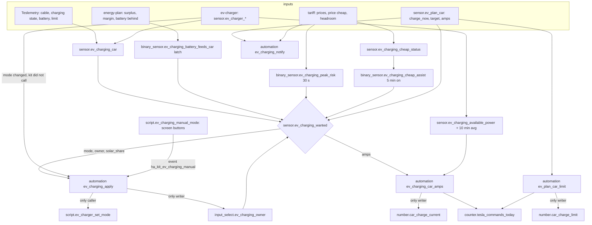

# Logic: <@ module.name @>

## In one sentence

One arbiter (`sensor.ev_charging_wanted`) decides per minute which mode the charger should have and who owns it (manual > charge plan > cheap power > solar surplus), and three single writers carry that out: `ev_charging_apply` (charger mode and owner), `ev_charging_car_amps` (car charge current) and `ev_plan_<car>_limit` (car charge limit).

## Flow chart

## Triggers

| Entity or automation                         | Triggers                                                                                                      | Why                                                                     |
| -------------------------------------------- | ------------------------------------------------------------------------------------------------------------- | ----------------------------------------------------------------------- |
| `sensor.ev_charging_car` (trigger-based)     | charger connected, cable, charging state, battery, located at home and limit of every car; every minute; start | which car is on the charger; keeps its state while the charger is unavailable |
| `sensor.ev_charging_wanted` (trigger-based)  | master switch, owner, connected, charger mode, car, latch, solar share, battery behind, peak risk, cheap assist, headroom, amps helpers, every plan sensor and plan switch; every minute; start | the arbiter                                                    |
| `sensor.ev_plan_<car>` (trigger-based)       | every 15 min (:00:20), start, template reload, the plan helpers of that car, its cable                        | the plan; calendar and Waze calls only then                             |
| `ev_charging_apply`                          | wanted (state or attributes), charger mode (not from or to unavailable), unplugged, master switch, event `ha_kit_ev_charging_manual`, every 5 min, start | carry out the arbiter; a mode chosen by hand on a screen; detect a change by hand; release on unplug |
| `ev_charging_car_amps`                       | every 5 min, amps automatic on, wanted attribute `amps`, peak risk on, charger in fast for 90 s, a car with current control charging for 20 s | car current                                  |
| `ev_plan_<car>_limit`                        | plan target, cable, plan switch, car online, every 15 min, start                                              | raise and restore the charge limit                                      |
| `ev_plan_target_reset`                       | every 15 min, start, a departure helper                                                                       | a manual target ends at its departure                                   |
| `ev_charging_notify`                         | price cheap on and off, plan feasible to false, 21:00                                                         | notifications                                                           |
| `ev_charging_tesla_counter_reset`            | 00:00 (only without gate)                                                                                     | daily command budget                                                    |

## Conditions and decisions

### The arbiter: situation, owner, mode

First match wins (`sensor.ev_charging_wanted`, attributes `owner`, `reason`, `solar_share`, `amps`).

| #   | Situation                                                                                             | Owner     | Mode         | Reason           |
| --- | ----------------------------------------------------------------------------------------------------- | --------- | ------------ | ---------------- |
| 1   | master switch `input_boolean.ev_charging_smart` off                                                   | `none`    | (`solar_only`, handed back once) | `off` |
| 2   | owner is `manual` (someone changed the charger)                                                       | `manual`  | the charger's own mode | `manual` |
| 3   | no car plugged in (`binary_sensor.ev_charger_connected` off)                                          | `none`    | `solar_only` | `no_car`         |
| 4   | plan of the car on the charger wants `fast` now, but the month peak leaves less than the minimum current (with car current control), or the peak is at risk (without it); sticky until 2 A above the minimum | `plan` | `solar_min` | `peak_limited` |
| 5   | plan of the car on the charger wants `fast` or `solar_min` now (plan switch on, battery below target)  | `plan`    | that mode    | `plan`           |
| 6   | cheap assist on (`binary_sensor.ev_charging_cheap_assist`) and no peak risk                           | `cheap`   | `solar_min`  | `grid_assist`    |
| 7   | car at its limit (battery at or above the limit, or charging state `complete`)                        | `surplus` | `solar_only` | `car_full`       |
| 8   | the home battery feeds the car (latch)                                                                | `surplus` | `stop`       | `paused_battery` |
| 9   | home battery behind (`binary_sensor.energy_plan_battery_behind`)                                      | `surplus` | `solar_only`, solar share 100 | `battery_behind` |
| 10  | otherwise                                                                                             | `surplus` | `solar_only`, solar share = helper | `solar` |

`solar_share` is passed on every call (100 while the battery is behind, else `input_number.ev_charging_solar_share`): the charger only starts in `solar_only` when that share of its charge power is surplus (Zappi: Minimum Green Level).

### Apply (`ev_charging_apply`, the only caller of the charger script)

0. **Chosen by hand on a screen** (`script.ev_charging_manual_mode`, fields `mode`, optional `solar_share` and `reason`; the energy screen's charger buttons call it): the script only fires `ha_kit_ev_charging_manual`; apply sets the owner to `manual` first (with smart on, also without a car: a mode chosen before plugging in holds for that session), then calls `script.ev_charger_set_mode` with that mode. A screen never calls the charger script itself: that call would update its `last_triggered` and look like a call of the kit, so the change-by-hand detection below would miss it and the arbiter would undo it.
1. **Unplugged** (connected on to off): owner `none`. A manual owner ends here.
2. **Changed by hand**: the charger mode changes (not from or to unavailable) to a mode that is not the wanted one, more than 150 s after the kit's last call of `script.ev_charger_set_mode` (cloud lag: the script waits 60 s and the cloud polls every 30 s), with smart on and a car plugged in: owner `manual`. The kit leaves the charger alone until the car is unplugged or the owner is set back to `none` by hand.
3. **Master switch off**: when the kit owned the charger (`surplus`, `cheap`, `plan`) and it is not in `solar_only`, one call `solar_only`; owner `none`. After that nothing.
4. **Otherwise** (smart on, owner not manual): owner = the arbiter's owner; when the charger mode differs from the wanted mode, or in `solar_only` the charger's `solar_share` differs, one call of `script.ev_charger_set_mode` (mode, solar_share, reason). The 5-minute check and the start only retry when the last call is more than 10 min ago.

### The car on the charger (`sensor.ev_charging_car`)

- A car counts when `binary_sensor.ev_charger_connected` is on, its charge cable is on, its charging state is not `disconnected` and, when the role `located_at_home` exists, that is not `off` (a car charging away from home is not on this charger).
- Several cars: the one that is `charging` wins, otherwise the first in `house.yaml`.
- Connected but no car of `house.yaml` matches: `other` (a guest car): solar logic only, no plan, no cheap assist, no car commands.
- Charger unavailable: the previous state stays (trigger-based sensor).

### Available power and the battery latch

- `sensor.ev_charging_available_power` (W) = charge power (the larger of the charger and the car's own power) + export − import − battery discharge. Battery charging does not count: the battery goes first. The 10-minute average feeds the car current and the phase switching of `charger-zappi`.
- `binary_sensor.ev_charging_battery_feeds_car` (only with a battery) turns on after 3 min when the car takes more than 500 W and the battery discharges more than max(300 W, car × (1 − solar share) + 200 W), or more than 300 W below `input_number.ev_charging_battery_floor`, or more than 150 W while the battery is behind. Once on it stays on (the car is paused, its power drops to 0) until the battery charges more than 300 W or `binary_sensor.energy_plan_surplus` is on, for 3 min. Unplugging resets it.

### Cheap power (`sensor.ev_charging_cheap_status`, only with a tariff module)

Daytime grid assist for the car when power is cheap: the car stays at its minimum when the surplus dips instead of stopping. It is never meant to fill the car from the grid; in the evening and at night nothing extra comes from the grid. First match:

| Status                | When                                                                                                         |
| --------------------- | ------------------------------------------------------------------------------------------------------------ |
| `off`                 | `input_boolean.ev_charging_cheap_enabled` or the master switch off                                           |
| `no_cheap_power`      | `binary_sensor.power_price_cheap` off (export price below 0 or import price at or below the cheap threshold)  |
| `no_sun`              | sun below the horizon, energy-plan says the sun has left the panels, or solar power below 300 W               |
| `no_car`              | no car of `house.yaml` on the charger, or its battery unknown                                                |
| `car_full`            | battery at or above the car's limit                                                                          |
| `battery_behind`      | home battery behind (skipped when export costs more than the assist, see below)                              |
| `battery_not_full`    | home battery below `input_number.ev_charging_cheap_battery_full` (same exception)                            |
| `battery_discharging` | home battery discharges more than 200 W                                                                      |
| `month_peak`          | headroom of this quarter below `input_number.ev_charging_cheap_max_grid_kw`                                  |
| `grid_import_high`    | grid import above that maximum                                                                               |
| `too_little_surplus`  | not assisting yet and import − export + what the car still needs to reach its minimum is above the maximum    |
| `commands_used_up`    | the car current is controlled and today's command budget is used up                                          |
| `charger_busy`        | not assisting yet and the plan or a manual change owns the charger, or the charger is not in `solar_only`     |
| `grid_assist`         | allowed                                                                                                      |

- `binary_sensor.ev_charging_cheap_assist` turns on after 5 min of `grid_assist` and off after `input_number.ev_charging_cheap_stop_min` minutes of anything else. The peak risk ends the assist at once in the arbiter (row 6).
- **Never pay to export**: while the export price is negative, the battery conditions `behind` and `not full` are skipped when gain ≥ cost: gain = the export the car would take (kW) × |export price|, cost = the grid power needed to keep the car at its minimum × (import price − value of own solar later, `tariff.compare.export`). While assisting: export taken = car power − import, grid power = import.

### Month-peak guard (only with a tariff module)

- `binary_sensor.ev_charging_peak_risk`: grid import above `sensor.capacity_headroom_kw` for 30 s (off after 1 min). Effects: the cheap assist stops (arbiter row 6), a plan in fast goes to `solar_min` when the car current cannot go lower or is not controlled (row 4), and `ev_charging_car_amps` lowers the car current at once.
- Car current for a plan in fast (attribute `amps`): floor((headroom − house load without the car) × 1000 / (voltage × phases)), at most the plan's own amps and the charger maximum. Phases: `sensor.ev_charger_phases` when 1 or 3, else `ev_charging.phases`.

### Charge plan (`sensor.ev_plan_<car>`, macros `plan()` and `calendar_target()`)

- **Target** = the higher of the manual target (`input_number.ev_plan_<car>_target` with `input_datetime.ev_plan_<car>_departure`, only while the departure is in the future) and the calendar target; **departure** = the earlier of both. `ev_plan_target_reset` sets a manual target back to 0 once its departure has passed.
- **Calendar** (`cars[].plan_calendar`): the appointments of the coming 36 h with a location and a start time (all-day ones do not count), limited to the day of the first one, at most 8. Distance per appointment: a number with km in the title or description (one way, e.g. "(45 km)"), else Waze Travel Time from `zone.home` (region `ev_charging.waze_region`). km = Σ 2 × one way. Target % = reserve + km × consumption/100 × (1 + margin) / battery × 100, rounded up, at most 100 (`calendar_needed_percent` shows the number before the cap). Departure = start of the first appointment − travel time − 15 min (travel time unknown: 50 km/h).
- **Needed** = (target − battery) × battery_kwh / efficiency.
- **Expected sun before departure**: today (sun still on the panels): the positive `sensor.energy_plan_margin` (sun left after the house and the home battery), only the part up to the departure. Next sun day: the forecast of that day (`solar_forecast_today` before sunrise, else `_tomorrow`) as a sine-shaped day from sunrise to sun end, up to the departure, minus 0.5 kW house load per hour and the home battery's usable kWh. The plan counts `input_number.ev_plan_<car>_solar_confidence` % of it.
- **Grid** = needed − sun. The quarters before departure are ranked by import price (the slot that contains the quarter; slots of 15 or 60 min); quarters without a price go last; daylight quarters whose sun is already counted and, while the home battery is behind, the quarters before sun end get +1 EUR/kWh (only chosen when otherwise not feasible). The cheapest quarters are taken until the grid energy is covered. Without a tariff module there are no prices: the earliest quarters win, outside the counted sun.
- **Power**: room = grid limit (`limit_kw` of `sensor.capacity_headroom_kw`; without a capacity tariff the charger maximum + house reserve) − `ev_charging.house_reserve_kw`. With car current control: `fast` at min(max power, room) when room ≥ minimum amps × voltage × phases. Without it: `fast` only when the full charger power fits. Else `solar_min` at 6 A × voltage (1 phase) and `peak_tight`.
- **States**: `unknown` (battery unknown), `no_target`, `target_reached`, `not_feasible` (not enough quarters: it charges in every quarter left), `charging_from_grid` (this quarter is chosen: `charge_now` = `fast` or `solar_min`), `planned`, `solar_enough`.

### Car current (`ev_charging_car_amps`, the only writer of `number.<car>_charge_current`)

| Situation                                                | Current                                                         | Limits                                                                    |
| -------------------------------------------------------- | --------------------------------------------------------------- | ------------------------------------------------------------------------- |
| plan in fast                                             | attribute `amps` of the arbiter, at most the car's maximum      | down at once on a peak risk, a start or the check; on a headroom change alone only by 2 A or more; up by 2 A or more; may exceed the daily budget |
| fast set by hand (owner manual), 90 s after the change   | the car's maximum (what the charger offers)                     | budget                                                                    |
| surplus (`solar_only`) or cheap assist (`solar_min`), the car charging | 10-min available power / (voltage × phases), between `input_number.ev_charging_min_amps` and the maximum | only on a difference, 10 min apart except a drop of 2 A or more, `input_number.ev_charging_car_commands_per_day` |

Every command adds 1 to `counter.tesla_commands_today`.

### Charge limit (`ev_plan_<car>_limit`, only with the role `charge_limit`)

- Raise: plan on, cable in, target above both the battery and the car's limit: the old limit goes to `input_number.ev_plan_<car>_previous_limit` (only when that is 0), the limit to the target (50 to 100).
- Restore: previous limit above 0, no target any more (target 0 or plan off), the car online or plugged in: back to the previous limit, previous to 0.

### Notifications (`ev_charging_notify`)

Through `script.send_notification` when `notifications` is installed, always a logbook line.

- Cheap window start and end (`binary_sensor.power_price_cheap`), daytime only and only with cheap power on: "Cheap power until HH:MM" (the first coming slot that is not cheap) with the current cheap status; "Cheap power over".
- A plan that becomes not feasible: target, departure, shortfall, and the month peak when that is the limit.
- 21:00 for every plan car with a departure tomorrow: km and appointments or the departure time, target and battery now, the blocks with kWh and cost, a warning when the car is not plugged in, when the trips need more than 100 % or when appointments have no distance.

## Settings

| Helper or field                                       | Default | Meaning                                                                                  |
| ----------------------------------------------------- | ------- | ---------------------------------------------------------------------------------------- |
| `input_boolean.ev_charging_smart`                     | on      | master switch                                                                            |
| `input_select.ev_charging_owner`                      | none    | `none`, `surplus`, `cheap`, `plan`, `manual`; set by apply; set it to `none` to end manual |
| `input_number.ev_charging_solar_share`                | 50 %    | share of the charge power that must be surplus in `solar_only`                           |
| `input_number.ev_charging_battery_floor`              | 50 %    | below it the home battery may not feed the car at all (with a battery)                   |
| `input_boolean.ev_charging_cheap_enabled`             | off     | cheap assist (with a tariff module)                                                      |
| `input_number.ev_charging_cheap_max_grid_kw`          | 1.0 kW  | total grid import allowed during the assist                                              |
| `input_number.ev_charging_cheap_battery_full`         | 95 %    | the home battery counts as full from here (with a battery)                               |
| `input_number.ev_charging_cheap_stop_min`             | 2 min   | not allowed this long: the assist stops                                                  |
| `input_boolean.ev_charging_car_amps_auto`             | on      | the kit sets the car current (cars with the role `charge_current`)                       |
| `input_number.ev_charging_min_amps`                   | 5 A     | lowest car current                                                                       |
| `input_number.ev_charging_car_commands_per_day`       | 25      | daily budget of car commands on surplus                                                  |
| `input_boolean.ev_plan_<car>`                         | on      | the plan of that car is carried out                                                      |
| `input_number.ev_plan_<car>_target`                   | 0 %     | manual target (0 = none)                                                                 |
| `input_datetime.ev_plan_<car>_departure`              | -       | departure of the manual target                                                           |
| `input_number.ev_plan_<car>_margin`                   | 15 %    | on top of the trip consumption                                                           |
| `input_number.ev_plan_<car>_reserve`                  | 20 %    | left on arrival back home                                                                |
| `input_number.ev_plan_<car>_solar_confidence`         | 70 %    | share of the expected sun the plan relies on                                             |
| `input_number.ev_plan_<car>_previous_limit`           | 0       | internal: the limit before the plan raised it                                            |
| `cars[].battery_kwh`, `consumption_kwh_100km`, `charge_plan`, `plan_calendar` | 75 / 18 / - / - | per car (house.yaml)                                         |
| `ev_charging.voltage`, `phases`, `max_power_kw`, `house_reserve_kw`, `efficiency`, `waze_region` | 230 / 3 / 11 / 1.0 / 0.9 / eu | the charger connection (house.yaml) |

## Edge cases

- **Restart**: the car, the arbiter and the plans are trigger-based and keep their state; the charger-mode trigger ignores the return from unavailable, so a restart never looks like a change by hand. The owner and the previous limit are helpers. The 5-minute check retries a mode the charger did not follow, at most every 10 min.
- **Cloud lag**: the charger script waits up to 60 s; a mode change up to 150 s after the kit's own call is never seen as manual.
- **Charger unavailable**: the car keeps its state, apply does not call the script while the mode is unknown.
- **Two cars**: the charging one wins; a plan only acts for the car that is on the charger.
- **Guest car or a car without Teslemetry**: `other`: solar logic only.
- **The car charges away from home** (cable in, located at home off): not on this charger.
- **Plan and cheap power at the same time**: the plan wins; cheap waits (`charger_busy`) until the plan lets go.
- **Peak while assisting**: the arbiter drops the assist at once; the assist binary sensor follows after the stop minutes; a restart of the assist needs 5 min of `grid_assist`.
- **Plan in fast near the peak**: the car current goes down first; only when it cannot go below the minimum does the charger go to `solar_min`, and it stays there until there is room for 2 A above the minimum.
- **Waze or the calendar fail**: the calendar target is 0 (the appointments without a distance are listed); a trigger during the Waze calls keeps the previous plan.
- **Prices only 24 h ahead**: quarters without a price go last; the plan is recomputed every quarter.
- **Gate installed later**: fill in again and deploy `ev-charging` first: its counter and its reset automation go (deploy.py removes the automation), then deploy `gate`.
- **A car loses its plan**: deploy.py removes its `ev_plan_<car>_limit` automation; the helpers stay until you delete them.

## What it does not do

- It never steers the home battery (the source battery is not controllable) and does not account for a battery that discharges into the car while charging from the grid at night.
- It does not chain appointments into a round trip (A → B → home): every appointment counts there and back from home (generous, safe).
- No quarter-hour solar profile: the next sun day is a sine-shaped day with a confidence factor.
- Phases: chosen by the charger adapter (`charger-zappi`), not here.
- It does not fire `ha_kit_result` yet: `results` computes the solar share of the car from `sensor.ev_charger_solar_energy_today`. The optional kinds `ev_cheap` (grid kWh charged in the cheap window) and `peak_avoided` (the peak guard kept the quarter under the month peak) of the results contract need session bookkeeping that is not built (open point in docs/phase4-contracts.md).

## Test plan

Simulated with mocked states (see the module README, "Tests done"); not yet on a real Home Assistant. On HA, with the car plugged in:

1. Deploy, check that `sensor.ev_charging_car` shows the prefix of the car, `sensor.ev_charging_available_power_avg` has a value and `sensor.ev_charging_wanted` is `solar_only` with owner `surplus`.
2. Set `binary_sensor.energy_plan_battery_behind` to on in Developer tools > States (set state): the wanted solar share goes to 100 and the charger's share (Zappi Minimum Green Level) follows within a minute.
3. Change the charger mode in its own app: within a minute `input_select.ev_charging_owner` is `manual` and the logbook says so; nothing changes the charger back. Unplug: owner `none`, the charger goes to `solar_only`.
4. Press `fast` on the energy screen (or run `script.ev_charging_manual_mode` with `mode: fast`): the owner is `manual` at once, the charger goes to `fast`, the logbook names the reason; 10 minutes later the kit has not changed it back. Unplug: owner `none`.
5. Set a manual target 5 % above the battery with a departure in 1 h: `sensor.ev_plan_<car>` goes to `charging_from_grid`, the charger to `fast`, the car current to the plan's `amps` (within the headroom), the charge limit up when it was lower. At the target the charger goes back to `solar_only`; when the target goes to 0 the limit comes back.
6. With the tariff module: during a cheap window with a full battery, `sensor.ev_charging_cheap_status` becomes `grid_assist`, after 5 min the charger goes to `solar_min`; switch on a large load: `grid_import_high` and back to `solar_only` after the stop minutes; above the headroom for 30 s it stops at once.
7. At 21:00 the evening before a departure the notification arrives; with a calendar appointment with a location the plan shows `calendar_km` and `appointments`.
8. Switch smart charging off while the charger is stopped by the kit: one change to `solar_only`, owner `none`, afterwards nothing.
