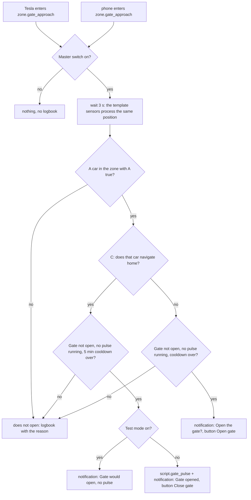
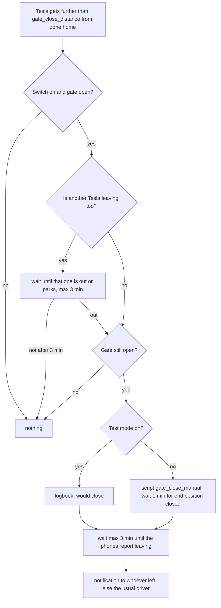
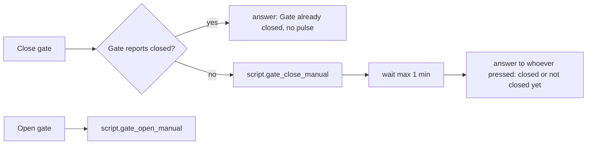

# Logic: <@ module.name @>

<!-- Filled in by tools/fill.py: values for the examples below (kept in a comment so a markdown formatter leaves them alone).
<% set a1 = cars[0] %>
<% set p1 = a1.prefix %>
<% set loc1 = car_entity(a1, 'location') %>
<% set route1 = car_entity(a1, 'route') %>
<% set dest1 = car_entity(a1, 'destination') %>
<% set dist1 = car_entity(a1, 'distance_to_arrival') %>
<% set homename = house.home_destinations[0] %>
<% set testlat = (house.lat + 0.0013) | round(6) %>
<% set phones = people | selectattr('phone', 'defined') | selectattr('phone') | list %>
<% set phone1 = phones[0] if phones else none %>
<% set suffix = '-location-permission' | replace('-', '_') %>
<% set permission1 = (phone1.get('location_permission') or 'sensor.' ~ phone1.phone ~ suffix) if phone1 else 'sensor.<phone>' ~ suffix %>
<% set zoneradius = module.defaults['zone.gate_approach'] %>
<% set withsensor = entities.get('gate_sensor') %>
<% set sensornote = '' if withsensor else ' (not applicable: no gate sensor filled in)' %>
-->

## In one sentence

Whoever navigates home in a Tesla finds the gate open on arrival; whoever drives off sees it close behind them; and whoever still has to do something gets a notification with one button.

The rule is **per car**: who is in the car does not matter. A phone is never needed to open. Phones only serve to tell who is coming home and who gets a notification.

The texts quoted below (notifications, logbook) are the English ones; with `house.language: nl` they are the Dutch texts from `strings.yaml`.

## Flow chart

### Opening on arrival (`automation.gate_auto_open`)

### Closing after leaving (`automation.gate_close_after_departure`, only with a gate sensor)

### Buttons in the notifications (`automation.gate_notification_action`)

Without a gate sensor "Close gate" always pulses and the answer is "Pulse given".

## Triggers

| Automation                        | Trigger                                                                          | Threshold and why                                                                                                                                                                                   |
| --------------------------------- | -------------------------------------------------------------------------------- | --------------------------------------------------------------------------------------------------------------------------------------------------------------------------------------------------- |
| `gate_auto_open`                  | `teslemetry.location` of a car enters `zone.gate_approach` (`id: car`)           | Radius <@ zoneradius @> m. In the source the gate needed ±23 s; the car reports its position every ±10 s and the automation waits 3 s. So the gate is open before the car is there                  |
|                                   | `device_tracker.<phone>` enters `zone.gate_approach` (`id: phone`)               | Second chance: a phone always sends a fresh position on entering a zone. Only opens for a car that is in the zone itself                                                                           |
| `gate_notification_action`        | `mobile_app_notification_action` with `GATE_CLOSE` or `GATE_OPEN`                | Works on every phone that got the notification                                                                                                                                                      |
| `gate_open_too_long`¹             | `binary_sensor.gate_open` is on for `gate_open_alert_minutes`; or turns off      | 10 min: long enough for loading and unloading. Off: the notification disappears                                                                                                                     |
| `gate_close_after_departure`¹     | per car: distance to `zone.home` goes from ≤ to > `gate_close_distance`          | 50 m: in the source the gate is ±16 m from the middle of `zone.home`; a car reports every 10 s. Only fires when crossing outward                                                                    |
| `phone_location_permission_watch` | `sensor.<phone>_location_permission` changes from or to `Authorized Always`      | Only when "Always" is lost or restored, not on every state change                                                                                                                                   |
| `tesla_commands_counter_reset`    | 00:00                                                                            | Daily limit of the counter                                                                                                                                                                          |

¹ only with `entities.gate_sensor`.

The template sensors (`templates/gate.yaml`) are recalculated on every change of a car entity (position, route, distance, destination, status), on every change of a setting and every 30 s (the age of a position grows even when nothing changes).

## Conditions and decisions

### The conditions per car

|       | Condition                                                                      | Sensor                                       | How                                                                                                                                                                                                                                                                           |
| ----- | ------------------------------------------------------------------------------ | -------------------------------------------- | ----------------------------------------------------------------------------------------------------------------------------------------------------------------------------------------------------------------------------------------------------------------------------- |
| **A** | The car was further than `gate_far_distance` from home for `gate_away_minutes` | `binary_sensor.gate_<car>_away_long_enough`  | `sensor.gate_<car>_far_since` remembers the first position beyond `gate_far_distance` and is cleared as soon as the car is `home` again. So a trip to the bakery never makes A true                                                                                            |
| **C** | The car navigates home                                                         | `binary_sensor.gate_<car>_navigating_home`   | Three things: navigation active (`distance_to_arrival` has a value and the car is not asleep); the destination name is one of `house.home_destinations` or matches `house.address_regex`; the destination's coordinates lie within `gate_nav_home_tolerance` of `zone.home` |
|       | The car is in the approach zone                                                | attribute `gate_distance_m` of A             | ≤ radius of `zone.gate_approach`. So a phone trigger cannot open for a car that is still far away                                                                                                                                                                             |

`binary_sensor.gate_auto_open_ready` = A and C for the same car, with the master switch on. Informational only (dashboard, testing).

Attributes of A: `away_minutes`, `needed_minutes`, `gate_distance_m`, `position_age_s`. Attributes of C: `nav_active`, `destination`, `destination_is_home`, `distance_to_arrival_km`, `destination_to_home_m`, `tolerance_m`. Attributes of ready: `car`, `a_away_long_enough`, `c_navigating_home`.

### What happens

| Situation                                                                     | What happens                                                                                | Logbook                                    | Tunable                                                             |
| ----------------------------------------------------------------------------- | ------------------------------------------------------------------------------------------- | ------------------------------------------ | ------------------------------------------------------------------- |
| Master switch off                                                             | nothing                                                                                     | none                                       | `input_boolean.gate_auto_open_enabled`                              |
| A and C for the same car, gate not open, no pulse running, cooldown over      | pulse; notification "Gate opened" (with who is coming home) and button **Close gate**       | `OPENS <car>`                              | `gate_away_minutes`, `gate_far_distance`, `gate_nav_home_tolerance` |
| Same in test mode                                                             | no pulse; notification "🧪 Gate would open"                                                 | `OPENS <car> (test mode)`                  | `input_boolean.gate_auto_open_dry_run`                              |
| A true, C not (no navigation or another destination)                          | no pulse; notification "Open the gate?" with the reason and button **Open gate**            | `ASKS via notification`                    |                                                                     |
| No car in the zone with A (e.g. a 500 m trip, or only a phone)                | nothing                                                                                     | `does not open`                            |                                                                     |
| Gate reports open (`binary_sensor.gate_open` = `on`)                          | nothing: a pulse on an open gate closes it                                                  | `does not open`, `gate on ✘`               |                                                                     |
| Gate state unreachable                                                        | opens anyway (choice from the source: an unreachable sensor must not block coming home)     | `OPENS`                                    |                                                                     |
| No gate sensor filled in                                                      | opens anyway; the gate is assumed closed                                                    | `gate no sensor`                           | `entities.gate_sensor`                                              |
| Relay still `on` (pulse running, `switch` only)                               | nothing                                                                                     | `does not open`                            |                                                                     |
| Already handled (opened or asked) in the last 5 min                           | nothing                                                                                     | `cooldown ✘`                               | fixed: 5 min                                                        |
| Gate open and a Tesla gets further than `gate_close_distance`¹                | closes (`gate_close_manual`), notification "Gate is closed" with button **Open gate**       | `pulse given (automatic after leaving …)`  | `gate_auto_close_enabled`, `gate_close_distance`                    |
| Same, but another Tesla is near home in D/R (or outside P and > 2 km/h)¹      | waits until that one is out too or parks; after 3 min nothing ("open too long" takes over)  |                                            | fixed: 3 min                                                        |
| Same in test mode¹                                                            | no pulse; notification "🧪 Gate would close"                                                | `WOULD CLOSE (test mode)`                  | `gate_auto_open_dry_run`                                            |
| Gate open for `gate_open_alert_minutes`¹                                      | notification "Gate has been open for N min" with **Close gate**, repeats up to 6 times      |                                            | `gate_open_alert_minutes`                                           |
| Phone loses location access "Always"                                          | notification to the owner and the admin(s); on recovery to the admin(s)                     |                                            | `people[].admin`                                                    |

### Who gets which notification

| Notification                                           | To                                                                                                   |
| ------------------------------------------------------ | ---------------------------------------------------------------------------------------------------- |
| Gate opened / would open / open? / open too long       | everyone with `notify` in `house.yaml`                                                                |
| Answer to a button (closed, already closed, not yet)   | whoever pressed (iOS sends `sourceDeviceName`; matched on key, name or phone), unknown: everyone     |
| After closing on departure                             | whoever left home in the last 10 min (`person`), else the usual driver, else everyone                |
| Quick buttons (charge cable, gate already open, not operated) | the person of the HA user who started the script; started by an automation: everyone        |

### Who is in it (`riders(p)` in `gate.jinja`)

- A phone counts as a passenger when its position is ≤ 5 min old, it does not report `home` and it lies ≤ 300 m from the car.
- No phone found: the usual driver (`cars[].driver`), unless that person's phone gave a position in the last 20 min (then that person is somewhere else).
- Tesla itself does not report a driver (only seat occupancy and seat belt).

## Settings

| Helper                                   | Default          | Unit | Effect                                                                                                    |
| ---------------------------------------- | ---------------- | ---- | --------------------------------------------------------------------------------------------------------- |
| `input_boolean.gate_auto_open_enabled`   | off              |      | Master switch for automatic opening (and asking). The quick buttons always work                           |
| `input_boolean.gate_auto_open_dry_run`   | **on**           |      | Test mode: everything is decided, logged and notified, but no pulse. Applies to opening and to closing after leaving |
| `input_boolean.gate_auto_close_enabled`¹ | off              |      | Closing after leaving on/off                                                                              |
| `input_number.gate_away_minutes`         | 5                | min  | A: how long the car must have been further than `gate_far_distance`                                      |
| `input_number.gate_far_distance`         | 1500             | m    | A: what "far enough" is. Lower = short trips open the gate too                                            |
| `input_number.gate_nav_home_tolerance`   | 150              | m    | C: maximum distance between the navigation destination and `zone.home`                                    |
| `input_number.gate_open_alert_minutes`¹  | 10               | min  | After this many minutes open the notification comes, and again every this many minutes                   |
| `input_number.gate_close_distance`¹      | 50               | m    | Close after leaving as soon as the car is this far from the middle of `zone.home`                         |
| `zone.gate_approach` (radius)            | <@ zoneradius @> | m    | Approach zone. Bigger = gate opens earlier. Change it in Settings > Zones                                 |

¹ only with `entities.gate_sensor`.

`deploy.py` sets the defaults once, when the helper is new (from `module.yaml`, `defaults:`). After that your value stays: the helpers have no `initial`.

Fixed values in the code (deliberately no helper):

| Value                                         | Where                                 | Why                                                                                                   |
| --------------------------------------------- | ------------------------------------- | ----------------------------------------------------------------------------------------------------- |
| wait 3 s after the trigger                    | `gate_auto_open`                      | the template sensors react to the same position update as the trigger                                 |
| cooldown 5 min                                | `gate_auto_open`                      | one opening (or question) per arrival, also when car and phone enter the zone one after the other     |
| 30 s block, except with `force: true`         | `gate_pulse`                          | two pulses shortly after each other make the gate stop or reverse                                     |
| wait up to 45 s for an offline relay          | `gate_pulse` (switch)                 | in the source a wifi relay dropped out several times an hour for ±33 s                                |
| wait 1 min for end position closed            | button Close gate, close after leaving | then "not closed yet" with the button Close gate                                                     |
| wait 3 min for the other car and for phones   | `gate_close_after_departure`          | phones report leaving only 100 to 300 m beyond the zone boundary                                      |
| 300 m, 5 min, 20 min                          | `riders()`                            | measured: phone and car were 2 to 71 m apart at the same moment; a phone reports every 1 to 5 min     |

## Edge cases

What went wrong in the source and how it was solved.

1. **`zone.home` must be on the parking spot.** In the source `zone.home` was 553 m away, on the daily route. Result: the person jumped to `home` for ±20 s on every trip, and the destination "Home" was 553 m from `zone.home`, so C failed. Take the spot where `binary_sensor.<car>_located_at_home` turns on, or the coordinates of `device_tracker.<car>_route` while navigating home. `deploy.py --setup --home` puts `zone.home` on `house.lat/lon`. Everything that measures from `zone.home` (other modules too) moves along.
2. **The `in_zones` trap when testing.** A zone trigger looks at the `in_zones` attribute of the tracker, not at the coordinates. With a simulated position (Developer tools > States) set `in_zones` along with it, first `[]` (outside), then `[zone.gate_approach]` (inside). Otherwise nothing fires. Real updates fill it in themselves.
3. **Simulated states stay** until the next real update. A parked Tesla sends nothing for hours: put the real state back yourself.
4. **30 s block of the pulse.** When two people press "Close gate" shortly after each other, or someone presses "Open" right after an automatic opening, only the first pulse counts (logbook: "pulse ignored"). `gate_notification_action` runs in parallel, so everyone who pressed still gets an answer.
5. **Waiting for the other car when closing.** When two cars leave one after the other, the gate would close in front of the second car. So `gate_close_after_departure` waits while another car is driving near home. The last speed sticks after parking (measured: 0.999 km/h in P), so speed does not count in P or while the car sleeps.
6. **Phone location "Always".** In the source a phone's permission silently fell back to "While using". After that the phone sent nothing on the road: no zone trigger, and "who is in it" went blind. `phone_location_permission_watch` reports it now.
7. **A sleeping car** restored its old navigation after an HA restart (a trip from that morning): a ghost C. So navigation only counts when `teslemetry.status` is not `off`.
8. **The route tracker keeps the last destination** after the trip. Only `distance_to_arrival` with a value means "navigation active".
9. **A neighbour lies within the tolerance.** So the destination name must match too. The regex ends with `([^0-9a-z]|$)`: number 12 matches, 125 or 12a do not.
10. **Charging stop on the route.** Teslemetry then gives the **next stop** as destination ("Supercharger …"). C only becomes true after the charging stop. For the gate that is enough.
11. **A gate sensor on wifi and battery can go blind** and then keeps showing "closed" while the gate is open. In the source an automatic pulse closed a gate that someone had opened with the remote this way. Use a wired end-position signal (see README, "Gate hardware").
12. **Two triggers right after each other** (car and phone): `mode: single` drops the second. That is intended.
13. **Passive zone = no geofence.** `zone.gate_approach` must not be passive, otherwise the phone app registers no boundary for it. Result: inside that ring `person.<key>` shows the zone's name instead of "Away". No automation uses that.
14. **Old phone registrations.** The same phone can be registered twice; the old one sometimes reported "home" while the person was on the road. Let every `person` use only the current tracker.
15. **Parcel service (module parcel-service).** It opens the gate for a courier and closes it itself after "parcel service open". With `parcel-service` in `modules:`, `gate_open_too_long` reports nothing while `script.parcel_garage` runs; that script reports a gate that did not close itself, with the button **Close gate**. That button (`GATE_CLOSE`) is only handled by `gate_notification_action`, like the button in "open too long". After adding parcel-service: fill in again and run `gate/deploy.py` again. More: LOGIC.md of parcel-service.

## What it does not do

- **No automatic opening without navigating home.** Then a question comes. So a car that only drives past never opens the gate.
- **Nothing for cyclists or pedestrians.** On purpose: in the source those rules were too rough (a phone reports leaving only 100 to 300 m beyond the zone boundary; a short bike ride is invisible).
- **No obstacle detection.** Closing after leaving relies on the safety of the gate controller itself (photocell). Home Assistant does not see a person or bike behind the car.
- **Does not see the remote.** Without a gate sensor Home Assistant does not know whether someone opened the gate with the remote. With a sensor it knows the position, but not whether the gate is closing: then do not press "Close gate", a pulse while closing stops or reverses the gate.
- **Does not know who drives.** Only which phones are near the car.
- **Sends no commands to the car**, except for the button "unlock charge cable".
- **Cleans up nothing.** `deploy.py` adds and updates, but removes no entities.
- **Android:** the buttons work, but the module only recognises who pressed through iOS's `sourceDeviceName`. On Android everyone gets the answer.

## Test plan in test mode

Everything with `input_boolean.gate_auto_open_enabled` **on** and `input_boolean.gate_auto_open_dry_run` **on**: no pulse goes to the gate, except for the steps that say "real pulse". Simulate states in Developer tools > States. **Put the real state back afterwards.** The examples use the first car from `house.yaml` (`<@ p1 @>`).

| #   | Test                       | How                                                                                                                                                                                       | Expected                                                                                                           |
| --- | -------------------------- | ----------------------------------------------------------------------------------------------------------------------------------------------------------------------------------------- | ------------------------------------------------------------------------------------------------------------------ |
| 1   | Macro                      | Developer tools > Template: `{{ conditions('<@ p1 @>') }} {{ riders('<@ p1 @>') }}`                                                     | JSON with `away_ok`, `navigating_home`, `gate_distance_m`, …; a list of names                                      |
| 2   | A                          | Set `sensor.gate_<@ p1 @>_far_since` to a time 20 min ago (ISO with time zone) and `<@ loc1 @>` to `not_home` (keep the attributes)                                                      | `binary_sensor.gate_<@ p1 @>_away_long_enough` on within 30 s. Set `gate_away_minutes` to 30: off                  |
| 3   | C                          | Set `<@ route1 @>` to `latitude`/`longitude` of `zone.home`, `<@ dest1 @>` to `<@ homename @>` and `<@ dist1 @>` to `1.2`                                                               | `binary_sensor.gate_<@ p1 @>_navigating_home` on. Distance `unknown`: off. Destination "Kerkstraat 5": off         |
| 4   | Full chain                 | After 2 and 3: set `<@ loc1 @>` outside the zone first with `in_zones: []`, then to `latitude: <@ testlat @>`, `longitude: <@ house.lon @>` (±150 m north of home) with `in_zones: [zone.gate_approach]` | The zone trigger fires. Logbook "OPENS … (test mode)" + notification "🧪 Gate would open"            |
| 5   | Asking                     | Like 4, but `<@ dist1 @>` to `unknown`, after 5 min (cooldown)                                                                                                                          | Notification "Open the gate?" with button, logbook "ASKS via notification"                                         |
| 6   | Cooldown                   | Repeat test 4 within 5 min                                                                                                                                                              | Logbook "cooldown ✘"                                                                                               |
| 7   | Gate open¹                 | Like 4 with `binary_sensor.gate_open` set to `on`                                                                                                                                       | Logbook "does not open", "gate on ✘"; no notification                                                              |
| 8   | Open too long¹             | Set `gate_open_alert_minutes` to 1 and `binary_sensor.gate_open` to `on`; wait 1 min                                                                                                    | Notification "Gate has been open for 1 min" with button. Set it to `off`: the notification disappears              |
| 9   | Close after leaving¹       | `gate_auto_close_enabled` on, `binary_sensor.gate_open` to `on`; set `<@ loc1 @>` first to `zone.home`, then 200 m further                                                               | Logbook "WOULD CLOSE (test mode)", notification "🧪 Gate would close" after max 3 min                              |
| 10  | Location access            | Set `<@ permission1 @>` to `Authorized When In Use`, then back to `Authorized Always`                                                                                                   | Two notifications: "is no longer Always", then "back on Always"                                                    |
| 11  | Adapter (real pulse)       | At the gate: run `script.gate_pulse` in the UI; run it again within 30 s                                                                                                                | Gate moves; the second time logbook "pulse ignored"                                                                |
| 12  | Notification button (real pulse) | Tap "Open gate" in the notification of test 5, at the gate                                                                                                                        | `script.gate_open_manual` runs                                                                                     |
| 13  | Charge cable               | One car plugged in at home: run `script.tesla_unlock_charge_cable`                                                                                                                      | Cable free, notification, `counter.tesla_commands_today` +1 (+2 when it was still charging)                        |
| 14  | Real trips                 | Drive a week with test mode on                                                                                                                                                          | After every arrival the logbook says why it would open or not. Tune the zone with the `gate_update_interval` sensors |
| 15  | Live                       | Test mode off                                                                                                                                                                           | Opens for real; notification with "Close gate"                                                                     |

¹ only with a gate sensor<@ sensornote @>.
