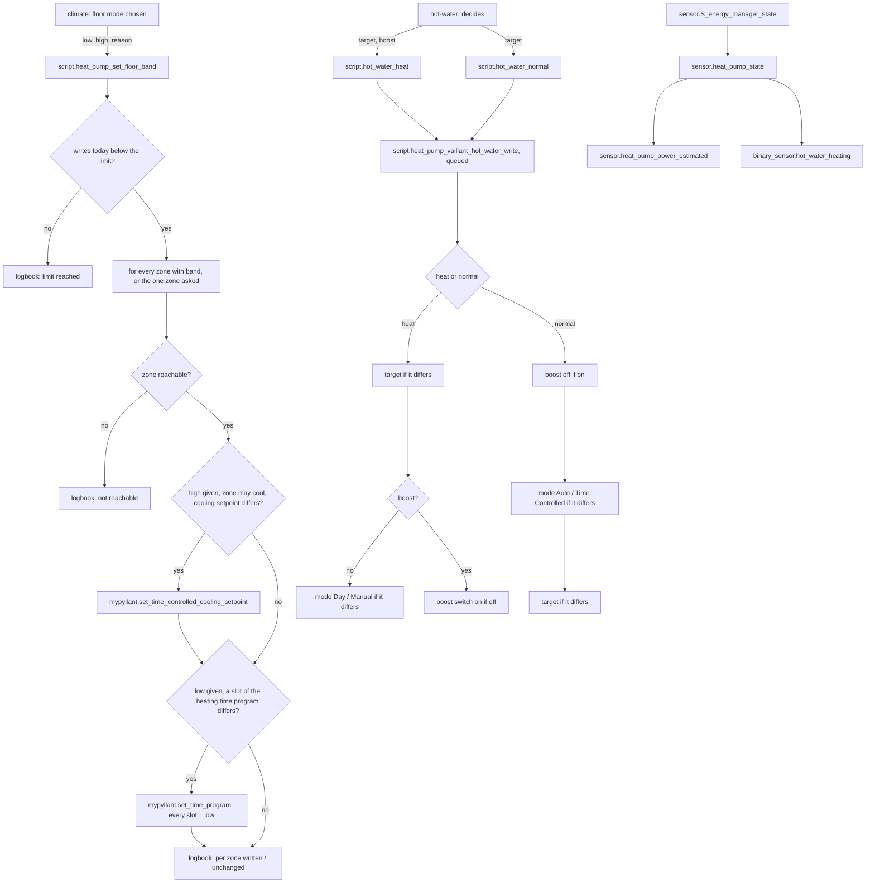

# Logic: Heat pump (Vaillant)

Status: built, not tested on HA. The scripts and sensors were run against mocked states (one and two zones, en and nl); the test plan below has not been run on a real heat pump yet.

## In one sentence

The adapter translates the brand-free requests of `climate` (floor band, quick veto) and `hot-water` (heat the tank, back to normal) into myVAILLANT calls that change only what differs, and turns the myVAILLANT entities into the normalised sensors those modules read.

## Flow chart

## Triggers

The adapter has no triggers of its own except the midnight reset of the write counter (`automation.heat_pump_vaillant_writes_reset`, 00:00). Everything else runs when a core module calls a script:

| Script                                | Called by (single writer)                         |
| ------------------------------------- | ------------------------------------------------- |
| `script.heat_pump_set_floor_band`     | `climate` (when its floor mode changes)           |
| `script.heat_pump_quick_veto`         | `climate` (optional; e.g. a sunny cool morning)   |
| `script.hot_water_heat`               | `hot-water` (`automation.hot_water_buffer`)       |
| `script.hot_water_normal`             | `hot-water` (`automation.hot_water_buffer`)       |

The template sensors follow their source entities (myVAILLANT refreshes from the cloud; the state lags behind by minutes, sometimes up to half an hour).

## Conditions and decisions

**Floor band** (`script.heat_pump_set_floor_band`, mode `queued`):

1. `low` and `high` are rounded to 0.5 °C. At least one must be given; with both, `low` < `high`. A `zone` that does not exist, or no zone with `band`, is invalid. Invalid: logbook line, nothing written.
2. Writes today ≥ `input_number.heat_pump_vaillant_max_writes_per_day`: logbook line, nothing written.
3. Per zone (every zone with `band: true`, or only the zone asked for, also one without band):
   - unavailable climate entity: logbook line, next zone;
   - **cooling**: only when `high` is given and the zone may cool (`zones[].cooling`, default `heat_pump.cooling`) and `sensor.<zone>_desired_cooling_temperature` differs by more than 0.05 °C (or is unknown). Written with `mypyllant.set_time_controlled_cooling_setpoint`. Not `climate.set_temperature` with `target_temp_high`: myPyllant ignores it;
   - **heating**: only when `low` is given and at least one slot of the attribute `time_program_heating` has another setpoint. Then every slot of every weekday gets `low` (start and end times stay) through `mypyllant.set_time_program` (`program_type: heating`). Not `climate.set_temperature`: with the option `time_program_overwrite` off, myPyllant turns that into a quick veto of 3 h;
   - 5 s between the cooling and the heating write; each write counts in the counter;
   - one logbook line per zone: what was written, unchanged, or why not.
4. Writes are `continue_on_error`: a cloud error does not stop the other zone; the next call writes again because the value still differs.

**Quick veto** (`script.heat_pump_quick_veto`): `hours` > 0 = `mypyllant.set_quick_veto` (`temperature`, `duration_hours`) per zone; `hours` 0 = `mypyllant.cancel_quick_veto`; no `hours` = 3. Same limit, zone and reachability rules as the band; one write per zone, always (a quick veto has no "same value" to compare).

**Hot water** (`script.hot_water_heat` / `hot_water_normal` both call the internal `script.heat_pump_vaillant_hot_water_write`, mode `queued`, so a heat and a normal shortly after each other are written in order):

1. The target is limited to the water heater's `min_temp`-`max_temp` and rounded to 1 °C. It is written when it differs by more than 0.4 °C from the attribute `temperature`.
2. Modes: the "heat" mode is the first of `heat_pump.hot_water_modes.heat`, `Day`, `Manual` that the water heater offers (`operation_list`); "normal" the first of `heat_pump.hot_water_modes.normal`, `Auto`, `Time Controlled`. VRC700 controllers call them Auto/Day, newer controllers Time Controlled/Manual.
3. **heat without boost**: target, 5 s, mode "heat" (the tank is kept at the target outside the time program until `hot_water_normal`). This is what a surplus session needs.
4. **heat with boost**: target, 5 s, boost switch on (`switch.<water heater>_boost`); the mode stays as it is. Vaillant ends the boost when the target is reached. This is the "one charge now" of the cheapest hour, the morning and the bath check.
5. **normal**: boost off (if on), mode "normal" (if different), 5 s, target. Always allowed, also above the write limit, so the tank never stays on a high target or in Day mode.
6. Unreachable water heater (`unavailable`/`unknown`) or the limit reached (heat only): logbook line, nothing written.

**Sensors**:

| Sensor                              | Rule                                                                                                                                       |
| ----------------------------------- | ------------------------------------------------------------------------------------------------------------------------------------------ |
| `sensor.heat_pump_state`            | from the energy manager state: contains DHW / HOT_WATER / DOMESTIC = `hot_water`; COOL = `cooling`; HEAT = `heating`; STANDBY, IDLE, OFF, STOP(PED), NO_DEMAND = `idle`; unavailable or anything else = `unknown` |
| `sensor.heat_pump_power_estimated`  | W per state from `heat_pump.power_estimate_w` (defaults hot_water 2000, heating 1800, cooling 800, idle 0); unavailable while the state is `unknown` |
| `sensor.heat_pump_flow_temperature` | the flow temperature of the first zone's circuit; attribute `circuits` per circuit                                                         |
| `sensor.hot_water_temperature`      | the water heater's `current_temperature`, else the tank sensor                                                                             |
| `sensor.hot_water_cop`              | heat / electrical energy of hot water today, limited to 1.5-4.5; before the first kWh of the day (both are daily totals in steps of 1 kWh) or without the sensors: `hot_water.cop` (default 2.8) |
| `binary_sensor.hot_water_heating`   | on while `sensor.heat_pump_state` is `hot_water`                                                                                           |
| `binary_sensor.heat_pump_fault`     | mirrors `binary_sensor.<system>_trouble_codes`                                                                                             |

## Settings

| Helper / field                                       | Default | Meaning                                                                                              |
| ---------------------------------------------------- | ------- | ---------------------------------------------------------------------------------------------------- |
| `input_number.heat_pump_vaillant_max_writes_per_day` | 40      | safety net: above this number of cloud writes today the scripts stop writing (normal always may)      |
| `counter.heat_pump_vaillant_writes_today`            | -       | cloud writes today; reset at 00:00                                                                   |
| `heat_pump.system`, `heat_pump.zones[]`              | -       | the myVAILLANT names in the entity ids; per zone `circuit`, `key`, `cooling`, `band`, `climate`       |
| `heat_pump.cooling`                                  | false   | the floor may cool (per zone overridable)                                                            |
| `heat_pump.power_estimate_w`                         | see above | estimate per state                                                                                 |
| `heat_pump.hot_water_modes`                          | -       | own names of the two water heater modes                                                              |
| `heat_pump.hot_water_heat_kwh`, `hot_water_electric_kwh` | -   | daily energy sensors for the measured COP                                                            |
| `entities.heat_pump`, `entities.water_heater`        | derived | overrides of the first zone's climate entity and the water heater                                    |
| `hot_water.cop`                                      | 2.8     | COP without a measurement                                                                            |

No helper has `initial`; `deploy.py` sets the default once, when the helper is new.

## Edge cases

- **Cloud lag.** The scripts do not wait for the cloud to follow. A second call within a minute may write the same value again because the state has not refreshed yet; the counter shows it. The cores call only on a change of their own decision, so this is rare.
- **Cloud error or quota block.** `continue_on_error`: the script goes on and logs "written" (the call was sent). The value still differs at the next call, so it is written again then. Repeated errors show as a counter that rises while nothing changes.
- **Time program without heating slots.** Nothing is written for heating ("no slots" in the logbook). Outside the slots the zone's setback temperature (set in the myVAILLANT app) applies; the band never changes the setback.
- **Several slots with different setpoints** (day 21, evening 22): the band gives every slot `low`; your own differences per slot are gone. Use the setback for the night.
- **Zone that may not cool** (e.g. a bathroom circuit, condensation): `high` is ignored for it and the logbook says so.
- **Quick veto running** when the band is written: the time program changes, the veto keeps its temperature until it ends.
- **Water heater with other mode names.** Found in `operation_list`; when no hold mode exists, only the target is written and the logbook says so (set `heat_pump.hot_water_modes`).
- **Above about 60 °C** a flexoTHERM may switch on its electric heating element (COP 1 instead of about 3). The adapter writes what it is asked; `hot-water` chooses the maximum.
- **Legionella protection** stays with Vaillant (the time program and the anti-legionella function of the controller).
- **Energy sensors unavailable** (they can stay unavailable for days): the COP falls back to the default, attribute `source: default`.
- **Unknown energy manager state** (a new firmware value): `sensor.heat_pump_state` is `unknown`, `brand_state` shows the value; add it to the template.

## What it does not do

- **No decisions.** The floor mode (heating / neutral / cooling over several days, at least 3 days per mode, heating ↔ cooling through neutral) is chosen by `climate` (`input_select.climate_floor_mode`, its bands `input_number.climate_floor_<mode>_low/high`); the "apply" part of the live setup became this band script. When the tank heats is decided by `hot-water`.
- No live power: myVAILLANT has none. For a real measurement put a meter on the heat pump's group and use it in `energy` (`entities.heat_pump_energy_kwh`).
- No changes to the time program's times, the setback temperature, the heating curve, the holiday mode, manual cooling or the ventilation boost of the zone: set those in the myVAILLANT app.
- No notifications: errors go to the logbook.

## Test plan

On a real Home Assistant with myVAILLANT. Watch Settings > Logbook (entity "Heat pump state" / "Hot water temperature") and the counter. Each step writes to the real heat pump: do it on a mild day.

1. `deploy.py --dry-run`, then `deploy.py`: no missing required entities; note the optional ones it names. On the first deploy it names `counter.heat_pump_vaillant_writes_today` (counter has no reload service): restart Home Assistant once. `input_number.heat_pump_vaillant_max_writes_per_day` = 40, counter 0.
2. Developer tools > States: `sensor.heat_pump_state` follows the energy manager state (`idle` in STANDBY); `sensor.heat_pump_power_estimated` matches; `sensor.hot_water_temperature` equals the water heater's temperature; attributes `zones` and `main_zone` hold your climate entities.
3. **Band, heating.** Note the heating time program in the app. Run `script.heat_pump_set_floor_band` with `low` = current slot setpoint + 0.5 and no `high`. Expected: one write, logbook "heating … written", after the next refresh every slot shows the new value in the app and the attribute `time_program_heating`. Times of the slots unchanged. Run it again: "unchanged", counter does not rise.
4. **Band, cooling** (only with `cooling: true`): `high` = current cooling setpoint + 1. Expected: `sensor.<zone>_desired_cooling_temperature` follows; the zone does not get a quick veto (attribute `quick_veto_end_date_time` stays empty).
5. **Two zones** (when you have them): without `zone` both band zones change; with `zone: <key>` only that one; a zone with `cooling: false` logs "does not cool".
6. **Invalid**: `low` 24, `high` 23 → "invalid band", nothing written.
7. **Quick veto**: `temperature` 19, `hours` 1 → the app shows the quick veto; `hours` 0 → cancelled.
8. **Hot water, hold**: `script.hot_water_heat` `target` = tank + 3, `boost` off → target and mode Day (or Manual); the tank heats outside the time program (`binary_sensor.hot_water_heating` turns on after the refresh).
9. **Back to normal**: `script.hot_water_normal` `target` 35 (or your minimum) → mode Auto (or Time Controlled), then the target.
10. **Hot water, boost**: `script.hot_water_heat` `target` = tank + 3, `boost` on → boost switch on, mode unchanged; the boost ends by itself at the target.
11. **Limit**: set the limit to the counter's value. Band and heat log "limit reached" and write nothing; `hot_water_normal` still writes. Set the limit back to 40.
12. **Unreachable**: while myVAILLANT is unavailable (e.g. integration disabled) a call logs "not reachable" and writes nothing.
13. After midnight the counter is 0.

Then install `climate` and `hot-water`: they are the only callers from then on.
