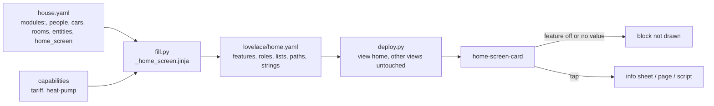

# Logic: <@ module.name @>

## In one sentence

One start screen that shows, for every installed module and nothing else, one short status chip or card, filled in from `house.yaml` so the card itself knows no entity of any house.

## Flow chart

## Triggers

None: no automations. The card re-renders when one of its own entities changes (at most every 5 s, at once for 10 s after a tap) and every minute for the clock.

## Conditions and decisions

### Feature flags (rendered at fill time, never guessed in the browser)

| Flag | On when |
| ---- | ------- |
| `climate` | `climate` in modules |
| `gate` | `gate` in modules (the chip also needs `entities.gate_sensor`: only then `binary_sensor.gate_open` exists) |
| `shading` | `shading` in modules |
| `presence` | `presence` in modules |
| `cars` | `tesla-route` in modules |
| `doorbell`, `parcel_service` | `doorbell`, `parcel-service` in modules |
| `ev_charging` | `ev-charging` in modules |
| `tariff`, `heat_pump` | capability `tariff`, `heat-pump` |
| `energy` | `energy-plan` in modules |
| `hot_water` | `hot-water` in modules |
| `cameras`, `media`, `todo` | `home_screen.cameras`, `media_players`, `todo` filled in |

A block whose flag is off gets no roles in the config, so the card cannot draw it. A block whose entity is missing or has no value is not drawn either (never a bare dash); a row inside a card says "no measurement yet".

### Status row

| Chip | Needs | Shows | Hides when | Tap |
| ---- | ----- | ----- | ---------- | --- |
| indoor | `entities.indoor_temperature` | temperature, label indoors | no number | sheet (with comfort band of `climate.comfort`), Open climate path |
| outdoor | `entities.outdoor_temperature`, else the `temperature` of `entities.weather` | temperature; weather icon (moon at night) | no number | sheet with the weather name |
| gate | `gate` + gate sensor | closed (calm) / open (outline) | no state | sheet; open: button "Close the gate" (confirm, `script.gate_close_manual` with `reason`) |
| blinds | `shading`, rooms with a blind | open / closed / n of total | no blind with a state | sheet with every room; Open shading path |
| home | `people[]` (person entity) | first letters of who is home, or 0 | no person entity | sheet with every person |
| car (one per car) | `tesla-route` | battery %, lightning while charging | no battery value | sheet: charging, plugged in or not |
| doorbell | `doorbell` | rings (< 5 min), time of today's last ring, or quiet; label parcel when a parcel was left (< 2 h) | no camera entity | own sheet: snapshot, last ring, what was seen (only when written after the ring), parcel left, expected parcel; buttons At the door / I'm coming (`script.doorbell_reply`), Garage ajar on the parcel day (`parcel_service` with the ring id); camera app button only with `home_screen.protect_url` |
| parcel | `parcel-service` | yes (today), short weekday + day, off | no helper | own sheet: Today / Tomorrow / Off (`script.parcel_expected`), Garage ajar today |
| climate | `climate` | expected indoor peak; icon follows the floor mode | no number | sheet: day type and floor mode |
| cameras | `home_screen.cameras` | number of live cameras | no camera matches | page (path `cameras`), else sheet |
| media | `home_screen.media_players` | number playing, or quiet | none of the players exists | page (path `media`), else sheet |
| our week | `presence` | ISO week number | - | `/lovelace/our-week` |
| smart charging | `ev-charging` | kW while charging, else the first plan target %, else on/off | no charger and no switch | page (path `charging`), else sheet |

Calm chips drop out first on a narrow phone (`minder`: climate 3, blinds 2, gate when closed 1); a chip with a tone never drops out. Cameras, media, our week and smart charging are shortcuts (`vul` 1-4): by default they only fill free spots of the last row. Each HA user can change all of this (picker of `cw-status`, saved as `cw-status-home` in the user data).

### Cards

| Card | Needs | Content |
| ---- | ----- | ------- |
| arrival | `tesla-route` with cars | `tesla-arrival-card` with the same config as `tesla-route/lovelace/arrival.yaml` (gate row with `gate`); takes no space while no car is on the road |
| Energy | `energy-plan` or `tariff` | live: solar, home battery (`energy.battery_power_sign`), grid (import − export), house; prices: now + level, cheapest 2 h, export, month peak (or the quarter in red when it is above max(month peak, `tariff.capacity.minimum_kw`)); extended: per phase |
| advice line (in Energy) | `tariff` | only when there is something to do: quarter above the peak (red), negative price, solar surplus (`energy-plan`); otherwise hidden |
| Controls | hot-water, `home_screen.toggles`, shading | Hot water for a morning shower (toggle; sub "on/off: target °C"), own toggles (icon by domain), all blinds and all curtains up/down (confirm; the room covers of `rooms[]`, not a group) |
| Playing now | media players | every player that plays, with Pause |
| To-do | `home_screen.todo` | "N tasks to do" while the count is above 0 |
| Climate (extended) | `climate` or `heat-pump` | indoor temperature, heat pump state, expected day, floor mode, hot water temperature |
| Cars (extended) | `tesla-route` | battery bar per car, plug, charging, where (home / zone / elsewhere); charger chip with `ev-charging` |
| Rooms (extended) | `shading` | per room blind and curtain state, "sun kept out" flag; tap toggles the blind (or the curtain) |
| What the house does (extended) | hot-water, ev-charging, shading | hot water on surplus, smart charging status, keep the sun out, morning heating |

### Why

- **Flags at fill time.** Home Assistant cannot tell the card which modules are installed; `modules:` can. An entity that happens to exist (an old helper) never brings back a removed module's chip.
- **Rooms, not cover groups**, for "all blinds": the group's entity id depends on the install language.
- **No fallback URLs or coordinates.** The camera app button needs `home_screen.protect_url`; the arrival map uses `zone.home`.
- **Texts in the config.** The card gets `strings:` from `strings.yaml` in `house.language`; only the card picker name and the cache version are baked into the JavaScript.

## Settings

| Setting | Where | Default |
| ------- | ----- | ------- |
| feature flags, roles, lists | rendered from `house.yaml` | - |
| `home_screen.paths` | `house.yaml` | energy `/energy`, presence `/lovelace/our-week`, todo `/todo?entity_id=…` |
| `home_screen.view_path` | `house.yaml` | `home` |
| extended view | layers button, per browser (`localStorage`) | off |
| chips and order | picker, per HA user | all chips that fit 2 rows |

No helpers, so no `defaults:`.

## Edge cases

1. **Module of wave 2 or 3 not built yet** (ev-charging, hot-water, climate, energy-plan): its flag is on as soon as it is in `modules:`, but its entities do not exist yet: the chip or card stays hidden until they have a value.
2. **Gate without sensor**: no gate chip (there is no `binary_sensor.gate_open`); the arrival card still has its gate row.
3. **Doorbell visit text of an older ring**: "Seen" only shows when the visit helper was written after the last ring.
4. **No `tesla-arrival-card` loaded yet**: the card waits for the element and mounts it once it is defined.
5. **Invalid `home_screen.cameras` regex**: no camera chip, no error.
6. **Overview auto-generated or in YAML mode**: `deploy.py` stops with "take control first".
7. **Two people share one HA account**: they share the chip choice (it is per HA user).

## What it does not do

- No presence card on this view: "Our week" stays in `presence` (the week chip links to it).
- No stepper for the shower temperature yet: `stap` in `<cw-toggles>` is available since `cw-thema.js` v28 (module `base`), the card does not use it yet (open points in docs/phase4-contracts.md).
- No speaking through the doorbell (the source had it switched off because of an HA bug).
- It does not change other views or other dashboards, and never deletes a view.

## Test plan

| # | Test | How | Expected |
| - | ---- | --- | -------- |
| 1 | Dry run | `deploy.py --dry-run`, then `--dry-run --live` | plan, features, roles; diff shows only the view `home` added or replaced, the other views listed as untouched |
| 2 | Deploy | `deploy.py` | resource `/local/ha-kit/home-screen/home-screen.js?v=…`, backup in `backup/`, view `home` first |
| 3 | Chips | open the view on a phone and a desktop | one chip per installed module with a value; no chip of a module that is not installed; at most 2 rows on a phone |
| 4 | Picker | long press on the row, switch a chip off, reload on another device | the choice is kept for that HA user |
| 5 | Doorbell | ring, open the chip | snapshot, last ring, buttons write the LCD text (`script.doorbell_reply` in the logbook) |
| 6 | Parcel | parcel chip > Tomorrow | `input_datetime.parcel_expected` = tomorrow; chip shows the weekday |
| 7 | Gate | open the gate, tap the chip > Close | confirm, `script.gate_close_manual` with the reason in the logbook |
| 8 | Controls | toggle a light, all blinds down | the light toggles; confirm, then every blind of `rooms[]` closes |
| 9 | Energy | compare with the energy screen | same values (W/kW read from the unit), month peak; advice line only on peak, negative price or surplus |
| 10 | Arrival | drive home with navigation | the arrival card appears between the chips and the cards, and disappears after arrival |
| 11 | Language | fill in with `language: nl`, deploy, hard refresh | every text Dutch, decimal comma |
