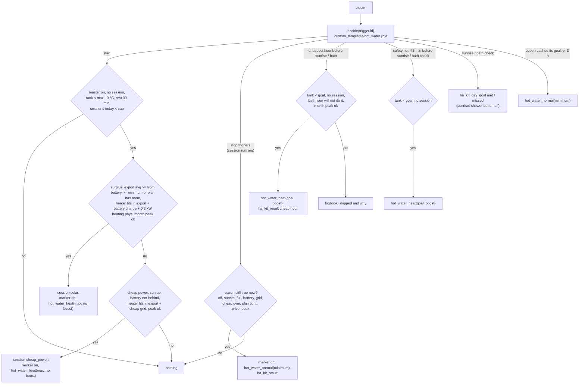

<!-- <% from '_hot_water.jinja' import litres, cop_default, heater_kw, max_sessions, bath, bath_from, tariff_on, battery, kwh_per_degree_default with context %> -->
# Logic: <@ module.name @>

## In one sentence

The tank is a heat battery: heat it to a high maximum when solar power would otherwise be exported for little (or power is cheap), keep only a comfort minimum otherwise, and make sure the morning and the bath are warm enough by heating in the cheapest hour before them, with a safety net at the moment itself, without raising the month peak and within the command quota of a cloud heater.

For this house: <@ litres @> l, COP <@ cop_default @> when the heater gives none, so about <@ kwh_per_degree_default @> kWh of electricity per °C; heater <@ heater_kw @> kW; at most <@ max_sessions @> sessions a day; tariff module: <@ 'yes' if tariff_on else 'no (surplus only)' @>; battery: <@ 'yes' if battery else 'no' @>; bath check: <@ ('yes, cheapest hour from ' ~ bath_from) if bath else 'no' @>.

## Flow chart



## Triggers

All triggers are in the one automation `hot_water_buffer` (mode `queued`). Each has an id; the macro `decide(id)` decides, the automation carries the result out.

| Id | Trigger | Exists |
| -- | ------- | ------ |
| `start` | template: `decide('start')` says start (the start condition as a whole turns true, so every input re-arms it, the end of the rest included); also Home Assistant start and `automation_reloaded` | always |
| `master_off` | `input_boolean.hot_water_on_surplus` to off | always |
| `sunset` | sun sets | always |
| `tank_full` | session running and tank >= maximum - 0.5 °C | always |
| `battery_discharge` | session running and the battery discharges > 300 W, for 5 min | with `entities.battery_power_w` |
| `grid` | session running and grid import > 0.3 kW, for 5 min | always |
| `plan_tight` | session running and `sensor.hot_water_room` < 0, for 10 min | with a battery |
| `grid_cheap` | session running and grid import > `hot_water_cheap_max_grid_kw`, for `hot_water_cheap_stop_min` | with a tariff module |
| `cheap_end` | `binary_sensor.power_price_cheap` on to off | with a tariff module |
| `price` | `binary_sensor.hot_water_heating_pays` off for 15 min | with a tariff module |
| `peak` | session running and grid import > `sensor.capacity_headroom_kw`, for 1 min | with a tariff module |
| `morning_cheap` | at `sensor.hot_water_cheapest_hour_before_sunrise` | with a tariff module |
| `morning_safety` | 45 min before sunrise | always |
| `sunrise` | sunrise | always |
| `bath_cheap` | at `sensor.hot_water_cheapest_hour_before_bath` | with a tariff module and the bath |
| `bath_check` | at `input_datetime.hot_water_bath_check` | with the bath |
| `boost_done` | `sensor.hot_water_session` is `boost` and the tank >= its target - 0.5 °C | always |
| `boost_timeout` | `sensor.hot_water_session` is `boost` for 3 h | always |

## Conditions and decisions

### One writer, one decision

`decide(tid)` in `custom_templates/hot_water.jinja` reads every input and returns one JSON decision: `action` (`start`, `stop`, `boost`, `end_boost`, `none`), `target`, `boost`, `reason`, the logbook line, the result event, the day goal and the new session record. The automation only executes it: the marker, the session record (event `ha_kit_hot_water_session` → `sensor.hot_water_session`), `script.hot_water_heat` / `script.hot_water_normal`, `ha_kit_result`, `ha_kit_day_goal`, the shower button and the logbook. Nothing else in the kit calls the heater scripts. The stop triggers only say "look now": the macro checks the reason again, so a trigger that fires late does nothing when the reason is gone.

Two kinds of heating, as the `hot-water-heater` contract defines them:

- a **session** (solar or cheap power): `hot_water_heat(target = maximum, boost: false)`, the heater holds the maximum outside its own schedule until `hot_water_normal(target = minimum)`. Marker `input_boolean.hot_water_surplus_active` on while it runs.
- a **boost** (cheapest hour, safety net): `hot_water_heat(target = goal, boost: true)`, one charge now. When the tank reached the goal (or after 3 h) `hot_water_normal(minimum)` puts the target back, so the heater does not keep the higher goal all day; the heat stays in the tank.

### Start a session

All of these, in this order:

1. The master switch is on, no session runs, the tank temperature is known and below maximum - 3 °C (no session for a few degrees).
2. Rest: the previous session or boost ended at least 30 min ago (no flip-flopping, saves cloud commands).
3. Fewer than `hot_water.max_sessions_per_day` session starts today (`starts_today` of `sensor.hot_water_session`).
4. **Surplus** (session `solar`), all of:
   - export average (`sensor.energy_plan_export_avg`) >= `hot_water_surplus_from_kw`;
   - the battery first: no battery role, or the battery is at least `hot_water_battery_minimum`, or the plan has room for both (`sensor.hot_water_room` >= `sensor.hot_water_energy_needed`: the sun will still fill the battery and the car);
   - the heater fits: export average + battery charge power (only when the battery rule allows it) + 0.3 kW >= `hot_water.heater_kw`. During cheap power (below) the 0.3 kW becomes `hot_water_cheap_max_grid_kw`;
   - it pays: no tariff module, `hot_water_price_aware` off, or `binary_sensor.hot_water_heating_pays` on;
   - the month peak: grid import now + the part of the heater the surplus does not cover <= `sensor.capacity_headroom_kw` (skipped without that sensor).
5. Else **cheap power** (session `cheap_power`, only with a tariff module): `binary_sensor.power_price_cheap` on (import at or below `tariff.cheap_below`, or export negative), the sun above the horizon, the battery not behind, export + `hot_water_cheap_max_grid_kw` >= heater power, and the month peak as above. This is the merged second writer of the source setup (a boost on cheap power): with the defaults it bridges dips in the surplus with at most 1 kW from the grid; raise `hot_water_cheap_max_grid_kw` to let it run on the grid alone.

### End a session

Back to normal at `hot_water_minimum` and a result event, when the reason still holds at that moment:

| Reason | When |
| ------ | ---- |
| `off` | master switch off |
| `evening` | sunset |
| `full` | tank >= maximum - 0.5 °C |
| `battery` | the battery discharges > 300 W for 5 min |
| `grid` | grid import > 0.3 kW for 5 min, except during cheap power (sun up, battery not behind); during cheap power: import > `hot_water_cheap_max_grid_kw` for `hot_water_cheap_stop_min` min |
| `cheap_end` | cheap power ends: a cheap-power session always stops, a solar session only when it takes > 0.3 kW from the grid |
| `plan` | the room in the plan is below 0 for 10 min and the battery is below its minimum (only with a battery) |
| `price` | heating stopped paying 15 min ago and price weighing is on (solar sessions only) |
| `peak` | grid import above the capacity headroom for 1 min |

### Morning

- Goal at sunrise: `hot_water_minimum`, or `hot_water_shower` (if higher) with the shower button on.
- **Cheapest hour** (with a tariff module): at `sensor.hot_water_cheapest_hour_before_sunrise` (cheapest consecutive hour that starts after sunset or now and ends by sunrise), if the tank is more than 0.5 °C below the goal (the tolerance of "met"), no session or boost runs and grid import + heater power fits under the capacity headroom: boost to the goal, `ha_kit_result` kind `hot_water_cheap_hour`. Does it not fit: logbook "skipped", the safety net follows.
- **Safety net** 45 min before sunrise: still more than 0.5 °C below the goal and not already boosting to at least the goal: boost to the goal, without the peak check (comfort first). No result event.
- **Sunrise**: `ha_kit_day_goal` `morning`, `met` when the tank >= goal - 0.5 °C; then the shower button goes off (it counts for one morning).

### Bath (with `hot_water.bath: true`)

- **Cheapest hour** (with a tariff module): at `sensor.hot_water_cheapest_hour_before_bath` (cheapest consecutive hour between `hot_water.bath_from` or now, and the bath check, today), if the tank is more than 0.5 °C below `hot_water_bath` and nothing runs: skipped when the plan has room to fill the whole tank on the sun (`sensor.hot_water_room` >= `sensor.hot_water_energy_needed`), skipped when the peak would rise, else boost to the bath temperature with a result event.
- **Bath check** at `input_datetime.hot_water_bath_check`: `ha_kit_day_goal` `bath` (`met` when >= goal - 0.5 °C), then the safety net: more than 0.5 °C below the goal and no session: boost to the bath temperature.

### End of a boost

`boost_done` (tank >= the boost target - 0.5 °C) or `boost_timeout` (3 h after the start): `hot_water_normal(minimum)`. The master switch off also ends a boost.

### Results and day goals

- End of a solar session with heat gained: `ha_kit_result` `kind: hot_water_solar`, `kwh` = degrees gained × kWh per degree, `eur` = kWh × mean import price (start and end of the session: what that heat would have cost from the grid), `export_missed` = kWh × mean export price (what exporting would have earned). Without a tariff module both are 0.
- End of a cheap-power session: `kind: hot_water_cheap_hour`, `eur` = kWh × (reference price - mean import price), `export_missed` 0.
- Boost in a cheapest hour: `kind: hot_water_cheap_hour`, `kwh` = (goal - tank) × kWh per degree, `eur` = kWh × (price at the safety-net moment - price now).

### Economics

kWh of electricity per degree (k), with V the tank volume in litres and COP from `sensor.hot_water_cop` (else `hot_water.cop`):

```text
k = V × 1.163 Wh/(l·K) / 1000 / COP            e.g. 300 l, COP 2.8: 0.349 kWh heat per °C / 2.8 = 0.125 kWh per °C
energy needed     E = max(T_max - T_tank, 0) × k                       sensor.hot_water_energy_needed
room              R = margin (energy-plan) - car energy needed          sensor.hot_water_room
expected export   X = max(R - E, 0)                                     sensor.hot_water_expected_export
```

Heating on surplus pays (`binary_sensor.hot_water_heating_pays`) when

```text
p_export < h × p_later      or      p_export < 0
p_later = mean import price of the cheapest 2 h coming (else the lowest coming price): what the kit would pay
          to make the same heat later, since it heats in the cheapest hour
h       = hot_water_heat_value (0.9) = (COP_now / COP_later) × (1 - standing losses)
```

One kWh of surplus in the tank gives COP_now kWh of heat, which saves COP_now / COP_later kWh bought later, minus what the warmer tank loses; exporting it earns p_export. A higher tank temperature lowers the COP (and above about 60 °C many heat pumps switch on the element, COP 1), which is why the maximum is a helper and h is below 1. Without prices the sensor is on: the sun is not wasted when the price is unknown.

A cheapest-hour boost saves `E_goal × (p_safety - p_cheap)` against heating at the safety net. The heater fits in the surplus when `export + battery charge + tolerance >= heater_kw` (tolerance 0.3 kW, or the cheap-power grid allowance); it does not raise the month peak when `grid import + max(heater_kw - export - battery charge, 0) <= capacity headroom` (a boost: `grid import + heater_kw`).

## Settings

Helpers (start values in `module.yaml` `defaults:`, set once by `deploy.py`):

| Helper | Default | Meaning |
| ------ | ------- | ------- |
| `input_boolean.hot_water_on_surplus` | on | master switch |
| `input_boolean.hot_water_surplus_active` | - | session marker (set by the automation) |
| `input_boolean.hot_water_price_aware` | on | weigh the price (tariff module) |
| `input_boolean.hot_water_shower_tomorrow` | off | morning goal = shower temperature |
| `input_number.hot_water_minimum` | 35 °C | comfort minimum at sunrise; target outside a session |
| `input_number.hot_water_shower` | 40 °C | morning goal with the shower button |
| `input_number.hot_water_bath` | 45 °C | bath goal (with the bath) |
| `input_number.hot_water_surplus_max` | 60 °C | target of a session |
| `input_number.hot_water_surplus_from_kw` | 0.8 kW | export average from which a session may start |
| `input_number.hot_water_battery_minimum` | 95 % | the battery first (with a battery) |
| `input_number.hot_water_heat_value` | 0.9 | h in the economics (tariff module) |
| `input_number.hot_water_cheap_max_grid_kw` | 1.0 kW | grid allowed during cheap power (tariff module) |
| `input_number.hot_water_cheap_stop_min` | 5 min | how long above it before a stop (tariff module) |
| `input_datetime.hot_water_bath_check` | 16:30 | bath check (with the bath) |

Fields in `house.yaml`, section `hot_water:` (all optional): `tank_litres` (300), `cop` (2.8), `bath` (false), `heater_kw` (`heat_pump.power_estimate_w.hot_water` / 1000, else 2.0), `bath_from` ("10:00"), `max_sessions_per_day` (6).

Fixed values in the macro (change them there, with a reason):

| Value | Why |
| ----- | --- |
| 30 min rest after a session or boost | no flip-flopping; every start and stop costs cloud commands |
| start below maximum - 3 °C, full at maximum - 0.5 °C | no session for a few degrees; the tank sensor rounds |
| goal met at goal - 0.5 °C; a boost only below that | sensor resolution; no boost that ends at once |
| grid 0.3 kW for 5 min, battery 300 W for 5 min | short dips (a kettle, a cloud) do not stop a session |
| plan tight 10 min, price 15 min, peak 1 min | the plan and the price move slowly; the peak cannot wait |
| boost timeout 3 h | a heat pump that stays in standby does not keep the higher target all day |
| safety net 45 min before sunrise | time for one charge before people get up |
| cheapest hour looks back 14 min | the running slot stays a candidate while its trigger fires |

Cloud budget per day (a heater that counts its commands, like `heat-pump-vaillant`): a session ≈ 4 writes, a boost ≈ 3 (2 + 1 back). With 6 sessions, a morning and a bath boost: about 30, under the default limit of 40. The adapter writes only values that differ and always allows `hot_water_normal`, so a session can always end.

## Edge cases

- **Tank temperature unavailable**: no start, no boost, no day goal (no measurement, no verdict); stops still work.
- **Heater script refused** (write limit, heater unreachable): the marker is on but nothing heats; the session ends at sunset (or another stop) with `hot_water_normal`, which is never refused. The cap of sessions per day keeps this from happening early.
- **Restart of Home Assistant**: the marker and `sensor.hot_water_session` are restored; the `start` trigger runs once at start-up; `for:` timers of stop triggers start again.
- **Battery or price roles unavailable**: the battery rule needs the state of charge or room in the plan (no start on unknown); unknown prices count as "pays" (the sun is not wasted); an unavailable capacity headroom skips the peak check.
- **Shower button switched on in the morning** (for tomorrow): it stays on until the next sunrise.
- **Cheapest-hour sensors move**: after the hour passed, the next cheapest hour may come later the same night. The boost condition (tank below the goal, no boost running) prevents a second charge; a skipped hour gets a second chance.
- **A boost runs when surplus comes**: the session takes over (higher target), its end puts the heater back to normal.
- **A battery that covers the deficit**: during cheap power the grid allowance does not help when the battery discharges instead (the 300 W rule still stops).
- **Prices for tomorrow not known yet** (before about 13:00): the cheapest hour before sunrise is chosen among tonight's slots and moves when tomorrow's prices arrive.
- **Element heaters (COP 1)**: set `hot_water.cop: 1` and `heater_kw`; the economics then compare export with import directly (h near 1).

## What it does not do

- It never writes a brand entity (water heater, boost switch, mode): only the two scripts of `hot-water-heater`.
- No legionella program: the heater keeps its own.
- No notifications; everything is in the logbook (entity `input_boolean.hot_water_on_surplus`).
- No live power measurement: `heater_kw` is an estimate (myVAILLANT gives none).
- No heating at night on cheap power (cheap power only while the sun is up); the cheapest hour before sunrise covers the night.
- It does not control the home battery or the car; it waits for them (battery minimum, room after the car).

## Test plan

Simulated (in the builder's environment, not part of the repo): 50 decision cases with mocked states (start on surplus, battery first and plan room, heater fit, price weighing, rest, session cap, cheap power with grid allowance, month peak, every stop reason, morning cheapest hour and safety net, shower button, bath with "the sun will do it", boost end and timeout, master switch, no tariff, no battery with an element) and 24 cases for the template sensors and the logbook texts in English and Dutch.

On a real Home Assistant (until this passed the status stays "not tested on HA"):

1. Deploy (`deploy.py`), check that every sensor of the contract exists and `sensor.hot_water_energy_needed` matches (max - tank) × k.
2. Developer tools > Template: `{{ decide('start') }}` on a sunny afternoon: `action: start` only when the conditions above hold; change a helper (e.g. `hot_water_surplus_from_kw` above the export) and see it turn `none`.
3. Let a session run: the marker goes on, the heater gets the maximum (adapter logbook), the session ends by one of the reasons with `hot_water_normal(minimum)` and an `ha_kit_result` event (Developer tools > Events, listen to `ha_kit_result`).
4. Switch the master off during a session: back to normal at once.
5. Evening: `sensor.hot_water_cheapest_hour_before_sunrise` shows a time between sunset and sunrise; with the tank below the goal (shower button on), a boost at that time, the safety net 45 min before sunrise does nothing, `ha_kit_day_goal` at sunrise and the shower button off.
6. Bath: set the bath check 10 min ahead with the tank below the bath temperature: day goal `missed` and a boost; the boost ends at the goal with `hot_water_normal`.
7. Count the cloud writes of a sunny day (`counter.heat_pump_vaillant_writes_today`): below the limit.
