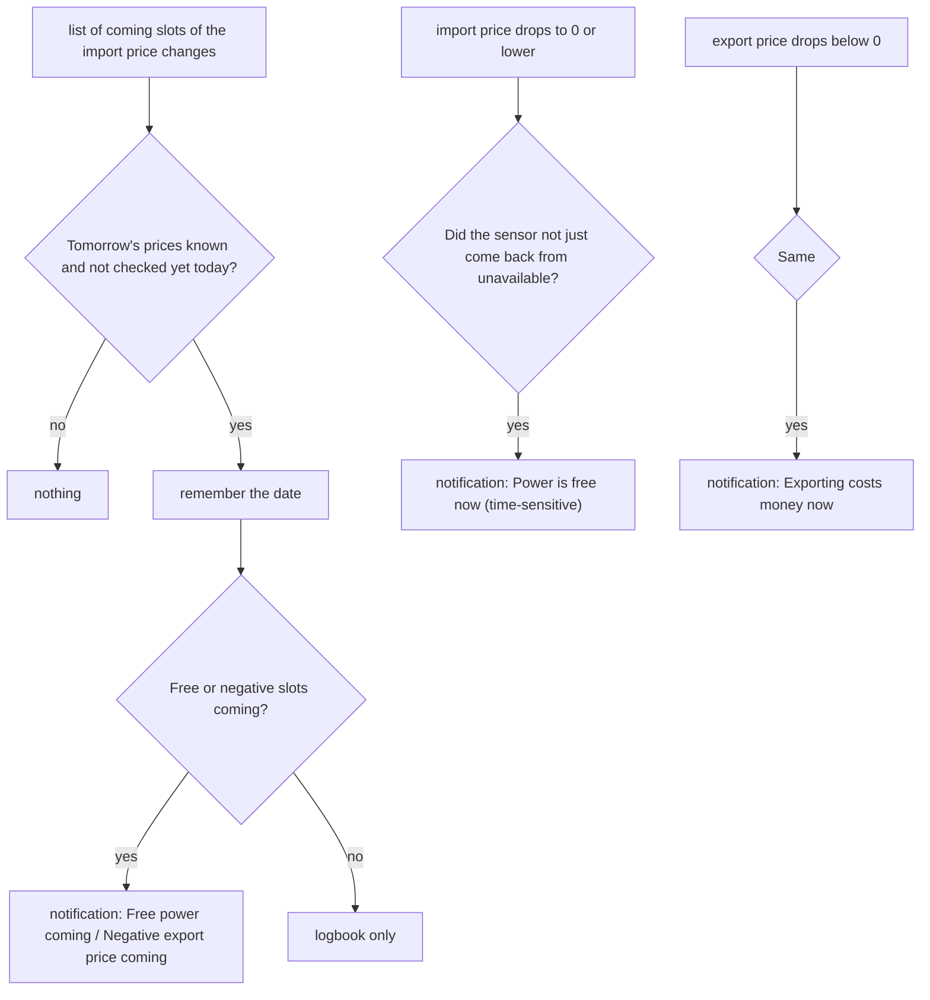
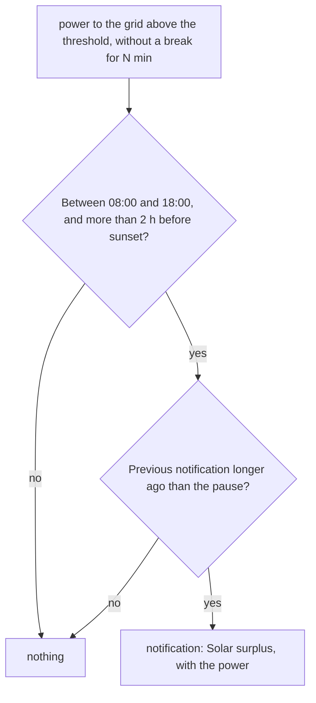
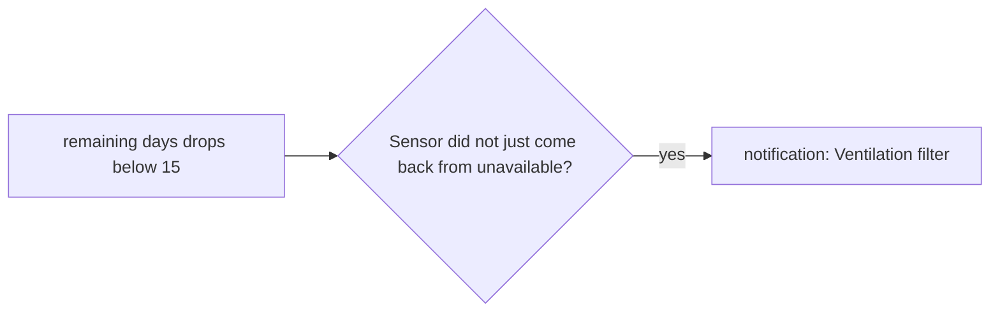

# Logic: <@ module.name @>

<!-- Filled in by tools/fill.py: values for the examples below (kept in a comment so a markdown formatter leaves them alone).
<% from '_notifications.jinja' import m, kinds, ent, kinds_text with context %>
<% from '_notifications.jinja' import price_import as role_import with context %>
<% set price_import = role_import or 'sensor.price_import' %>
<% set grid = ent.get('grid_export_w') or 'sensor.grid_export' %>
<% set s = module.defaults %>
<% set skw = s['input_number.notification_surplus_kw'] %>
<% set smin = s['input_number.notification_surplus_minutes'] %>
<% set spause = s['input_number.notification_surplus_pause_h'] %>
-->

## In one sentence

The house tells you what saves or costs you money: power that becomes free or for which exporting costs money (ahead and at the moment itself), solar power going to the grid while you could have used it yourself, and a ventilation filter that almost needs replacing.

Every notification goes through `script.send_notification` to everyone in `notifications.recipients` (or everyone with a `notify`). Other modules can use that same script. You choose which notifications exist with `notifications.kinds` (in this house: <@ kinds_text @>). The texts follow `house.language` (`strings.yaml`).

## Flow chart

### Power price (`automation.notification_free_or_negative_power`)

### Solar surplus (`automation.notification_solar_surplus`)

### Ventilation filter (`automation.notification_ventilation_filter`)

## Triggers

| Automation                            | Trigger                                                                                                   | Why                                                                                       |
| ------------------------------------- | --------------------------------------------------------------------------------------------------------- | ----------------------------------------------------------------------------------------- |
| `notification_free_or_negative_power` | attribute `starts` of `entities.price_import` changes (`ahead`)                                           | That list grows as soon as tomorrow's prices are there. Checked once per day               |
|                                       | `entities.price_import` drops below 0.0001 €/kWh (`free_now`)                                             | Free = 0 or less; 0.0001 catches rounding                                                  |
|                                       | `entities.price_export` drops below 0 €/kWh (`export_now`, only when filled in)                           | From then on every kWh to the grid costs money                                             |
| `notification_solar_surplus`          | `entities.grid_export_w` (counted in kW) above `notification_surplus_kw`, for `notification_surplus_minutes` | A short peak (a cloud passing, a kettle switching off) is no surplus                    |
| `notification_ventilation_filter`     | the filter sensor (`entities.ventilation_filter_days`, or the one of the module ventilation-zehnder) drops below 15 | Two weeks: enough time to order filters                                         |

## Conditions and decisions

| Situation                                                                 | What happens                                                                            | Logbook (Notifications)                   |
| ------------------------------------------------------------------------- | --------------------------------------------------------------------------------------- | ----------------------------------------- |
| Tomorrow's prices known, free import or negative export coming            | notification with the windows, e.g. "13:00–15:30, tomorrow 12:00–14:00"                 | "tomorrow's prices known · …"             |
| Same, nothing free or negative                                            | no notification                                                                         | "… · no notification"                     |
| Tomorrow's prices already checked earlier today                           | nothing (`input_datetime.notification_price_ahead` = today)                             | -                                         |
| Import price becomes 0 or negative                                        | notification "Power is free now", time-sensitive (iOS: also through Focus)              | "import free · …"                         |
| Export price becomes negative                                             | notification "Exporting costs money now" with the end of the window                     | "export negative · …"                     |
| Same, with `ev-charging` installed, its cheap power on (`input_boolean.ev_charging_cheap_enabled`) and the sun up | no notification from here: ev-charging announces the cheap window itself (`ev_charging_notify`) | "export negative · …" |
| Price sensor comes back from `unavailable` or `unknown` with a low price  | nothing: that is no new free period                                                     | -                                         |
| Surplus above the threshold, inside the time window, pause over           | notification "Solar surplus" with the power                                             | "… kW to the grid · notification sent"    |
| Surplus, but within the pause after the previous notification             | nothing; comes back only when the surplus first drops below the threshold and rises again | -                                       |
| Filter: fewer than 15 days                                                | notification with the number of days                                                    | -                                         |

The examples are the English texts; with `house.language: nl` the Dutch ones from `strings.yaml`.

### Who gets the notifications

| Setting in `house.yaml`                | Recipients                                                         |
| -------------------------------------- | ------------------------------------------------------------------ |
| `notifications.recipients` empty       | everyone in `people` with `notify`                                 |
| `notifications.recipients: [jan]`      | only those people (with `notify`)                                  |
| nobody with `notify`                   | filling in stops with an error                                     |

A caller can pass `only_home: true` to `script.send_notification`: then only the recipients whose person entity (`people[].person`, default `person.<key>`) is `home` get it. Nobody at home = nobody gets it (the caller writes its own logbook line).

`script.send_notification` sends one notification per phone, with `continue_on_error`: a phone that is offline does not stop the others. With `notifications.tap_url` a tap on the notification opens that page (unless the module itself passes a `url`).

### What the price sensor needs

The notification ahead reads the **attributes** of `entities.price_import` (and `price_export`):

| Attribute           | Content                                                                          | Needed for                    |
| ------------------- | -------------------------------------------------------------------------------- | ----------------------------- |
| `starts`            | list with the start times (ISO) of the coming slots, quarter-hour or hour        | notification ahead, windows   |
| `prices`            | list with the prices in €/kWh, as long as `starts` (`prijzen` also works)        | notification ahead, windows   |
| `negative_upcoming` | (alternative for the export sensor) start times of the negative slots (`negatief_komend` also works) | windows export |

The state of the sensor is the price of now in €/kWh (all-in: with grid tariffs and VAT, as on your bill). The module `tariff-be` (or another module that provides `tariff`) delivers such sensors: with it in `modules:`, empty roles default to `sensor.power_price_import` and `sensor.power_price_export`. Without one you fill in a sensor of your own. Without `starts` and `prices` the notifications "free now" and "exporting costs money now" work, but the notification ahead does not.

## Settings

| Helper                                       | Default        | Unit  | Effect                                                                                           |
| -------------------------------------------- | -------------- | ----- | ------------------------------------------------------------------------------------------------ |
| `input_number.notification_surplus_kw`¹      | <@ skw @>      | kW    | From this power to the grid on there is a surplus. Lower = more notifications                    |
| `input_number.notification_surplus_minutes`¹ | <@ smin @>     | min   | The surplus has to last this long without a break                                               |
| `input_number.notification_surplus_pause_h`¹ | <@ spause @>   | h     | At most one surplus notification per this many hours                                             |
| `input_datetime.notification_price_ahead`²   | -              | date  | Internal: the day on which tomorrow's prices were already checked. Clear it = check again today  |

¹ only with kind `surplus`. ² only with kind `power_price`.

`deploy.py` sets the defaults once, when the helper is new (from `module.yaml`, `defaults:`). After that your value stays: the helpers have no `initial`. Turning a kind of notification off also works without `house.yaml`: turn the automation off in Settings > Automations & scenes.

Fixed values in the code (deliberately no helper):

| Value                                   | Where               | Why                                                              |
| --------------------------------------- | ------------------- | ---------------------------------------------------------------- |
| free = below 0.0001 €/kWh               | power price         | rounded values of 0 count as free                                |
| 08:00–18:00, until 2 h before sunset    | surplus             | after that there is too little sun left to start an appliance    |
| 15 days                                 | ventilation filter  | enough time to order filters                                     |
| slot of 15 min when the sensor does not give two | `price_windows()` | quarter-hour prices are the norm in Belgium                 |

## Edge cases

1. **Price sensor without `starts` and `prices`** (e.g. the raw Nord Pool sensor): the notification ahead never comes, "free now" does. `deploy.py` reports it.
2. **The list `starts` changes every quarter-hour.** The automation checks every time, but notifies only once per day: the date is in `input_datetime.notification_price_ahead`.
3. **A power sensor in kW.** The role is called `grid_export_w`, but a sensor in kW works too: the module converts based on `unit_of_measurement` (W or kW).
4. **Surplus that is briefly interrupted** (a cloud, an appliance switching on): the waiting time starts over. The original setup had a sliding average over 10 min in between; that absorbs short dips and so notifies a bit more often.
5. **Surplus during the pause**: no notification, and no later one either while the surplus lasts. Only after a drop below the threshold and a new rise.
6. **Restart of Home Assistant**: the waiting time for the surplus starts over; the pause stays (it reads `last_triggered` of the automation).
7. **A phone that is offline** does not get the notification; the others do (`continue_on_error`).
8. **Tomorrow's prices only arrive after midnight**: then the last slot no longer lies "after today" and there is no notification ahead for that day.

## What it does not do

- **Controls nothing.** No battery, car or boiler: that is for `ev-charging`, `hot-water` and the other phase-4 modules.
- **No cheap-window notification.** "Cheap power until …" and "Cheap power over" (with the status of "use cheap power") are sent by `ev-charging` (`automation.ev_charging_notify`, daytime, only while its cheap power is on). While that is the case this module leaves out its own "Exporting costs money now" (the same moment); "Power is free now" and the notification ahead stay here.
- **Calculates no prices.** The all-in price (grid tariff, surcharges, VAT) comes from the sensor in `entities.price_import`.
- **No notifications per person per kind.** Everyone in `notifications.recipients` gets everything from this module.
- **No quiet hours.** A notification "Power is free now" at 3 am comes too (time-sensitive). Turn the automation off or use Focus on the phone.

## Test plan

| #   | Test                    | How                                                                                                                         | Expected                                                                          |
| --- | ----------------------- | --------------------------------------------------------------------------------------------------------------------------- | --------------------------------------------------------------------------------- |
| 1   | Script                  | Developer tools > Actions: `script.send_notification` with `title: Test`, `message: Hello`                                  | Every recipient gets the notification                                             |
| 2   | Macro recipients        | Template: `{{ recipients() }}`                                            | The notify services from `house.yaml`                                             |
| 3   | Windows                 | Template: `{{ price_windows('<@ price_import @>', 0.30) }}`             | Slots below 0.30 €/kWh, merged. Empty without the attribute `prices`              |
| 4   | Ahead                   | Clear `input_datetime.notification_price_ahead` (or set an old date) after 2 pm; wait for the next quarter-hour             | Logbook "tomorrow's prices known · …"; notification when something is free or negative |
| 5   | Free now                | In Developer tools > States set `<@ price_import @>` to `0.10`, then to `-0.01` (keep the attributes)                       | Notification "Power is free now". Put the real state back                         |
| 6   | Back from unavailable   | Set the sensor to `unavailable`, then to `-0.01`                                                                            | No notification                                                                   |
| 7   | Surplus                 | Set `notification_surplus_minutes` to 1 and `notification_surplus_kw` just below the current power to the grid (daytime)    | After 1 min notification "Solar surplus"; again within the pause: no notification |
| 8   | Filter                  | In States set the filter sensor from 20 to 10                                                                               | Notification "Ventilation filter"                                                 |
| 9   | Language                | Fill in with `house.language: nl`, deploy, repeat test 1 with a kind (e.g. test 5)                                          | Dutch title and message                                                           |
| 10  | Only at home            | Test 1 with `only_home: true`, once with a recipient away                                                                   | Only the recipients at home get it; nobody at home = no notification              |
