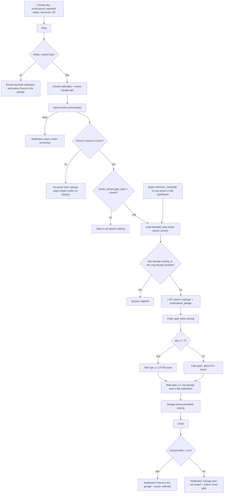

# Logic: <@ module.name @>

<!-- Filled in by tools/fill.py (kept in a comment so a markdown formatter leaves it alone).
<% set ajar = parcel_service.ajar_s %>
<% set open_time = parcel_service.open_s %>
-->

## In one sentence

On a day you expect a parcel, the courier puts it in the garage: the doorbell sees the parcel, the garage door opens briefly (fully or ajar) and closes again, without anyone in the house having to do anything.

## Flow chart

## Triggers

| Trigger                                                          | Entity role                                      | Why                                                                     |
| ---------------------------------------------------------------- | ------------------------------------------------ | ----------------------------------------------------------------------- |
| ring (in `automation.doorbell_ring`, module doorbell)            | `entities.doorbell_button`                       | the decision belongs to the ring: same photos, same notification        |
| `mobile_app_notification_action` `PARCEL_GARAGE`                 | button in the parcel notification, dashboard     | backup when Gemini misses the parcel; passes the id of the ring         |
| `mobile_app_notification_action` `DOORBELL_GARAGE`               | button "Parcel in the garage" in every notification | also on a normal day: open the gate fully for 1 min for a parcel     |
| `event.received` `detected` (parcel left, off by default)        | `entities.doorbell_package`                      | Protect sees a parcel on the ground with the package camera             |

## Conditions and decisions

| Situation                                                            | What happens                                                                                                    | Configurable                         |
| -------------------------------------------------------------------- | --------------------------------------------------------------------------------------------------------------- | ------------------------------------ |
| Ring on the parcel day                                               | critical notification (through Silent and Focus, full volume) to everyone, with the button "Garage ajar (N s)"  | `input_datetime.parcel_expected`     |
| Gemini sees a parcel in a hand or a courier, gate closed             | automatically `script.doorbell_reply` (button `parcel_service`): LCD "Leave in garage", gate open or ajar       | -                                    |
| Gemini sees nothing, fails, or the gate is not closed                | the gate stays closed; the notification says why and keeps the backup button                                   | -                                    |
| Second press for the same ring (another phone, or after the automation) | ignored: the first press wins (`input_text.parcel_service_ring` = id of the ring)                            | -                                    |
| Press while an ajar is running                                       | ignored (`script.parcel_garage` runs `single`)                                                                  | -                                    |
| Press without an id (dashboard)                                      | always allowed, except while an ajar is running                                                                 | -                                    |
| `ajar_s` > 0                                                         | `ajar_s` s after leaving the end position a STOP pulse; after `open_s` s a CLOSE pulse                          | `input_number.parcel_service_ajar`   |
| `ajar_s` = 0                                                         | fully open: about 25 s travel + `open_s` s, then `script.gate_close_manual`                                     | `input_number.parcel_service_open`   |
| Gate was already open or position unknown                            | no pulse, notification "Garage door not opened"; a gate that was already open is never closed by the script     | -                                    |
| No movement within 30 s after the pulse                              | notification "Garage door not opened", stop                                                                     | -                                    |
| Someone closes the gate while waiting                                | logbook "already closed", no more pulses                                                                        | -                                    |
| Not closed 1 min after the close pulse                               | notification "Garage door not closed" with button **Close gate** (`GATE_CLOSE`, handled by the module gate)     | -                                    |
| After a successful ajar                                              | the day stays active: a later ring with a parcel opens again                                                    | button Off                           |
| A day in the past                                                    | counts as off by itself; "off" = 01-01-2000                                                                     | -                                    |

The examples are the English texts; with `house.language: nl` the Dutch ones from `strings.yaml`. The LCD text "Leave in garage" is English in every language: couriers often do not speak the local language.

## Settings

| Helper                                 | Default                                       | Unit    | Effect                                                                                           |
| -------------------------------------- | --------------------------------------------- | ------- | ------------------------------------------------------------------------------------------------ |
| `input_datetime.parcel_expected`       | 2000-01-01 (off)                              | date    | the parcel day; set through `script.parcel_expected` (today, tomorrow, off) or directly          |
| `input_number.parcel_service_ajar`     | <@ ajar @> (from `house.yaml`)                | s       | travel time until the STOP pulse; 0 = fully open. About 6 s gave about 50 to 70 cm in the original setup |
| `input_number.parcel_service_open`     | <@ open_time @> (from `house.yaml`)           | s       | how long the gate stays open or ajar                                                             |
| `input_text.parcel_service_ring`       | empty                                         | text    | id of the last handled ring (internal)                                                           |
| automation `doorbell_parcel_left`      | off after the first install (`deploy.py`)     | on/off  | notification when Protect sees a parcel on the ground and Gemini confirms it                     |

`script.parcel_garage` also has the fields `open_s` (default 60), `ajar_s` (default 0) and `parcel_service` (live view + photo); the button "Parcel in the garage" uses the defaults.

## Edge cases

- **Ajar needs a controller that stops.** Ajar works with three pulses on the same input: OPEN, STOP, CLOSE. That only works when your controller **stops** on a pulse while moving (sequence OPEN-STOP-CLOSE-STOP; on a GfA TS 970: menu item 2.6 = `.2`). When your controller reverses on a pulse (OPEN-CLOSE-OPEN), the "STOP" pulse closes the gate and the "CLOSE" pulse then opens it fully. That is why ajar is **0** (fully open) by default in the kit. Test first with the remote: press again while it opens. If the gate stops, ajar is possible.
- **The height of the opening is timing.** It depends on the reaction time of the relay and HA. Adjust it with "Parcel service ajar". Some controllers can do an exact partial opening themselves (GfA with P 1.6 + P 2.9 and a switch on an extra input): wiring, a professional, not in the kit.
- **The 30 s lock of the pulse.** `script.gate_pulse` (module gate) ignores a pulse within 30 s of the previous one, so two people pressing do not stop or reverse the gate. The STOP and CLOSE pulses of the ajar therefore use `force: true`.
- **One ajar per ring.** Every ring gets an id (the state of the bell button entity = time). It goes along in `action_data` of the notifications and comes back in the button event. When the notification reaches several phones, the first press wins (or the automation); the rest is ignored (logbook "ajar ignored"). Tested: the same id was ignored in 16 ms without the gate moving.
- **The day stays active.** An earlier version set the day to off after an ajar, even when the parcel day was tomorrow. Now the day stays until Off or until it has passed: when a second courier rings, the gate opens again.
- **Photo before closing.** With the gate closed a garage is often dark and the camera still switches to night vision; a photo after closing was black. That is why the photo is taken just before the CLOSE pulse, with daylight through the opening, and the notification with that photo only comes after closing.
- **Photo cell.** Closing relies on the safety of the controller. When the courier is still in the opening, the gate normally reverses and "Garage door not closed" follows.
- **HA does not know who moved the gate.** When someone opens it with the remote within 30 s of a pulse that did not come through, the script thinks it opened the gate itself and closes it after the waiting time.
- **The relay drops out.** At the STOP pulse: the gate opens fully, the CLOSE pulse still closes it (from the OPEN end position the next step is CLOSE). At closing: no pulse, after 1 min the notification with Close gate.
- **Gemini makes a mistake.** It can miss a parcel (gate stays closed, backup button) or take something for a parcel (gate opens). Both are in the logbook and the calendar.

### Why "parcel left" is off by default

1. **Only with a package camera.** The event only exists with a doorbell with a downward camera (G4 Doorbell Pro), and that camera is disabled by default in the UniFi Protect integration.
2. **Protect reports false parcels.** Tested: Protect reported a "parcel left" while the ground was empty (the box had already been taken in), 8 s before a ring. Without a check the speakers, Nest Hub and TV then announced "parcel left". The automation now lets Gemini look first and only notifies when something is really there; that costs an extra Gemini call per event and the notification comes about 5 s later.
3. **Noise.** Every parcel gives an announcement on every speaker, the Nest Hub and the TV. Not everyone wants that.

Turning it on: Automations > "Doorbell: parcel left" > on (or the switch on the example card). It then stays on, also after a restart and after a new `deploy.py`. The automation deliberately has no `initial_state`: `deploy.py` turns it off **once**, only when that run creates it (the same approach as the helpers with a default). When it already exists, `deploy.py` leaves it on or off as you set it. On the first install it is on for a few seconds between being created and being turned off.

## Coordination with the module gate

The parcel service drives the gate through `script.gate_pulse` and `script.gate_close_manual` and reads `binary_sensor.gate_open`, all three from the module gate. What the gate itself does while a parcel goes in:

- **"Gate open too long" stays silent during a delivery.** `automation.gate_open_too_long` (gate) gets, when `parcel-service` is in `modules:`, the condition that `script.parcel_garage` is off. Normally that does not matter (the notification only comes after `gate_open_alert_minutes`, default 10 min), but it does when you set "Parcel service open" long. The trigger fires once per open period: when the gate stays open after the delivery, the parcel service's own notification "Garage door not closed" (with **Close gate**) takes over. When you add the parcel service later: fill in again and run `gate/deploy.py` again too.
- **The button Close gate (`GATE_CLOSE`)** in "Garage door not closed" is handled by exactly one automation: `automation.gate_notification_action` (gate). It only closes when the end position reports open and replies to whoever pressed. The parcel service itself only has handlers for `DOORBELL_GARAGE` and `PARCEL_GARAGE`.
- **Opening on arrival and closing after departure** do not interfere: `gate_auto_open` gives no pulse on an open gate, `gate_close_after_departure` only fires when a car drives away.
- **A gate sensor is required.** Without `entities.gate_sensor` there is no `binary_sensor.gate_open`; filling in then stops with an error.
- **Reason in the gate's logbook.** The pulses pass `reason` (the field of the gate scripts) with a text from `strings.yaml` ("parcel", "parcel ajar (stop)", "parcel close").

## What it does not do

- No partial opening through the controller itself; the ajar is a timed STOP pulse.
- Never opens without a parcel day, except after a press on "Parcel in the garage" (with Face ID / unlocking).
- Never opens when the gate is not surely closed, and never closes a gate that was already open.
- No recognition of the courier or the company; "courier" = uniform, logo or handheld scanner in the photo.
- Does not turn the day off by itself after a delivery.
- No parcel tracking (track & trace): you choose the day yourself.

## Test plan

Without the gate opening unexpectedly:

1. `script.parcel_expected` with `day: tomorrow`: the date jumps to tomorrow, logbook "parcel expected tomorrow". Ring with a box: normal notification, not critical, the gate stays closed.
2. Open the gate (by hand) and set the day to today. Ring with a box: "The gate is not closed: the garage does not open." Nothing moves.
3. Gate closed, day today, **someone at the gate**. Ring without a box: critical notification, then "No parcel seen: the garage stays closed."
4. Same, long-press the notification > "Garage ajar/open": the gate moves, notification with the garage view, closed after `open_s`, "Parcel in the garage" with photo. Press again on the same notification: logbook "ajar ignored · already handled".
5. Ring with a box in your hand: same course, without a button.
6. Set the ajar (only when your controller stops, see Edge cases): "Parcel service ajar" to 6 s, repeat step 4, measure the opening, adjust.
7. `script.parcel_expected` with `day: off`.
8. Language: fill in with the other `house.language`, deploy doorbell and this module, repeat step 1: logbook and notifications in that language.
