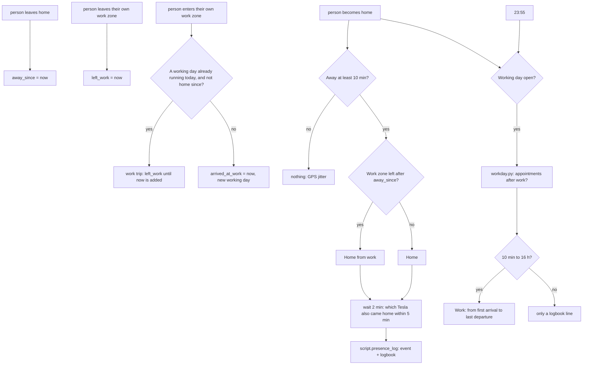
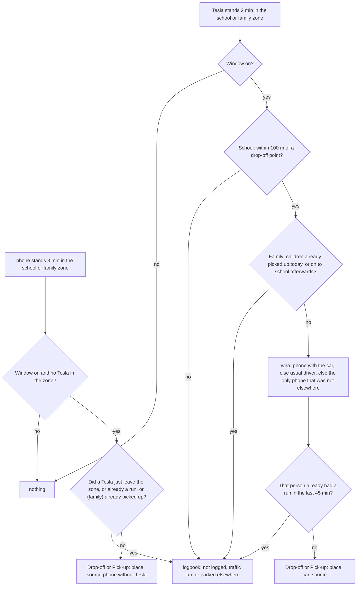
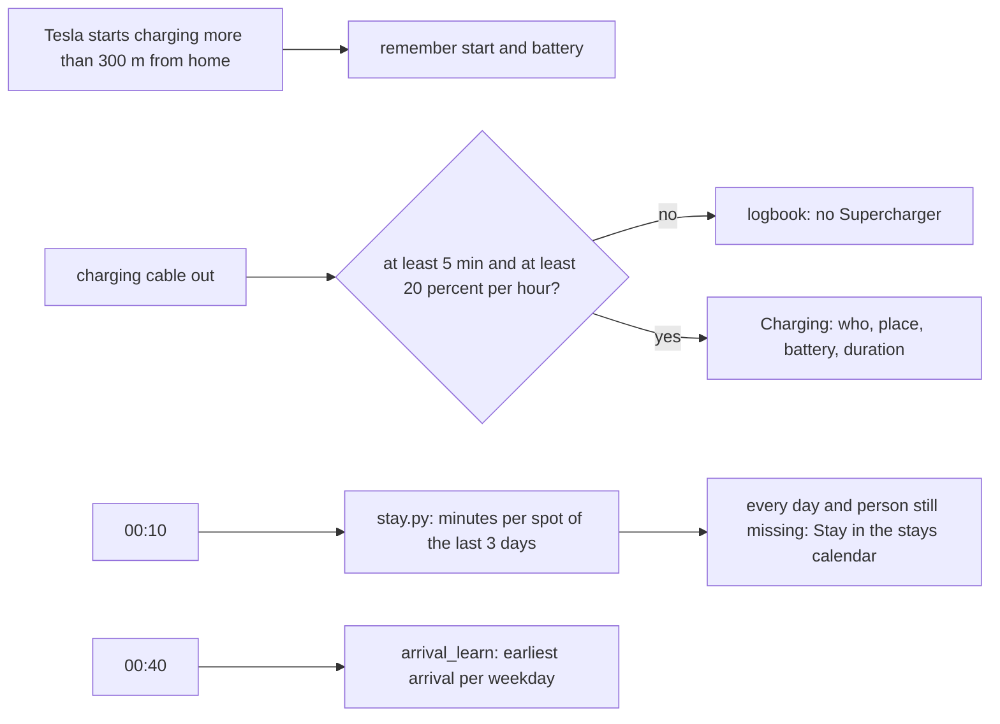

# Logic: <@ module.name @>

<!-- Filled in by tools/fill.py: values for the examples below (kept in a comment so a markdown formatter leaves them alone).
<% set tracked = people | selectattr('phone', 'defined') | selectattr('phone') | list %>
<% set p1 = tracked[0].key if tracked else 'jan' %>
<% set n1 = tracked[0].name if tracked else 'Jan' %>
<% set n2 = tracked[1].name if tracked | length > 1 else 'Lien' %>
<% set cl = cars if cars is defined and cars else [] %>
<% set car1 = cl[0].name if cl else 'the Tesla' %>
<% set loc1 = car_entity(cl[0], 'location') if cl else 'device_tracker.<prefix>_location' %>
<% set pl = (presence.get('places') if presence is defined and presence else []) or [] %>
<% set schoolzone = (pl | selectattr('kind', 'defined') | selectattr('kind', 'eq', 'school') | map(attribute='name') | first) | default('School') %>
<% set famzone = (pl | selectattr('kind', 'defined') | selectattr('kind', 'eq', 'family') | map(attribute='name') | first) | default('Grandparents') %>
<% set k_home = t('kind_home') %>
<% set k_hfw = t('kind_home_from_work') %>
<% set k_drop = t('kind_drop_off') %>
<% set k_pick = t('kind_pick_up') %>
<% set k_work = t('kind_work') %>
<% set k_charge = t('kind_charge') %>
<% set k_stay = t('kind_stay') %>
<% set w_and = t('word_and') %>
<% set unk = t('unknown') %>
<% set learn = t('learn_alias') %>
-->

## In one sentence

Whoever gets home, goes to work, takes the children to school or picks them up, or charges at a Supercharger, automatically gets an event for it in an ordinary calendar, and the tab "Our week" turns that into a calm picture of the week.

Everything is **derived from positions**: the person entity (phone) and, when there are any, the Teslas. Nobody has to tap anything. What was logged wrongly, you correct in the calendar; the card counts with the correction.

Texts follow `house.language`. The quotes below are the English texts (`strings.yaml` has the Dutch ones); event titles in this house are shown as they are filled in.

## Flow chart

### Arrival and working day

### School run and picking up at family

### Supercharger and stays

## Triggers

| Automation                  | Trigger                                                                                    | Threshold and why                                                                                       |
| --------------------------- | ------------------------------------------------------------------------------------------ | ------------------------------------------------------------------------------------------------------- |
| `presence_track`            | `person.<key>` leaves `home`; `person.<key>` leaves their own work zone (zone trigger)     | timestamps the other automations read                                                                   |
|                             | a Tesla leaves the school or family zone (state, by zone name)                             | guard for the run without a Tesla: was the phone in that car?                                           |
|                             | the role `destination` of a car gets a value                                               | the destination disappears on arrival; needed for the name of a Supercharger                            |
| `presence_arrival`          | `person.<key>` becomes `home`                                                              | every person with a phone                                                                               |
| `presence_school_run_car`   | a Tesla stands **2 min** in the school zone or a family zone                               | measured: driving past 40 to 70 s, a real stop 5 to 12 min                                              |
| `presence_school_run_phone` | `person.<key>` stands **3 min** in those zones                                             | a phone reports less often than a car: one minute margin                                                |
| `presence_workday`          | `person.<key>` enters their own work zone; `person.<key>` becomes `home`; 23:55            | 23:55 closes a working day that did not end at home                                                     |
| `presence_supercharger`     | the role `charging_state` becomes `charging`, or `disconnected`                            | end = the moment charging stopped, not the moment the cable came out                                    |
| `presence_stays`            | 00:10                                                                                      | the recorder then has the whole previous day                                                            |
| `arrival_learn`             | 00:40                                                                                      | after the stays were saved                                                                              |

Zone names are used **literally** in the state triggers: a tracker in a zone has the name of that zone as its state (here e.g. "<@ schoolzone @>" and "<@ famzone @>"). The work zone uses a zone trigger (`zone.<key>`), its name does not matter there.

## Conditions and decisions

### What happens

| Situation                                                                       | What happens                                                                             | Logbook                                                   | Tunable                             |
| ------------------------------------------------------------------------------- | ---------------------------------------------------------------------------------------- | --------------------------------------------------------- | ----------------------------------- |
| Person gets home after at least 10 min away                                     | event "<@ k_home @>" with the absence ("away: 2 h 5 min (since …)") and the car          | "<@ k_home @>: … at …"                                    | fixed: 10 min                       |
| The same, and left their own work zone during this absence                     | "<@ k_hfw @>", with "left work: 17:02"                                                   | the same                                                  |                                     |
| Person gets home after less than 10 min                                         | nothing                                                                                  | none (trace: `away_min >= 10` fails)                      |                                     |
| Arrival in the work zone, no working day open                                   | new working day (`arrived_at_work`)                                                      | none                                                      |                                     |
| Arrival in the work zone, today's working day open and not home in between      | work trip: the time away counts as work                                                  | "back at work after a work trip"                          |                                     |
| Getting home or 23:55 with an open working day of 10 min to 16 h                | event "<@ k_work @>" from first arrival to last departure, or to the last appointment    | "<@ k_work @>: … at …"                                    | fixed: 10 min, 16 h                 |
| The same, shorter than 10 min or longer than 16 h                               | working day closed, not logged                                                           | "working day of … min not logged"                         |                                     |
| Tesla 2 min at school, window on, within 100 m of a drop-off point              | "<@ k_drop @>" (drop-off window) or "<@ k_pick @>" (pick-up window) with place, car and source | "<@ k_drop @>: …"                                    | schedules, drop-off points          |
| The same, further than 100 m from every drop-off point                          | not logged                                                                               | "… m from the nearest drop-off point: not logged"         | fixed: 100 m                        |
| Tesla 2 min at family, window on                                                | "<@ k_pick @>" with "place: at <zone name>"                                              | "<@ k_pick @>: …"                                         | `schedule.family_pick_up`           |
| The same, but the children were already picked up today after 11:00             | not logged: a visit                                                                      | "… already picked up today at …: not logged as a pick-up at family" | fixed: 11:00              |
| The same, and the same car is at school within 20 min                           | not logged as family; the run at school counts                                           | "… then drove to the school"                              | fixed: 20 min                       |
| Phone 3 min at school or at family, no Tesla in that zone                       | "<@ k_drop @>"/"<@ k_pick @>" with "source: phone without Tesla"                         | "<@ k_pick @>: …"                                         |                                     |
| The same, but a Tesla left the zone after the phone came in                     | not logged: the phone was probably in that car                                           | "… not logged: a Tesla left the zone at …"                |                                     |
| Someone already had a school run in the last 45 min                             | not that person again                                                                    | "not logged (already logged)"                             | fixed: 45 min                       |
| Run outside every window                                                        | nothing                                                                                  | none                                                      | schedules                           |
| Tesla charges more than 300 m from home and rose at least 20 %/h, at least 5 min | event "<@ k_charge @>" from start to stop with place, battery, duration                 | "<@ k_charge @>: …"                                       | fixed: 300 m, 20 %/h, 5 min         |
| The same, slower or shorter                                                     | not logged                                                                               | "… no Supercharger, not logged"                           |                                     |
| 00:10                                                                           | per day and person "<@ k_stay @>: <name>" in the stays calendar, when missing            | "stays saved: N new day(s)"                               | `presence.sleep_window`             |

### Who was in the car (school run by Tesla)

In this order:

1. **phone with the car:** the person stands in the same zone, or their phone gave a position within 300 m of the car in the 10 min before it drove in. Everyone who counts this way is listed ("<@ k_pick @>: <@ n1 @> <@ w_and @> <@ n2 @>").
2. otherwise the **usual driver** (`cars[].driver`), unless that phone is fresh (less than 20 min old) and more than 1 km from the car;
3. otherwise the **only** person whose phone was not demonstrably elsewhere;
4. otherwise nobody: not logged, with the reason in the logbook.

For a charging session: the phones within 300 m of the car, otherwise the usual driver, otherwise "<@ unk @>" (correct it in the calendar).

### Event format

The card reads the title. When you correct an event, use exactly this format (names as in `people[].name`). Titles of every language in `strings.yaml` are read; these are the ones this house writes:

| Title                              | Kind             | Meaning                                                                        |
| ---------------------------------- | ---------------- | ------------------------------------------------------------------------------ |
| `<@ k_home @>: <name>`             | `home`           | arrival, not from work                                                         |
| `<@ k_hfw @>: <name>`              | `home_from_work` | arrival after leaving the work zone during this absence                        |
| `<@ k_drop @>: <name>`             | `drop_off`       | school run in the drop-off window                                              |
| `<@ k_pick @>: <name> <@ w_and @> <name>` | `pick_up` | school run in the pick-up window, or picking up at family; several names joined with "<@ w_and @>" |
| `<@ k_work @>: <name>`             | `work`           | working day: start = first arrival, end = last departure before getting home   |
| `<@ k_charge @>: <name>`           | `charge`         | Supercharger: start = start, end = stop                                        |
| `<@ k_stay @>: <name>`             | (stays calendar) | all-day: minutes per spot, on the road and at night                            |

The description holds `key: value` lines (English keys below; the install language writes its own, and every language is read): `away` (with "since dd/mm hh:mm", the card computes the travel time from it), `left work`, `car`, `place`, `source`, `duration`; for Work also `arrival`, `departure`, possibly `work trip: 11:05-12:20, 14:00-14:30` and `appointments: …`; for Charging `place`, `location`, `battery: 14 → 99 %`. Picking up at family is a Pick-up with `place: at <zone name>`; the card recognises it by the zone name (`family:` in the card config).

### Language switch

Titles, detail keys, the word between names, "unknown" and the stay labels are matched against the texts of **every** language in `strings.yaml` (`_presence.jinja` builds the tables at fill time from `t.table`). So after switching `house.language` the card, `arrival_learn`, `presence_stays` and `backfill.py` keep reading the events written before. Limits:

- events are not translated; the calendar shows both languages for a while;
- a text that is reworded in `strings.yaml` is no longer recognised in old events: add a language rather than rewording one;
- a title typed by hand in a wording that is in no language of `strings.yaml` is skipped by the card (as before).

### Appointments after work (`workday.py`)

When it closes a working day, the automation refreshes `sensor.presence_workday`. That script looks for stops between the last departure from work and getting home:

- positions of the phone plus the Tesla that was in that person's work zone that day;
- stop = at least 10 min within 150 m, followed by a departure;
- appointment = a stop that starts before 20:00, lies outside every zone (+30 m) and does not overlap charging of that Tesla.

If there are appointments, the working day ends at the departure from the last one. The result only counts when it is from today and concerns the same departure (within 30 min).

### Stays (`stay.py`)

Per two consecutive positions of a phone: standing still (next position within 150 m, or slower than 2 km/h) counts for that spot (rounded to ±100 m), at most 16 h; otherwise on the road, at most 3 h. Positions less precise than 200 m do not count. Midnight splits. Home, work or elsewhere is decided by the card only when it shows the data, with the zones (radius + 50 m): when you move a zone, the whole history follows. At home in the sleeping window counts as asleep.

## Settings

| What                                | Default                                         | Where to change                                                  | Effect                                                                                          |
| ----------------------------------- | ----------------------------------------------- | ---------------------------------------------------------------- | ----------------------------------------------------------------------------------------------- |
| `schedule.school_drop_off`          | Mon to Fri 07:45 to 09:15                       | Settings > Helpers (start value from `house.yaml`)               | a school run in this window is a drop-off                                                       |
| `schedule.school_pick_up`           | Mon, Tue, Thu, Fri 15:30 to 18:30; Wed 11:45 to 14:00 | the same                                                   | a pick-up                                                                                       |
| `schedule.family_pick_up`           | Mon to Fri 12:00 to 20:00                       | the same                                                         | picking up at family only counts in this window                                                 |
| `input_datetime.arrival_<day>`      | 17:00 (or `arrival_defaults`)                   | learned every night                                              | start value until there are 3 arrivals on that weekday                                          |
| Sleeping window                     | 23:00 to 07:30                                  | `presence.sleep_window` in `house.yaml`, fill in and deploy again | at home in this window is asleep; older days: `backfill.py --stays --write --update`           |
| Zones                               | radius per kind (`module.yaml`)                 | Settings > Zones                                                 | larger = in earlier, but also more driving past                                                 |

`deploy.py` sets the schedules and the arrival times once, when the helper is new. After that your value stays. No helper has `initial`.

Fixed values in the code (deliberately no helper):

| Value                                    | Where                                    | Why                                                                                              |
| ---------------------------------------- | ---------------------------------------- | ------------------------------------------------------------------------------------------------ |
| 10 min away                              | arrival                                  | GPS jitter around the house puts a person away for minutes                                       |
| wait 2 min after arriving                | arrival (only with cars)                 | the phone's geofence usually fires before the car reports its parked position                   |
| 2 min (Tesla), 3 min (phone) in the zone | school runs                              | measured: driving past 40 to 70 s, a real stop 5 to 12 min                                       |
| 100 m from a drop-off point              | school run by Tesla                      | a traffic jam on the road next to the school is in the school zone but not at a drop-off point   |
| 45 min                                   | school runs                              | one run per person per drop-off or pick-up                                                       |
| 11:00 and 20 min                         | picking up at family                     | after a pick-up a stop at family is a visit; family and then school = the children were still at school |
| 300 m, 1 km, 20 min                      | who was in the car                       | phone and car were 2 to 71 m apart at the same moment; a phone reports every 1 to 5 min          |
| 300 m from home, 20 %/h, 5 min, 6 h      | Supercharger                             | home charging (AC) stays far below 20 %/h; 6 h = a session that stayed open                      |
| 10 min, 16 h                             | working day                              | shorter is driving past, longer is a forgotten departure                                         |
| 150 m, 10 min, 20:00, +30 m              | appointments after work (`workday.py`)   | a stop outside every zone before the evening                                                     |
| 150 m, 2 km/h, 200 m, 16 h, 3 h          | stays (`stay.py` and the card)           | the same rule in the script and in the card                                                      |

## Edge cases

1. **The `in_zones` trap when testing.** A zone trigger (work zone) looks at the tracker's `in_zones` attribute, not at the coordinates. With a simulated position (Developer tools > States) set `in_zones` as well: first `[]` (outside), then `[zone.<key>]` (inside). Otherwise nothing fires. Real updates fill it in themselves.
2. **Phone without location "Always".** With "While using" a phone sends almost nothing on the road. In the original house one phone sent almost nothing for days: arrivals came late or not at all, and the school runs only went through the usual driver. Set the Companion app to "Always" + "Precise location" and check the tracker's history after the first trip. With the module `gate`, its location permission watch reports when that falls back.
3. **Car without driver** (`cars[].driver` empty). In a school run without a phone with the car, step 2 of "who was in the car" drops out: with one person whose phone was not elsewhere, that person is listed; otherwise the run is not logged (reason in the logbook). A charging session without a phone with the car becomes "<@ k_charge @>: <@ unk @>". At an arrival the car is listed when it came home within 5 min, also without a driver; the own car wins when there is a driver. A driver without a phone does not count (they do not take part).
4. **A simulated `home` really logs.** In the original house a test logged a false "Home from work" while the person was on the road, and the helpers had to be put back by hand. Test with `person` only when that person really is at home, or clean up afterwards (event and helpers).
5. **Zone names are literal in triggers.** Renaming a zone only in the UI breaks the school rules without an error. Change `name` in `house.yaml`, fill in again and deploy.
6. **`zone.home` in the wrong place** makes arrivals, "away since", the 300 m of the Supercharger and "home" in the stays unreliable. In the original house `zone.home` lay 553 m further, on the daily route. Put `zone.home` on the parking spot (the gate module's `deploy.py`, or Settings > Zones).
7. **Old phone registration** linked to a `person`: it can report "home" while the person is away. One tracker per person. When a phone was replaced, put the old one in `presence.previous_phones` with the switch moment: `stay.py` and `backfill.py` then use the old one until that moment.
8. **Family on the daily route.** In the original house the cars drove past at 40 to 60 m on every trip, each time for less than 1 min; a real stop took 10 min. The 2-minute rule keeps driving past out. Keep the family zone small (75 m).
9. **First family, then school.** In the original house a car stood 6 min at family and then drove to the school, where the children were picked up. That is why the Tesla rule waits another 20 min after a stop at family: when the car is then at school, that run counts. The other way round (first school, then family) the stop at family is a visit.
10. **Fast charging gives power 0** in Teslemetry (Fleet Telemetry only sends AC values). A Supercharger is therefore recognised by place and speed, not by charging power.
11. **Recorder on SQLite.** `stay.py` and `workday.py` read the database directly (read only). With MariaDB or PostgreSQL they report `error` in their attribute; "Where we spend our time" and the appointments after work then drop out, the rest works.
12. **The sleeping window** is applied when saving. If you change it later, run `backfill.py --stays --write --update` for the days the recorder still has.
13. **One presence-card per page:** the card keeps its settings in a shared variable.
14. **Dashboard in auto mode:** `deploy.py --tab` cannot add a tab then. Take control of the dashboard first, or create the tab by hand (panel view, card config from `lovelace/our-week.yaml`).
15. **Language switch:** see "Language switch" above. The command_line sensors keep their English names in every language (their entity id follows the name).

## What it does not do

- **No control or surveillance.** It logs what happened, for the picture of the week and for other modules (learned arrival time). No notifications.
- **Does not know who drives.** Tesla does not report a driver; one phone in the car counts as "that person drives", with two phones in the car both names are listed.
- **Does not tell the children apart.** A run counts for "the children" together; children separately (at different moments) cannot be told apart.
- **Does not know days off.** A run on a day off within a window still counts as a school run.
- **Working from home or elsewhere** is not logged.
- **A shop or traffic jam of 10 min** on the way home counts as an appointment after work: correct the end of "<@ k_work @>: …" in the calendar.
- **Translates no events.** After a language switch the old events stay in their language (they are still read).
- **Cleans up nothing.** `deploy.py` adds and updates, but deletes no helpers, zones or events.

## Test plan

Developer tools > States overwrites a state until the next real update. **Put the real state back afterwards, and delete test events from the calendar.** Test with `person` only when that person really is at home (edge case 4). The examples use the first person from `house.yaml` (<@ n1 @>, key `<@ p1 @>`).

| #   | Test                       | How                                                                                                                                                         | Expected                                                                                                   |
| --- | -------------------------- | ----------------------------------------------------------------------------------------------------------------------------------------------------------- | ---------------------------------------------------------------------------------------------------------- |
| 1   | Log script                 | Run `script.presence_log`: kind <@ k_home @>, who "Test", a time                                                                                            | Event "<@ k_home @>: Test" + logbook line, in the right time zone                                          |
| 2   | Departure                  | `person.<key>` to `not_home`                                                                                                                                | `…_away_since` = now                                                                                       |
| 3   | Arrival                    | `…_away_since` 35 min back, then `person.<key>` to `home`                                                                                                   | After 2 min (without cars immediately) "<@ k_home @>: …" with "away: 0 h 35 min"                           |
| 4   | GPS jitter                 | Like 3, `away_since` 3 min back                                                                                                                             | Nothing (condition `away_min >= 10` fails in the trace)                                                    |
| 5   | From work                  | Like 3, first `…_left_work` to 20 min ago                                                                                                                   | "<@ k_hfw @>: …"                                                                                           |
| 6   | School run by Tesla        | Within a window: the car's tracker to the school name with lat/lon of a drop-off point and `in_zones: [zone.school]`, wait 2 min                            | "<@ k_drop @>/<@ k_pick @>: …", place, source "usual driver" or "phone with the car"                      |
| 7   | Driving past               | Like 6, back to `not_home` after 1 min                                                                                                                      | Nothing; `…_tesla_left_school_zone` = now                                                                  |
| 8   | Traffic jam next to school | Like 6, position 120 m from every drop-off point but inside the zone                                                                                        | Logbook "… m from the nearest drop-off point: not logged"                                                  |
| 9   | On foot                    | `person.<key>` to the school name, no Tesla in the zone, wait 3 min                                                                                         | "<@ k_pick @>: …", source "phone without Tesla"                                                            |
| 10  | Phone in a passing Tesla   | Test 7 right after the phone came in in test 9                                                                                                              | Logbook "… not logged: a Tesla left the zone"                                                              |
| 11  | Double                     | Test 6 twice within 45 min                                                                                                                                  | Second time: "not logged (already logged)"                                                                 |
| 12  | First family, then school  | Within the pick-up window: tracker 2 min on the family name (with `in_zones`), then on the school name at a drop-off point                                  | Logbook "… then drove to the school"; 2 min later "<@ k_pick @>: …" at school                              |
| 13  | First school, then family  | After a logged pick-up today (after 11:00): tracker 2 min on the family name                                                                                | Logbook "… already picked up today at …: not logged as a pick-up at family"                                |
| 14  | Correcting                 | Change "<@ k_pick @>: …" in the calendar to another name                                                                                                    | The card shows it within 3 min                                                                             |
| 15  | Working day                | `person.<key>` to the work zone name with `in_zones: [zone.<work place>]`, 10 min later `not_home` with `in_zones: []`, then `home`                          | "<@ k_work @>: …" from arrival to departure                                                                |
| 16  | Too short                  | Like 15, within 10 min                                                                                                                                      | Logbook "working day of … min not logged"                                                                  |
| 17  | Work trip                  | Like 15, but after `not_home` the work zone again (without `home`), then `not_home`, then `home`. `…_away_since` before the first arrival                   | Logbook "back at work after a work trip"; one "<@ k_work @>: …" with the work trip line                    |
| 18  | No arrival home            | Like 15 without `home`                                                                                                                                      | At 23:55 "<@ k_work @>: …"                                                                                 |
| 19  | Supercharger               | A real charging session                                                                                                                                     | "<@ k_charge @>: …" with place, battery and duration                                                       |
| 20  | Stays                      | Developer tools > Actions: `homeassistant.update_entity` on `sensor.presence_stays`                                                                         | Attribute `days` filled, `error` empty (otherwise: SQLite?)                                                |
| 21  | Learning arrival times     | Run the automation `arrival_learn` ("<@ learn @>") after a few weeks                                                                             | `input_datetime.arrival_<day>` gets a quarter of an hour, only for days with at least 3 arrivals           |
| 22  | Language switch            | Switch `house.language`, fill in, deploy; open the tab                                                                                                      | Old events still on the card; new events in the new language; `arrival_learn` still counts the old ones    |
| 23  | A real week                | A week of ordinary life                                                                                                                                     | Every school morning and afternoon one run, every working day one "<@ k_hfw @>" per person. Read the logbook for "not logged" |

Example for test 6 with the first car (<@ car1 @>): set `<@ loc1 @>` to "<@ schoolzone @>" with `in_zones` and the coordinates of a drop-off point. Example for test 3: set `person.<@ p1 @>` to `home`.
