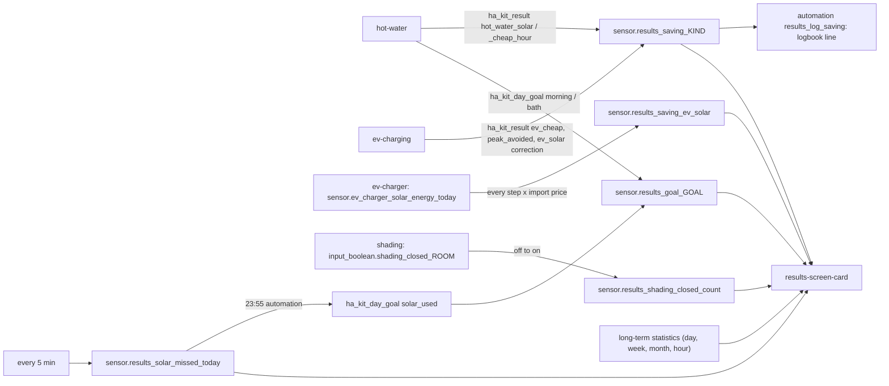

# Logic: Results

## In one sentence

Results listens to what the smart modules report (`ha_kit_result`, `ha_kit_day_goal`), sums it into one EUR sensor per kind and one sensor per day goal, counts the solar that was sold while the tank or the car still had room, and shows it all on one screen next to the consumption, the electricity cost, other contracts, last year and the invoice.

## Flow chart

## Triggers

| Trigger | Sensor or automation | Why |
| --- | --- | --- |
| event `ha_kit_result` with `kind: <kind>` | `sensor.results_saving_<kind>` | the producer reports one finished action |
| state of `sensor.ev_charger_solar_energy_today` (not `unknown`/`unavailable`) | `sensor.results_saving_ev_solar` | every step of the charger's solar counter |
| event `ha_kit_result` with `kind: ev_solar` | `sensor.results_saving_ev_solar` | a correction (e.g. a day before the tracking started) |
| state of `input_boolean.shading_closed_<room>` from `off` to `on` | `sensor.results_shading_closed_count` | a blind closed against the sun |
| time pattern every 5 min | `sensor.results_solar_missed_today` | export since the last look, with or without room |
| event `ha_kit_day_goal` with `goal: <goal>` | `sensor.results_goal_<goal>` | a goal was checked |
| time 23:55 | automation `results_solar_used_goal` | the day's solar goal |
| event `ha_kit_result` (installed kinds) | automation `results_log_saving` | one readable logbook line |
| state of `input_number.results_invoice_last_month` | `sensor.results_invoices` | an invoice was entered |

## Conditions and decisions

### Which sensors exist

Rendered at fill time from `modules:` and the capabilities (`_results.jinja`, kind table): `ev_solar` and `ev_cheap` with `ev-charging` and an `ev-charger` adapter; `hot_water_solar` and `hot_water_cheap_hour` with `hot-water`; `appliance_solar` and `appliance_cheap` with `appliances-home-connect`; `peak_avoided` with `ev-charging` or `hot-water`; the shading count with `shading` and at least one room whose blind closes on sun (blind, side, `shading` not false, `shading.sun_protection` not false); solar missed and the goal `solar_used` with a solar role (`solar_power_w` or `solar_energy_kwh`) and `hot-water` or an `ev-charger`; the goals `morning` with `hot-water`, `bath` with `hot_water.bath: true`. The screen also hides a line whose sensor does not exist yet, `ev_solar` without the charger's solar counter, and an extension kind (`ev_cheap`, `appliance_*`, `peak_avoided`) until its producer sent a first result.

### Saving per kind (EUR)

The basic rule: **saving = the kWh the house used smartly × what that kWh would have cost from the grid at that moment**. What exporting it would have earned is kept apart (`export_missed`), so "net" = saving − export missed.

| Kind | Formula | Computed by | Assumptions |
| --- | --- | --- | --- |
| `hot_water_solar` | kWh = degrees gained × kWh per degree; eur = kWh × mean import price of the start and end of the session; export_missed = kWh × mean export price | hot-water | kWh per degree = tank litres × 1.163 Wh/(l·K) ÷ COP (`sensor.hot_water_cop`, or `hot_water.cop`); heat losses ignored |
| `hot_water_cheap_hour` | eur = kWh × (reference price − price paid) | hot-water | reference = what heating later would have cost (the safety-net moment or the mean import price of the coming 24 h); may be negative when the cheap hour was not cheaper |
| `ev_solar` | per counter step Δ: eur += Δ × import price now; export_missed += Δ × export price now | results | the charger counts only surplus as solar; the price of the moment of the step (a step of a few minutes); a step without a price counts in `kwh_unpriced`, 0 EUR |
| `ev_cheap` (extension) | eur = kWh from the grid × (reference price − mean price paid) | ev-charging | reference = mean import price of the coming 24 h at the start |
| `appliance_solar`, `appliance_cheap` (extension) | eur = estimated kWh of the program × import price at the start (solar), or × (price when started at once − price at the start) | appliances-home-connect | Home Connect gives no energy: kWh per program is an estimate from `house.yaml` |
| `peak_avoided` (extension) | eur = ΔkW × capacity tariff (EUR/kW/year) ÷ 12 | ev-charging, hot-water | ΔkW = how much the month peak would have risen above max(month peak, minimum); one month peak is 1/12 of the 12-month average that is billed for 12 months: 12 × (ΔkW ÷ 12) × rate ÷ 12 = ΔkW × rate ÷ 12 |

Every event sensor adds `eur` to its state and `kwh`, `export_missed` (and `kw` for `peak_avoided`) to its attributes; `actions` counts the events. Missing or non-numeric values count as 0. The state never resets (`state_class: total`): today, this week and this month are the change in the long-term statistics.

### Counter step (`counter_step` in `custom_templates/results.jinja`)

kWh since the last stored reading: new − old when it rose (a step above 50 kWh counts 0: a reconfigured sensor); a drop counts the new value when the day changed (the daily counter was reset), else 0 (a glitch); 0 when a reading is unknown. Readings of `unknown`/`unavailable` are skipped, so a jump after an outage counts from the last good reading.

### Solar missed today (kWh)

Every 5 min: Δ = export total (sum of `entities.grid_export_kwh`) − the total of the last look. Δ counts as missed when at that moment there was room (`room_now()`): the tank (`input_boolean.hot_water_on_surplus` on and `sensor.hot_water_temperature` more than 3 °C below `input_number.hot_water_surplus_max`) or a car (`binary_sensor.ev_charger_connected` on, `sensor.ev_charger_status` not `complete`, `sensor.ev_charger_power` below 1000 W, and with ev-charging `sensor.ev_charging_energy_needed` > 0). Attribute `exported_today` sums every Δ. The first look of a new day starts from 0. Assumption: the room at the end of a 5-minute step holds for the whole step.

### Day goals

`morning` and `bath` come from hot-water (met when the tank is at least the goal − 0.5 °C). `solar_used` at 23:55: met when solar missed < `input_number.results_solar_missed_max_kwh`. results fires it as `ha_kit_day_goal` itself, so every goal goes through the same sensor. A goal sensor keeps the last result; attribute `date` is the day it counts for (the screen shows "measured at …" while today has no result). An event with a status other than `met`/`missed` changes nothing.

### Consumption and electricity cost (screen)

For today, this week (from Monday) and this month, from the change in the long-term statistics:

- used in the house = import − export + solar + battery out − battery in (the formula of HA's energy dashboard); self-supplied = 1 − import ÷ used;
- cost and earned = the cost sensors (`results.cost_sensors`) when set; otherwise Σ per hour of import kWh × mean import price of that hour − export kWh × mean export price (≈, up to the last full hour; kWh of an hour without a price is named and not counted);
- capacity tariff = average peak (`sensor.capacity_average_peak_kw`, at least `tariff.capacity.minimum_kw`) × rate (`input_number.tariff_capacity_eur_per_kw_year`, else the sensor's `cost_eur_per_year`) × days ÷ 365, with days = 1, the days since Monday, the day of the month;
- fixed fees = `input_number.tariff_fixed_eur_per_year` × days ÷ 365;
- electricity cost = cost + capacity + fixed − earned.

### Per month and the invoice

Monthly statistics of the last 6 (extended: 12) months. Cost as above (months older than last month without cost sensors: kWh × the mean price of the month, ≈). The average peak of a month is the mean of the 12 month peaks up to that month: the tariff sensor's remembered `peaks` first, then the monthly maximum of `sensor.capacity_month_peak_kw`, then `input_number.capacity_start_peak_kw` (> 0); every month at least the minimum. Months before `results.exact_from` show "–". The invoice of a month is in `sensor.results_invoices` (attribute `invoices`); the difference with the calculation is shown under it.

### Other contracts

For this and last month, per hour h of the hourly statistics: variable or fixed = Σ import_h × (contract price + levies + grid fee day/night of h) ÷ 100 − Σ export_h × export price ÷ 100, in EUR (prices in c€/kWh from the helpers; levies and grid fees from `window.haKitTariff.coefficients(hass)`, day/night from `window.haKitTariff.isNight`). Dynamic = the cost sensors (or the price estimate) over the same hours. The capacity tariff and the fixed fees are the same for every contract and left out. Without `window.haKitTariff` or with both prices 0 the block is hidden.

### Last year

Current month so far against `results.last_year` of the same month a year ago, scaled to the same number of days: last year × days so far ÷ days in the month. Shown only from `results.exact_from` on.

### What the house did

The `logbook.log` lines (not the state changes) of today on the master switches of the installed modules, results' own sensors and `results.log_entities`. Extended view: 3 days, plus every automation run with the device changes it caused (same context id), loaded with a 60 s limit.

## Settings

| Helper or field | Default | Meaning |
| --- | --- | --- |
| `input_number.results_invoice_last_month` | 0 (`defaults:`) | invoice of the previous month; 0 removes it |
| `input_number.results_solar_missed_max_kwh` | 1 kWh | goal `solar_used` is met below this |
| `input_number.results_compare_variable` | `tariff.compare.variable` or 0 | energy price of a variable contract, c€/kWh incl. VAT, without grid fee and levies; 0 = not compared |
| `input_number.results_compare_fixed` | `tariff.compare.fixed` or 0 | same for a fixed contract |
| `input_number.results_compare_export` | `tariff.compare.export` or 0 | export price of those contracts, c€/kWh |
| `results.exact_from` | - | first month with an exact cost |
| `results.cost_sensors` | - | cost and compensation sensors of the energy dashboard |
| `results.last_year` | - | last settlement per month (local only) |
| `results.view_path`, `results.log_entities` | `results`, - | view path; extra logbook entities |

## Edge cases

- **No price at that moment** (`sensor.power_price_import` unavailable): the car's kWh is counted in `kwh_unpriced`, 0 EUR; the screen's estimate names the kWh without a price.
- **Counter reset at midnight, late or early**: see "Counter step"; a value that has not reset yet on the new day counts 0.
- **Charger counter unavailable for a while**: the jump after it counts from the last good reading.
- **An export register unavailable**: solar missed adds nothing and keeps the last good total.
- **HA restart**: trigger-based template sensors restore their state and attributes; a 5-minute step across the restart is counted once.
- **Two results on the same tick**: every event is its own trigger; the logbook automation queues up to 20.
- **A producer installed later**: fill in again and deploy results; its sensor starts at 0.
- **First month**: the capacity average uses the start peak for months not measured yet.

## What it does not do

- It switches nothing and decides nothing: it only counts.
- It does not compute savings of a producer (except `ev_solar`): a producer that sends no event has no amount.
- No EUR for shading: how much cooling it saves cannot be measured.
- It does not read the invoice: you enter it.
- No real counterfactual: "what it would have cost" is a model (see the assumptions above).

## Test plan

1. `deploy.py --dry-run`: paths, defaults, automations, the sensors of this house; no connection. `--dry-run --live`: the real diff of the dashboard.
2. `deploy.py`: the helpers exist with their defaults, the sensors exist (unknown until their first trigger), the view `results` is the last view.
3. Developer tools > Events: fire `ha_kit_result` with `{kind: hot_water_solar, kwh: 2.5, eur: 0.75, export_missed: 0.1}`: `sensor.results_saving_hot_water_solar` = 0.75, attributes `kwh` 2.5, `actions` 1; a logbook line appears on the screen.
4. Fire `ha_kit_result` with `kind: foo`: nothing changes.
5. Let the car charge on solar: every step of `sensor.ev_charger_solar_energy_today` adds step × import price; check the next morning that the counter reset did not count.
6. Fire `ha_kit_day_goal` `{goal: morning, status: met, detail: test}`: the goal shows a tick with "test".
7. Evening: at 23:55 `sensor.results_goal_solar_used` gets today's date; the detail names the missed and the exported kWh.
8. Enter 100 in "Invoice last month": `sensor.results_invoices` has `[<last month>, 100]`; the screen shows it next to the calculation.
9. Screen: light and dark, phone and desktop, extended view; with the tariff module's `tariff.js` loaded the comparison shows; with both compare prices 0 it hides.
10. After a week: the week and month amounts match the statistics graph of the saving sensors.
