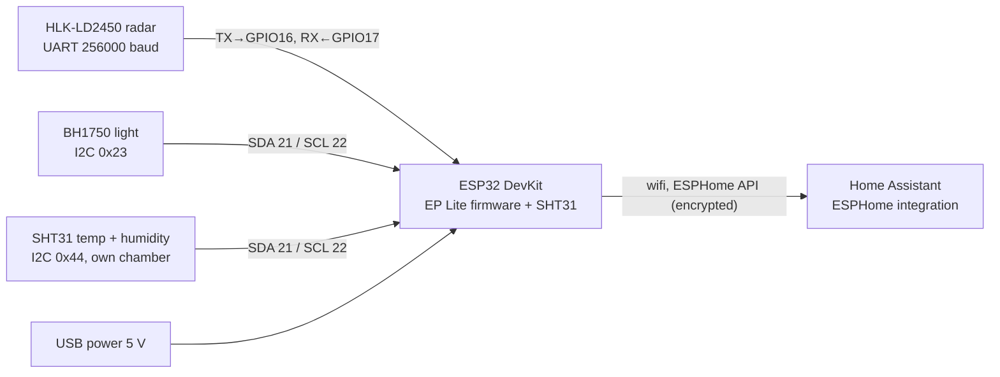

# Logic: <@ module.name @>

<!-- Filled in by tools/fill.py: values for the examples below (kept in a comment so a markdown formatter leaves them alone).
<% set ks = rooms | selectattr('sensor', 'defined') | selectattr('sensor') | list %>
<% set k1 = ks[0] if ks else none %>
<% set room = k1.name if k1 else 'Bedroom' %>
<% set pre = room | lower | replace(' ', '_') %>
<% set device = 'kamersensor-' ~ (k1.slug | replace('_', '-') if k1 else 'bedroom') %>
<% set offset = k1.get('temp_offset', -0.5) if k1 else -0.5 %>
<% set id_temp = t('entity_temperature') | lower | replace(' ', '_') | replace('-', '_') %>
<% set id_hum = t('entity_humidity') | lower | replace(' ', '_') | replace('-', '_') %>
<% set id_offset = t('entity_temperature_offset') | lower | replace(' ', '_') | replace('-', '_') %>
-->

## In one sentence

One ESP32 per room tells Home Assistant whether someone is there (radar), how much light there is, and the temperature and humidity; the device itself decides nothing.

## Flow chart

Wiring per pin: see README, "Wiring". The firmware is the Everything Presence Lite (EP Lite) of EverythingSmartHome, at a pinned commit, with the SHT31 and a correction on top.

## Triggers

No automations. The device reports on its own schedule:

| What | Source | Entity (example) | How often |
| --- | --- | --- | --- |
| Presence | LD2450 through the EP Lite packages | `binary_sensor.<room>_occupancy` | immediately on a change |
| Zones and targets | LD2450 (up to 3 targets, x/y in mm) | `zone_1..4_occupancy`, `target_1..3_*` | immediately |
| Light | BH1750 | `sensor.<room>_illuminance` | every 2 s (substitution `illuminance_update_interval`) |
| Temperature | SHT31 + correction | `sensor.<room>_<@ id_temp @>` | reading every 30 s, average of 4, sent every 2nd reading (± 1 min) |
| Humidity | SHT31 | `sensor.<room>_<@ id_hum @>` | same |

## Conditions and decisions

- The device **controls nothing** outside itself. What you can set in HA only goes to the device: the temperature correction, the zones and the radar settings of the EP Lite (range, delay before "absent", ...).
- The temperature is `reading + correction`; the correction is in `number.<room>_<@ id_offset @>` (starts at `temp_offset` from `house.yaml`, kept in the device).
- **Entity names in `house.language`.** The four entities this module adds (temperature, humidity, correction, the internal update entity) take their names from `strings.yaml`; Home Assistant derives the entity ids from them. `nl` keeps the names of the first version, so existing installations keep their ids. The EP Lite entities are English in every language. Table: README, "Entity ids depend on house.language".
- **Device name `kamersensor-<slug>`** in every language: the wiring drawing and the shared base `kamersensor.yaml` use that name, and the device name does not change the entity ids (those follow `rooms[].name`).

## Settings

| Setting | Where | Default | Why |
| --- | --- | --- | --- |
| `rooms[].sensor` | `house.yaml` | empty = no sensor | only rooms where a device hangs |
| `rooms[].temp_offset` | `house.yaml` | -0.5 °C | measured at the source: the SHT31 in the lower chamber still reads ± 0.5 °C too warm |
| `house.language` | `house.yaml` | `en` | names (and so entity ids) of the four added entities |
| Temperature correction | HA, per device | `temp_offset` | tune without flashing; survives a restart |
| Zones, max. distance, delay | HA, per device (EP Lite entities or the Everything Presence zone editor) | those of EP Lite | different per room |
| EP Lite commit | `esphome/kamersensor.yaml`, `packages: ref:` | `107478e7…` (main on 2026-09-27) | a new `main` can rename entities; change only together with a test build |

For <@ room @> in this house: device `<@ device @>`, start correction <@ offset @> °C.

## Edge cases

1. **The ESP32 warms up.** That is why the SHT31 sits in a separate, vented chamber at the bottom: warm air rises away from the sensor. A sensor loose next to the ESP32 easily reads 2–3 °C too high.
2. **Calibrating the correction.** On the first day put a reference thermometer next to the sensor (not in the sun, not above a radiator) and enter the difference in `number.<room>_<@ id_offset @>`. Then adjust `temp_offset` in `house.yaml`, so a new build has the same start.
3. **Radar through plastic.** 24 GHz passes through PLA and PETG, not through metal- or carbon-filled filament, "silk" or paint. Do not mount the sensor behind a cupboard or a metal strip.
4. **No firmware updates from EP Lite.** The official EP Lite firmware has no SHT31; an update from their manifest would remove the temperature. That is why the update entity points to an invalid address and is internal.
5. **Pinned commit.** The EP Lite packages come from GitHub at a pinned commit. Never follow `main` without a test build: entities can change names.
6. **Bathroom.** The SHT31 tolerates condensation but drifts when it gets wet often: mount it outside the direct spray of the shower.
7. **I2C addresses.** Leave the ADDR pins open (0x23 and 0x44). A connected ADDR gives another address and then the firmware does not find the sensor.
8. **Same name, other device.** The device name is `kamersensor-<slug>`. When an ESPHome device with that name already exists, they clash on the network (mDNS). Pick another `slug` then.
9. **Wifi after reflashing.** When the built-in wifi does not work, the device opens the hotspot "<room> Fallback" after ± 1 min (password `wifi_hotspot_password`).
10. **ESPHome warning about the OTA password.** `esphome config` reports that an OTA password next to the API key is superfluous. Kept on purpose: same structure as the other devices of the kit.
11. **Language changed after flashing.** A new `house.language` renames the four added entities, so HA creates new entity ids for them. Rename them in HA, or keep the language of the first build.

## What it does not do

- **No automations.** Light or ventilation on presence or humidity belongs to `climate` and `shading` (planned), not here.
- **No battery.** Radar and ESP32 use too much; the sensor needs a USB power supply.
- **No CO2, no Bluetooth proxy.** The EP Lite options `co2_enabled` and `bluetooth_enabled` are off.
- **Does not count people reliably.** The LD2450 sees up to 3 moving targets; someone lying very still can drop to "absent" after the delay.
- **Changes nothing in Home Assistant.** `deploy.py` only puts files in `/config/esphome/`.

## Test plan

The examples use `<@ device @>` ("<@ room @>"). Status: never flashed, so none of these steps has passed yet.

| # | Test | How | Expected |
| --- | --- | --- | --- |
| 1 | Files | `deploy.py --dry-run`, then `deploy.py` | `kamersensor.yaml` and one file per room in `/config/esphome/`; no missing keys |
| 2 | Validation | Device Builder: card of the device > menu > **Validate** | "Configuration is valid" |
| 3 | First flash | USB, **Install** > **Plug into this computer** | Log shows `wifi: Connected`, `sht3xd` and `bh1750` without errors |
| 4 | Pairing | HA > Settings > Devices > ESPHome > **Configure** with the API key | Device with the name of the room appears |
| 5 | Temperature | Look at the entities after 2 min | Temperature and humidity have a value; temperature = reading + correction |
| 6 | Correction | Set the correction to +1.0 | After ± 1 min the temperature is 1 °C higher (the average shifts first) |
| 7 | Restart | Restart the device (button ESP Reboot) | The correction stays |
| 8 | Light | Hand over the light sensor, then a lamp on | Lux drops and rises within a few seconds |
| 9 | Presence | Leave the room, wait until the delay has passed, come in | Occupancy goes off, and on again right when you come in |
| 10 | Sitting still | Sit still reading for 10 min | Occupancy stays on; if not: raise the delay or the range |
| 11 | Calibration | One day next to a reference thermometer | Difference < 0.3 °C after tuning the correction |
| 12 | Wireless | Change something small (e.g. the correction in `house.yaml`), fill in and deploy again, **Install** > **Wirelessly** | Flashes without USB; the correction in HA stays (the stored value wins) |
| 13 | Entity ids | Compare the entity ids with the table in the README | Temperature, humidity and correction carry the names of `house.language` |
