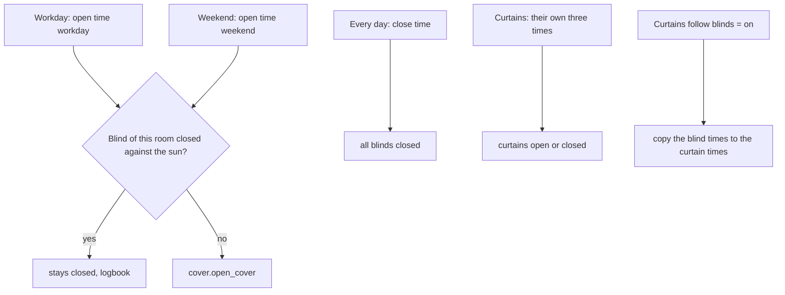
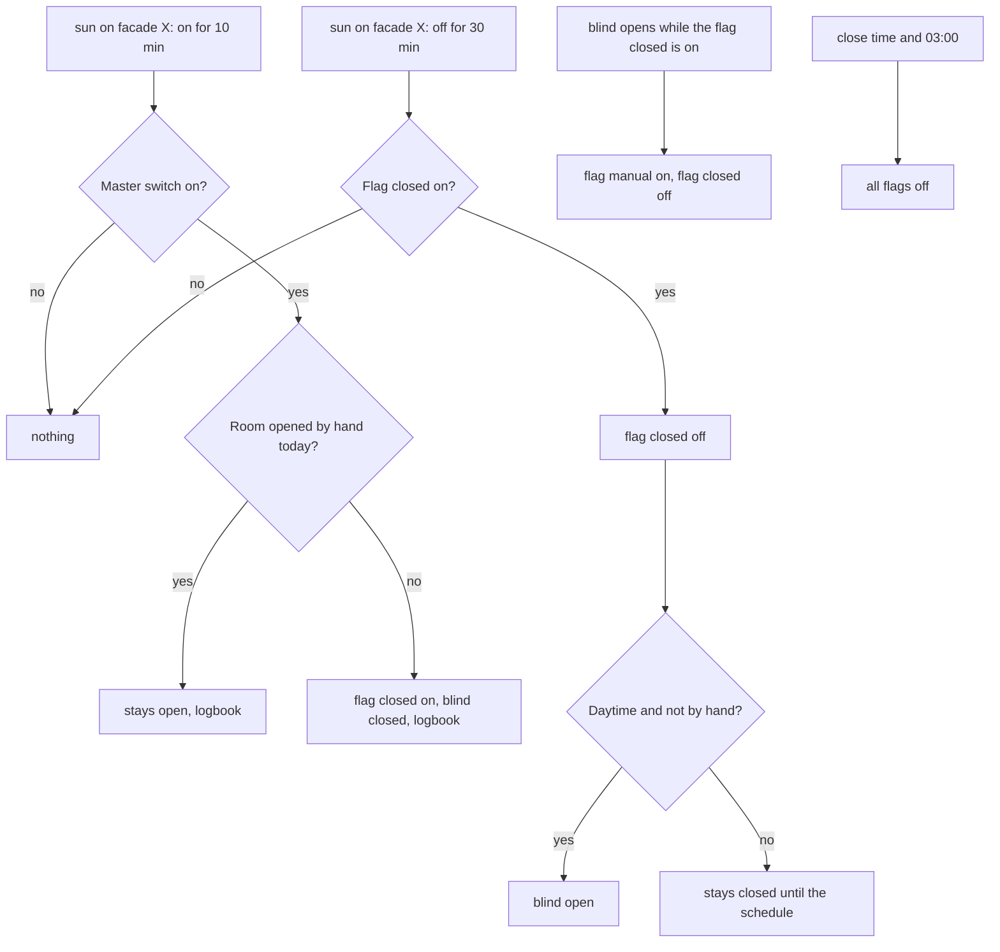
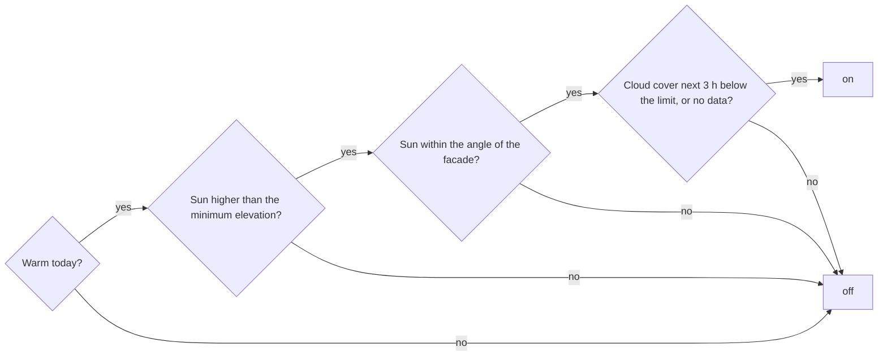

# Logic: <@ module.name @>

<!-- Filled in by tools/fill.py: values for the examples below (kept in a comment so a markdown formatter leaves them alone).
<% from '_shading.jinja' import all_rooms, blinds, curtains, sun_on, sun, indoor with context %>
<% set s = module.defaults %>
<% set ow_ = s['input_number.shading_outdoor_warm_from'] %>
<% set iw = s['input_number.shading_indoor_warm_from'] %>
<% set mc = s['input_number.shading_max_cloud_cover'] %>
<% set me = s['input_number.shading_min_sun_elevation'] %>
<% set an = s['input_number.shading_angle_*'] %>
<% set bw = s['input_datetime.blinds_open_workday'][:5] %>
<% set be = s['input_datetime.blinds_open_weekend'][:5] %>
<% set bc = s['input_datetime.blinds_close'][:5] %>
<% set k1 = sun[0] if sun else none %>
<% set z1 = (k1.side | lower) if k1 else 'sw' %>
<% set room1 = k1.slug if k1 else 'room' %>
<% set blind1 = k1.blind if k1 else 'cover.blind' %>
<% set lb = t('logbook_name') %>
<% set nosun = '' if sun else ' In this house no room takes part in sun and heat: those parts are not installed.' %>
-->

## In one sentence

In the morning blinds and curtains open and in the evening they close, at fixed times; on a warm day every blind keeps the sun out while it is on its facade, and whoever opens a blind by hand wins for the rest of the day.

Everything is per room (`rooms:` in `house.yaml`). A room without a blind drops out of the blind automations, a room without a curtain out of the curtain automation. Sun and heat only drive blinds, and only in rooms with a `side`.<@ nosun @>

Texts (logbook lines, helper and automation names) follow `house.language`; the quotes below are the English texts (`strings.yaml` has the Dutch ones).

## Flow chart

### Schedule (automations `blinds_schedule`, `curtains_schedule`)

### Sun and heat (automation `shading_sun`)

### When is the sun "on the facade" (`binary_sensor.shading_sun_<side>`)

## Triggers

| Automation            | Trigger                                                                                                        | Why                                                                     |
| --------------------- | -------------------------------------------------------------------------------------------------------------- | ----------------------------------------------------------------------- |
| `blinds_schedule`     | `input_datetime.blinds_open_workday` (Mon–Fri), `blinds_open_weekend` (Sat–Sun), `blinds_close` (every day)    | You change the times on the dashboard, the automation stays the same    |
| `curtains_schedule`   | `input_datetime.curtains_open_workday`, `curtains_open_weekend`, `curtains_close`                              | The same, with their own times for the curtains                         |
| `curtains_sync_times` | a blind time changes; `curtains_follow_blinds` turns on                                                        | Setting one schedule is enough                                          |
| `shading_sun`         | `binary_sensor.shading_sun_<side>` on for 10 min (`close_<side>`)                                              | A cloud of a few minutes does not move the blinds up and down           |
|                       | `binary_sensor.shading_sun_<side>` from on to off for 30 min (`open_<side>`)                                   | Longer than closing: rather a little too long closed than oscillating   |
|                       | a blind of the sun rooms goes to `open` or `opening` (`manual`)                                                | Whoever opens it while the sun kept it closed wins                      |
|                       | `input_datetime.blinds_close` and 03:00 (`reset`)                                                              | A clean slate every day                                                 |

The sensors (`templates/shading.yaml`): `sensor.shading_weather` fetches the hourly forecast every 30 min (`weather.get_forecasts`), also at a restart and after reloading the templates. The `binary_sensor`s recalculate on every change of the sun (`sun.sun`), the weather or a setting, and every minute.

## Conditions and decisions

### When is it warm (`binary_sensor.shading_warm`)

| Condition                                                                                             | Setting                                     |
| ----------------------------------------------------------------------------------------------------- | ------------------------------------------- |
| The warmest temperature of today (`sensor.shading_weather`) is at least the outdoor threshold         | `input_number.shading_outdoor_warm_from`    |
| **or** the indoor temperature (`entities.indoor_temperature`, when filled in) is at least the threshold | `input_number.shading_indoor_warm_from`   |

`sensor.shading_weather` = the highest of: the forecast hours still to come today, the current temperature of the weather entity, and its own value from earlier today. So a warm day stays warm in the evening, even when no warm hours are forecast any more: the evening sun on a west facade still counts.

### When is the sun on a facade (`binary_sensor.shading_sun_<side>`)

Every `side` in `house.yaml` has a direction (the facade normal): N 0°, NE 45°, E 90°, SE 135°, S 180°, SW 225°, W 270°, NW 315°. There is one sensor per facade that occurs in the house.

| Condition                                                                                     | Setting                                   | Attribute of the sensor   |
| --------------------------------------------------------------------------------------------- | ----------------------------------------- | ------------------------- |
| It is warm                                                                                    | see above                                 |                           |
| The sun is higher than the minimum elevation                                                  | `input_number.shading_min_sun_elevation`  |                           |
| The difference between the sun's azimuth and the facade direction is at most the angle        | `input_number.shading_angle_<side>`       | `angle_to_sun`            |
| The average forecast cloud cover over the next 3 hours is below the limit, or there is no data | `input_number.shading_max_cloud_cover`   | `cloud_cover_next_3h`     |

### What happens

| Situation                                                                         | What happens                                                                    | Logbook (<@ lb @>)                                 |
| --------------------------------------------------------------------------------- | ------------------------------------------------------------------------------- | -------------------------------------------------- |
| Open time, room not closed against the sun                                        | blind opens                                                                     | -                                                  |
| Open time, flag `shading_closed_<room>` on                                        | blind stays closed                                                              | "Schedule: … kept closed against the sun"          |
| Close time                                                                        | all blinds closed; all flags off                                                | -                                                  |
| Sun 10 min on the facade, master switch on, room not opened by hand               | flag closed on; blind closes unless it already is                               | "… closed against the sun · facade …"              |
| The same, but opened by hand today                                                | nothing                                                                         | "… stays open: operated by hand today"             |
| Master switch off                                                                 | no new blinds close; what is closed still opens                                 | -                                                  |
| Sun 30 min gone from the facade, daytime                                          | flag closed off, blind opens                                                    | "… open · sun gone from facade …"                  |
| The same, but after the open period (30 min before the close time or later) or before the open time | flag closed off, blind stays closed; the schedule opens it the next morning | "… stays closed until the schedule"   |
| Someone opens a blind while the flag closed is on                                 | flag manual on, flag closed off; the sun leaves that blind alone today          | "… opened by hand …"                               |
| Curtains follow blinds on, a blind time changes                                   | the three curtain times become the blind times                                  | -                                                  |

"Daytime" = from today's open time (workday or weekend) until 30 min before the close time.

## Settings

| Helper                                       | Default              | Unit | Effect                                                                                                      |
| -------------------------------------------- | -------------------- | ---- | ----------------------------------------------------------------------------------------------------------- |
| `input_datetime.blinds_open_workday`         | <@ bw @>             | time | Blinds open Monday to Friday                                                                                |
| `input_datetime.blinds_open_weekend`         | <@ be @>             | time | Blinds open Saturday and Sunday                                                                             |
| `input_datetime.blinds_close`                | <@ bc @>             | time | Blinds close, every day; also the moment the sun flags go off again                                         |
| `input_datetime.curtains_open_workday` (and `_weekend`, `curtains_close`) | same as the blinds | time | Own times for the curtains. With "Curtains follow blinds" on they are overwritten   |
| `input_boolean.curtains_follow_blinds`¹      | on                   |      | Curtains get the blind times                                                                                |
| `input_boolean.shading_automatic`²           | on                   |      | Master switch: blinds close on sun. Off = nothing closes any more, what is closed still opens               |
| `input_number.shading_outdoor_warm_from`²    | <@ ow_ @>            | °C   | From this warmest temperature of the day it is warm. Lower = closed more often                              |
| `input_number.shading_indoor_warm_from`³     | <@ iw @>             | °C   | From this indoor temperature it is warm too                                                                 |
| `input_number.shading_max_cloud_cover`²      | <@ mc @>             | %    | Above this forecast cloud cover the sun does not count. Higher = also closed with light clouds              |
| `input_number.shading_min_sun_elevation`²    | <@ me @>             | °    | Lower sun does not count (trees, neighbours). Higher = closed later in the morning, open earlier in the evening |
| `input_number.shading_angle_<side>`²         | <@ an @>             | °    | How oblique the sun may be on the facade. 90 = any sun in front of the facade; smaller = only sun straight on it |
| `input_boolean.shading_closed_<room>`²       | off                  |      | Set by the automation: this blind is closed against the sun. Do not set it yourself                        |
| `input_boolean.shading_manual_<room>`²       | off                  |      | Set by the automation when someone opens. Turn it on yourself = the sun leaves this blind alone today       |

¹ only when there are both blinds and curtains. ² only with sun and heat (at least one room with a blind and a side). ³ only with `entities.indoor_temperature`.

`deploy.py` sets the defaults once, when the helper is new (from `module.yaml`, `defaults:`). After that your value stays: the helpers have no `initial`.

Fixed values in the code (deliberately no helper):

| Value                          | Where                                 | Why                                                                         |
| ------------------------------ | ------------------------------------- | --------------------------------------------------------------------------- |
| 10 min on before closing       | `shading_sun`                         | a short bright spell closes nothing                                         |
| 30 min off before opening      | `shading_sun`                         | a cloud of a quarter of an hour opens nothing; oscillating annoys more than some shade |
| cloud cover over 3 hours       | `shading.jinja`, `cloud_cover()`      | what comes in the next hours, not the whole day                             |
| 30 min before the close time   | `shading_sun`, "daytime"              | no blind that opens briefly and closes again shortly after                  |
| reset at 03:00                 | `shading_sun`                         | safety net when the close time was missed (e.g. a restart)                  |
| forecast every 30 min          | `sensor.shading_weather`              | a weather service does not refresh more often either                        |

## Edge cases

1. **Existing groups with the same name as the cover groups.** If you already have one as a UI group, the group of this module gets `_2` after its entity id. `deploy.py` reports it. Delete the old group and rename the new one (README, "Existing groups").
2. **No cloud cover in the forecast.** Not every weather integration gives `cloud_coverage`. Then `cloud_cover_next_3h` says "no data" and clouds do not count: the blinds then also close in cloudy warm weather. Better that than never.
3. **No hourly forecast.** When `weather.get_forecasts` with `type: hourly` fails, `sensor.shading_weather` only uses the current temperature (and the value from earlier today). Choose an integration with an hourly forecast (e.g. Met.no).
4. **Sun on the facade before the morning opening.** An east facade gets sun before 7 o'clock in summer. The flag then goes on while the blind is still closed, and the schedule leaves it closed. Want light anyway: open it by hand, then the hand wins for that day.
5. **Sun gone after the evening window.** Then only the flag goes off; the blind stays closed until the schedule opens it the next morning.
6. **Every opening counts as a hand.** Also "all blinds open" on the dashboard or another automation. That is intended: whoever opens deliberately wants light.
7. **Blinds without a position** (e.g. Somfy RTS without feedback) never report `open`. Then the module does not recognise an opening by hand, and it sends `close_cover` even when the blind is already closed.
8. **Restart of Home Assistant** during the 10 or 30 min wait: the wait starts again. The flags stay (no `initial`).
9. **The azimuth is a direction, not a shadow.** The module does not see a tree or an overhang. Tune the angle and the minimum sun elevation per facade until it matches what you see.
10. **A warm day stays warm until midnight** (`sensor.shading_weather` remembers the warmest value of today). So a west facade still closes in the evening sun at 7 pm when the day was warm.
11. **Master switch off while blinds are closed against the sun.** They still open when the sun has gone (the open branch ignores the switch), so turning it off leaves nothing hanging closed.
12. **Changing `house.language`** renames the helpers, groups and automations on the next deploy (entity ids stay, except for the automations and cover groups created for the first time). Logbook lines already written stay in their language.

## What it does not do

- **No curtains against the sun.** Only blinds (outdoor shading really keeps the heat out). A room with only a curtain just follows the schedule.
- **No intermediate positions.** Open or closed, no percentage.
- **No check on the solar panels.** In the original house the south-west facade also had to see at least 1 kW of solar power; that is specific to one house and not in here.
- **No wind, rain, frost or holidays.** Blinds that must not move in wind or frost: turn the automation or the schedule off then.
- **No dashboard.** The helpers are in Settings > Helpers; a screen comes with the module climate or the home screen.
- **Cleans up nothing.** When a room disappears from `house.yaml`, its helpers stay until you delete them yourself.

## Test plan

Simulate states in Developer tools > States; **put the real state back afterwards** (or wait for the next update). The examples use the first sun room from `house.yaml` (`<@ room1 @>`, facade `<@ z1 @>`).

| #   | Test                     | How                                                                                                                       | Expected                                                                                                          |
| --- | ------------------------ | ------------------------------------------------------------------------------------------------------------------------- | ----------------------------------------------------------------------------------------------------------------- |
| 1   | Blind schedule           | Set `input_datetime.blinds_close` 2 min later than now                                                                    | All blinds close. Set the time back                                                                               |
| 2   | Curtains follow          | Change `blinds_open_workday` with "Curtains follow blinds" on                                                             | `curtains_open_workday` gets the same time                                                                        |
| 3   | Forecast                 | Developer tools > States: `sensor.shading_weather`                                                                        | A temperature, attributes `forecast_times` and `forecast_cloud_cover` filled (or `null` per hour without cloud data) |
| 4   | Macro                    | Template: `{{ cloud_cover(3) }} {{ angle_diff(200, 225) }}`      | A number (or -1 without data) and 25                                                                              |
| 5   | Warm                     | Set `shading_outdoor_warm_from` below the current temperature                                                            | `binary_sensor.shading_warm` on                                                                                   |
| 6   | Sun on the facade        | After 5, during the day: read the attributes of `binary_sensor.shading_sun_<@ z1 @>`; set `shading_angle_<@ z1 @>` to 90  | On as soon as the sun is in front of that facade, higher than the minimum elevation, with few clouds              |
| 7   | Closed against the sun   | After 6: wait 10 min                                                                                                      | `<@ blind1 @>` closes, `input_boolean.shading_closed_<@ room1 @>` on, logbook "closed against the sun"            |
| 8   | The hand wins            | After 7: open the blind by hand                                                                                           | `shading_manual_<@ room1 @>` on, `shading_closed_<@ room1 @>` off; the blind stays open                           |
| 9   | Sun gone                 | Turn `shading_manual_<@ room1 @>` off, repeat 7, then set the outdoor threshold high again; wait 30 min                   | During the day: blind opens, flag off, logbook "open · sun gone"                                                  |
| 10  | Schedule keeps it closed | Turn `shading_closed_<@ room1 @>` on and set today's open time 2 min later than now                                       | The other blinds open, this one stays closed; logbook "kept closed against the sun"                               |
| 11  | Reset                    | After 10: close time 2 min later than now                                                                                 | All flags off                                                                                                     |
| 12  | Real days                | A week with the default values                                                                                            | The logbook "<@ lb @>" has every movement with facade, angle and cloud cover. Tune per facade                     |
