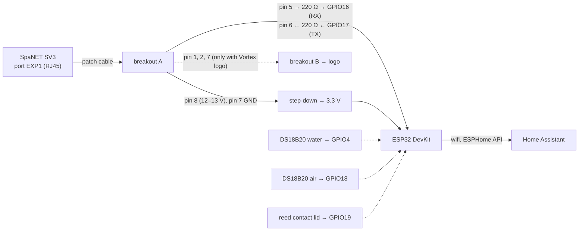

# Logic: <@ module.name @>

<!-- Filled in by tools/fill.py: values for the examples below (kept in a comment so a markdown formatter leaves them alone).
<% from '_spa.jinja' import device_name, friendly, entity_prefix, probes, lid with context %>
<% set probes_note = '' if probes else ' (not applicable: spa.probes is off)' %>
<% set lid_note = '' if lid else ' (not applicable: spa.lid is off)' %>
<% set probes_state = 'on' if probes else 'off' %>
<% set lid_state = 'on' if lid else 'off' %>
<% set id_water = t('water_temperature') | lower | replace(' ', '_') %>
<% set n_connected = t('connected') %>
<% set n_lid = t('lid') %>
-->

## In one sentence

An ESP32 on the EXP1 port asks the SpaNET controller for its full status every 10 s and passes it on to Home Assistant; a setting from HA goes to the controller as one text command, and the controller keeps deciding by itself when it heats and filters.

## Flow chart

Dotted lines are optional (`probes`, `lid`, logo). Pins per wire: README, "Wiring".

## Triggers

No automations. The firmware polls and reacts:

- **Every 10 s** (`poll_interval`): the command `RF`.
- **A line from the spa**: parsed and published (see below).
- **A command from HA** (number, select, button): queued and sent once, followed by an `RF`.
- **Own sensors**: probes every 60 s, the lid contact immediately (2 s debounce).

### What it reads

Protocol: plain text, 38400 8N1. `RF` returns the status registers `R2` to `RG`, one line per register (`,R2,18,250,...,:`). The parser (`esphome/spanet.h`, the same code as the host test) extracts:

| Register | Fields | Entities (names in `house.language`, here in English) |
| --- | --- | --- |
| R2 | mains current, mains voltage, control box temperature, heater temperature, water present | Total current, Mains voltage, Control box temperature, Heater temperature, Water present |
| R3 | current limit, firmware, model, status, heater current | Current limit (C.LMT), Firmware, Model, Status, Heater current, Heater power (= current × voltage) |
| R4 | operating mode, raw power and energy fields | Operating mode, Power (raw), Energy total (raw), Energy today (raw) |
| R5 | sleep timer active, heating, automatic filtration, water temperature | Sleep timer active, Heating, Automatic filtration, Water temperature |
| R6 | filtration hours, cycle, target temperature, Power Save and window, sleep timers | Filtration hours per day, Filtration cycle, Target temperature, Power Save, Power save window, Sleep timer 1 and 2 |

Own measurements, apart from the spa:

| Measurement | Entity | How often |
| --- | --- | --- |
| Water temperature (probe) | DS18B20 on GPIO4 | every 60 s |
| Air temperature | DS18B20 on GPIO18 | every 60 s |
| Lid | reed contact on GPIO19, open = on | immediately, 2 s debounce |
| Connected to spa | on when a status line came in during the last 60 s | |

Probes: <@ probes_state @>. Lid: <@ lid_state @>.

## Conditions and decisions

### What it controls

Every command goes through one queue (`script.spa_send`, max. 8 waiting), so the poll and the commands do not interfere; every command is followed by an `RF` to read the new state back.

| Entity | Command | Range |
| --- | --- | --- |
| Target temperature (number) | `W40:<°C × 10>` | 10–41 °C, step 0.5 |
| Operating mode (select) | `W66:n` | NORM, ECON, AWAY, WEEK |
| Power Save (select) | `W63:n` | Off, Low, High (`nl`: Uit, Laag, Hoog) = 0, 1, 2 |
| Filtration hours per day (number) | `W60:n` | 1–24 |
| Filtration cycle (select) | `W90:n` | every 1, 2, 3, 4, 6, 8, 12 or 24 hours |
| Sanitise cycle (button) | `W12` | |

Pumps, blowers, light and the sleep timers are not controlled.

### Language

- Entity names, the Power Save options and the word "day" in the sleep timer states come from `strings.yaml` in `house.language`. The same text is used in the select options, in the lambda that maps an option to `W63:n` and in the lambda that publishes the spa's value, so they always agree.
- `spanet.h` stays language-free: it keeps the raw day code and the time window of a sleep timer apart (`sleep1_days`, `sleep1_window`) and the firmware puts them together as "<day> 127, 22:00 - 09:00".
- `nl` keeps the names of the first version, so an installation filled in with `nl` keeps its entity ids. Table: README, "Entity ids depend on house.language".

## Settings

| Setting | Where | Default | Why |
| --- | --- | --- | --- |
| `spa.name`, `display_name` | `house.yaml` | jacuzzi | device name, entity ids |
| `spa.probes` | `house.yaml` | true | own water and air temperature |
| `spa.lid` | `house.yaml` | true | lid contact |
| `house.language` | `house.yaml` | `en` | entity names (and so entity ids), Power Save options |
| `poll_interval` | `esphome/jacuzzi.yaml` | 10 s | the reply to `RF` is ± 1 kB; 10 s keeps the line calm |
| Target temperature, mode, Power Save, filtration | HA or the touchpad | what is set in the spa | the spa is in charge; HA only sets another value |

## Edge cases

1. **5 V on the data lines.** The ESP32 does not tolerate 5 V. Measure pins 5 and 6 against pin 7 at idle; at 5 V a voltage divider or level shifter on RX.
2. **EXP1 shared with the Vortex logo.** The logo uses pins 1, 2 and 7, the ESP32 pins 5, 6, 7 and 8. They share the port through two breakouts with pins looped through 1-to-1. No ethernet splitter.
3. **No SmartLINK at the same time.** The SmartLINK wifi module uses the same port and pins.
4. **Water temperature of the spa** is only reliable while the pump runs. The water probe always measures; use it for a heat-up or cool-down model.
5. **Raw fields.** "Power (raw)" and the energy fields are not calibrated yet (compare with an energy meter). "Heater power" is current × voltage and so an approximation.
6. **Never USB and step-down together.** Two power supplies on the ESP32 at the same time can damage the USB port of the computer or the step-down.
7. **Logs.** ESPHome 2026.9 no longer logs sensor values at DEBUG: "no sensor logs" does not mean nothing comes in. Look in HA, or at the lines `spanet: reply:` and `send:`.
8. **`esphome upload` flashes the last compiled build**, not your changed YAML. Use `esphome run` (or Install in the Device Builder).
9. **Clock of the spa.** Power Save and the sleep timers depend on the clock of the controller, not on HA; set it right (also after the change to winter or summer time).
10. **A sleep timer wins over Power Save.** Pressing a button on the touchpad lifts the sleep timer for 45 min.
11. **Lid contact.** The MC-38 contact is not waterproof: mount it sheltered and seal the connections.
12. **Frost protection** always stays with the controller of the spa; the ESP32 cannot turn it off.
13. **Language changed after flashing.** A new `house.language` renames the entities, so HA creates new entity ids. A Power Save value set from HA keeps working: options and mapping change together.

## What it does not do

- **No planning or automations.** Heating on solar surplus or in cheap quarter hours towards a bath time, notifications for an open lid: that comes later with the energy and climate modules.
- **No pumps, blowers or light.** The protocol knows them (`S2x`), the firmware does not control them.
- **No other brands.** Only SpaNET (see the warning in the README).
- **Changes nothing in Home Assistant.** `deploy.py` only puts files in `/config/esphome/`.

## Test plan

Entity ids follow the friendly name "<@ friendly @>" (example: `sensor.<@ entity_prefix @>_<@ id_water @>`). Status: bench test only (steps 1–5); steps 6–12 need the real spa and have not passed yet.

| # | Test | How | Expected |
| --- | --- | --- | --- |
| 1 | Parser | compile and run `test/spanet_test.cpp` (README, "Bench test") | "All tests passed." |
| 2 | Simulator | `spanet_sim.py --selftest` | "selftest: passed" |
| 3 | First flash | USB, Install | Log shows `wifi: Connected`; HA offers the device |
| 4 | Bench test reading | Simulator on the adapter, ESP32 on USB | <@ n_connected @> on; water temperature, status and target temperature of the simulator in HA |
| 5 | Bench test control | Target temperature to 39 | Simulator shows `W40:390`; after the next RF HA shows 39 |
| 6 | Probes | Hold a probe in your hand | Temperature rises within 1–2 min<@ probes_note @> |
| 7 | Lid | Magnet away and back | <@ n_lid @> open and closed after ± 2 s<@ lid_note @> |
| 8 | Measuring at the spa | Breaker off, breakout A on EXP1, breaker on, measure with COM on pin 7 | pin 8 ≈ 12–13 V, pins 5 and 6 ≈ 3.3 V at idle |
| 9 | Installation | Breaker off, connect the ESP32 (without USB), breaker on | <@ n_connected @> on; the logo (if present) still lights up |
| 10 | Compare | Put the values next to the touchpad | Water temperature, target temperature, mode and filtration equal |
| 11 | Control at the spa | Target temperature 0.5 °C lower and back; change Power Save and back | The touchpad follows |
| 12 | Calibration | One day with an energy meter or the digital meter | Scale of the raw fields and of "Total current" known |
