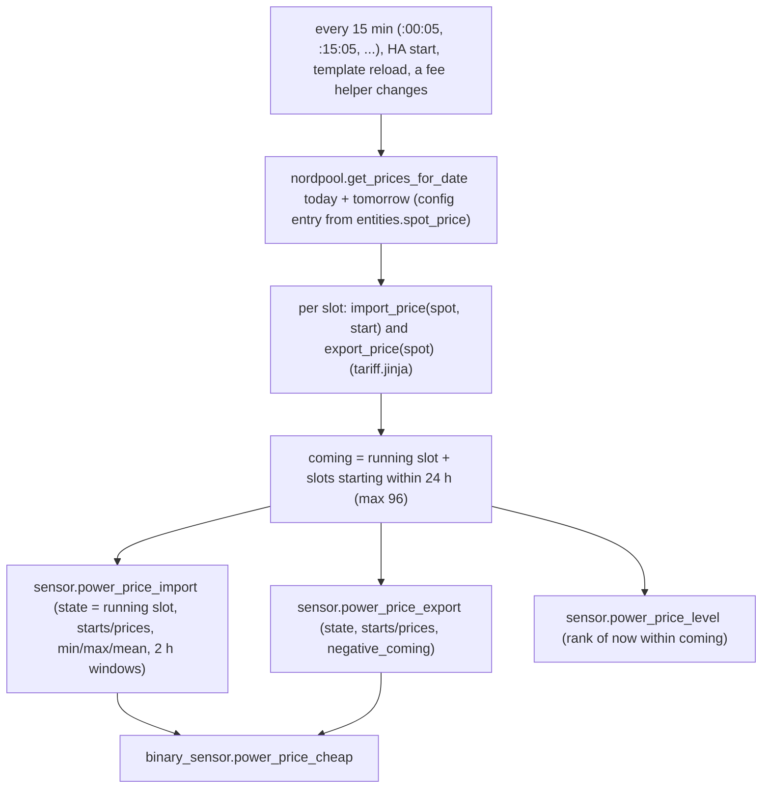
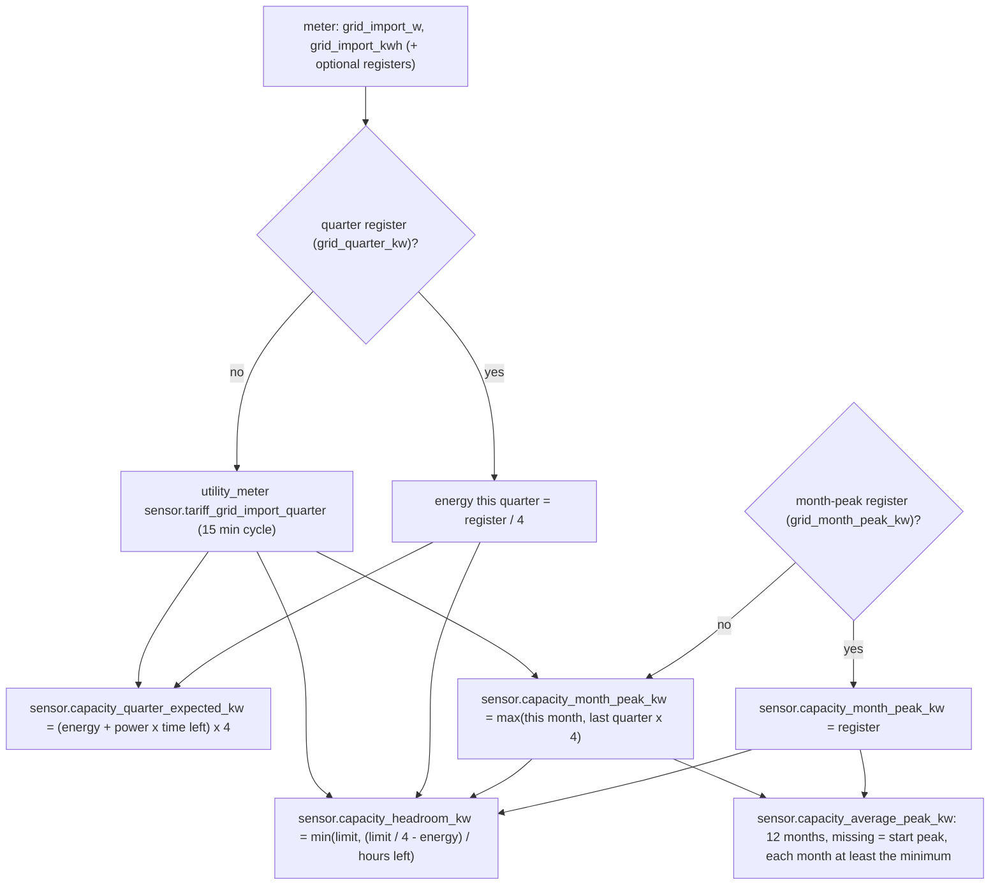

# Logic: <@ module.name @>

<!-- Filled in by tools/fill.py: values for the text below (kept in a comment so a markdown formatter leaves them alone).
<% from '_tariff.jinja' import own_quarter, reg_month, reg_quarter, reg_average, minimum_kw, connection_kw, cheap_below with context %>
<% set f = tariff['import'].factor %>
<% set mk = tariff['import'].markup %>
<% set vat = tariff['import'].vat %>
<% set ef = tariff['export'].factor %>
<% set ed = tariff['export'].deduction %>
<% set gd = tariff.grid.day %>
<% set gn = tariff.grid.night %>
<% set lv = tariff.grid.levies %>
<% set ns = tariff.night.start %>
<% set ne = tariff.night.end %>
<% set wk = 'and the whole weekend' if tariff.night.get('weekend') else '(the weekend follows the same hours)' %>
<% set cap = tariff.capacity.eur_per_kw_year %>
<% set day100 = (((f * 10 + mk) * vat + lv + gd) / 100) | round(4) %>
<% set night100 = (((f * 10 + mk) * vat + lv + gn) / 100) | round(4) %>
<% set exp100 = ((ef * 10 - ed) / 100) | round(4) %>
<% set zero = ((mk * vat + lv + gd) / 100) | round(4) %>
-->

## In one sentence

Every quarter hour the module turns the Nord Pool day-ahead price (Belpex) into what a kWh really costs and earns in this house, ranks it against the coming 24 hours, and keeps track of the quarter-hour peaks that the Flemish capacity tariff bills, so that every other module can ask "is now cheap?" and "how much may I still draw this quarter?".

## Flow chart

### Prices

### Capacity tariff

## Triggers

| Entity                                        | Updates on                                                                                                     |
| --------------------------------------------- | -------------------------------------------------------------------------------------------------------------- |
| price sensors (import, export, level)         | every 15 min at second 5, HA start, template reload, a change of the grid fee or levies helpers               |
| `binary_sensor.power_price_cheap`             | a change of the price sensors or of `input_number.power_price_cheap_below`                                    |
| `sensor.power_tariff_period`                  | every minute (template with `now()`)                                                                           |
| `sensor.capacity_quarter_expected_kw`         | every change of the import power or of the quarter energy, and every minute                                    |
| `sensor.capacity_headroom_kw`                 | the same, plus the month peak, the price and the margin and "may rise" helpers                                 |
| `sensor.capacity_month_peak_kw` (register)    | every change of the register, every 15 min at second 30, HA start, template reload                            |
| `sensor.capacity_month_peak_kw` (own meter)   | every 15 min at second 2 (just after the quarter-hour meter reset), HA start, template reload                 |
| `sensor.capacity_average_peak_kw`             | a change of the month peak, of the start peak or of the capacity tariff helper; HA start, template reload     |
| `automation.capacity_start_peak_from_meter`   | a change of the meter's average-peak register; HA start                                                        |

Tomorrow's prices are published by Nord Pool around 13:00; the next quarter-hour run after that picks them up (`tomorrow_known` turns true).

## Conditions and decisions

### The price formula

All amounts of the tariff sheets are in c€/kWh; Nord Pool gives the spot price in EUR/MWh, so spot / 10 = c€/kWh. The result is EUR/kWh, rounded to 4 decimals.

    import = ((import.factor x spot/10 + import.markup) x import.vat + levies + grid fee) / 100
    export = (export.factor x spot/10 - export.deduction) / 100

With this house: import.factor = <@ f @>, import.markup = <@ mk @> c€/kWh, import.vat = <@ vat @>, levies = <@ lv @> c€/kWh, grid fee day = <@ gd @> and night = <@ gn @> c€/kWh, export.factor = <@ ef @>, export.deduction = <@ ed @> c€/kWh. At a spot price of 100 EUR/MWh that is <@ day100 @> EUR/kWh in the day register, <@ night100 @> EUR/kWh at night and an export price of <@ exp100 @> EUR/kWh; at a spot price of 0 the import still costs <@ zero @> EUR/kWh (fees and levies).

Where each coefficient comes from:

| Coefficient           | Source                                                                                                                                          | Where it lives                                     |
| --------------------- | ----------------------------------------------------------------------------------------------------------------------------------------------- | -------------------------------------------------- |
| spot price            | Nord Pool day-ahead, area BE (Belpex), per quarter hour since October 2025                                                                      | the Nord Pool integration, fetched every 15 min    |
| `import.factor`       | supplier's tariff card of the dynamic contract ("factor x Belpex"): balancing and profile costs as a share of the spot price                    | `house.yaml` -> `tariff.jinja`, `tariff.js`        |
| `import.markup`       | the same card: fixed supplier margin per kWh, excl. VAT                                                                                         | `house.yaml`                                       |
| `import.vat`          | VAT on electricity for households (6 % in 2026); applied to the energy part only, the levies and grid fees on the card already include VAT     | `house.yaml`                                       |
| levies                | supplier's card, "taxes and levies": special excise, energy contribution, green power and CHP certificates, incl. VAT                           | `input_number.tariff_levies`                       |
| grid fee day / night  | Fluvius distribution tariff of your region + Elia transmission, per kWh in the day and the night register, incl. VAT (VREG publishes it yearly) | `input_number.tariff_grid_fee_day` / `_night`     |
| `export.factor`       | supplier's card, injection: "factor x Belpex"                                                                                                   | `house.yaml`                                       |
| `export.deduction`    | the same card: fixed deduction per kWh (no VAT on injection for households)                                                                     | `house.yaml`                                       |
| capacity tariff       | Fluvius tariff sheet, EUR per kW per year of the 12-month average peak, incl. VAT                                                               | `input_number.tariff_capacity_eur_per_kw_year`     |
| minimum peak          | Flemish regulation (VREG): every month counts for at least 2.5 kW                                                                               | `house.yaml` `tariff.capacity.minimum_kw`          |
| fixed costs           | supplier's yearly fee + Fluvius data management                                                                                                 | `input_number.tariff_fixed_eur_per_year`           |

The coefficients that only change with a new contract are rendered into the files; the ones that change every January (grid fees, levies, capacity tariff, fixed costs) are helpers. The defaults of the helpers come from `house.yaml` once.

### Day and night register

`is_night(ts)`: the local hour (house time zone) is from <@ ns @>:00 up to <@ ne @>:00, <@ wk @>. A start after the end means "over midnight". The same rule is in `tariff.js` (`isNight`), which converts to the house time zone itself, so a browser in another time zone gives the same answer. `sensor.power_tariff_period` shows the result for now.

### The coming slots

- `coming` = the running slot (its end lies after now) plus every slot that starts within 24 h, at most 96. With quarter-hour prices that is 96 slots; after 13:00 they reach into tomorrow, before that they stop at midnight.
- `starts` are the slot starts as Nord Pool gives them (ISO, UTC); `prices` are the import (or export) prices in the same order.
- `cheapest_2h` / `priciest_2h`: the consecutive window of 2 h (8 quarters; with hourly slots 2) with the lowest / highest mean import price among the coming slots, `{start, end, mean}`.

### Level (relative) and cheap (absolute)

- `sensor.power_price_level`: `negative` when the export price of the running slot is below 0. Otherwise the rank of the current import price among the coming slots (share of slots that are cheaper): < 0.2 `very_cheap`, < 0.4 `cheap`, < 0.6 `normal`, < 0.8 `expensive`, else `very_expensive`; `unknown` without prices. This level is relative: every day has its cheap quarters, also on an expensive day.
- `binary_sensor.power_price_cheap`: on when the export price is below 0 or the import price is at or below `input_number.power_price_cheap_below` (default <@ cheap_below @> EUR/kWh: about "spot price around 0 or lower" with the fees of 2026). That is the signal for drawing from the grid on purpose; it does not happen every day. Off when the prices are unavailable.

### Capacity tariff

- **Energy this quarter.** <% if reg_quarter %>From the meter's quarter register (`<@ reg_quarter @>`): it rises during the quarter and ends at the quarter's average, so energy so far = register / 4.<% else %>From the kit's own quarter-hour meter `sensor.tariff_grid_import_quarter` (utility_meter on the import registers, reset at :00, :15, :30, :45).<% endif %>

- **Expected quarter** = (energy so far + import power x hours left) x 4. It assumes the current power holds until the end of the quarter.
- **Month peak.** <% if reg_month %>The meter's month-peak register (`<@ reg_month @>`). `at` is the start of the quarter that raised it (the register changes at a quarter end). In the first 20 minutes of a month the old value is kept: the meter resets around midnight and a late reading of the old month may still come through.<% else %>At every quarter end: max(month peak so far, last quarter x 4), where "last quarter" is `last_period` of the quarter-hour meter. The month is the month of the quarter that just ended, so 23:45-00:00 on the last day still counts for that month; the first quarter of a new month starts from 0.<% endif %>

- **Average peak** (what is billed): per month the highest peak is kept in the attribute `peaks` (the last 12 months). Months not measured yet count as `input_number.capacity_start_peak_kw` when that is > 0. Every month counts for at least <@ minimum_kw @> kW (the regulation floors each month, not the average). `cost_eur_per_year` = average x `input_number.tariff_capacity_eur_per_kw_year` (<@ cap @> EUR/kW/year at the start).
- **Headroom.** limit = max(month peak, <@ minimum_kw @> kW) - `input_number.capacity_margin_kw`. When the import price is negative and `input_boolean.capacity_peak_may_rise` is on, the limit is the connection (`tariff.capacity.connection_kw`, here <@ connection_kw @> kW): then drawing more pays even if the month peak rises. headroom = min(limit, (limit / 4 - energy so far) / hours left), with hours left at least 2 minutes, so an expensive start of the quarter counts against what is left. A negative headroom means this quarter will end above the limit if nothing changes.
- **Start peak from the meter.** <% if reg_average %>`automation.capacity_start_peak_from_meter` copies the meter's average-peak register (`<@ reg_average @>`), rounded to 0.1 kW, into `input_number.capacity_start_peak_kw` whenever it changes and differs, and writes one logbook line.<% else %>No automation: `entities.grid_average_peak_kw` is empty. Set `input_number.capacity_start_peak_kw` yourself from the Fluvius portal.<% endif %>

## Settings

| Helper                                          | Unit     | Default (from `house.yaml`)          | What                                                                    |
| ----------------------------------------------- | -------- | ------------------------------------ | ----------------------------------------------------------------------- |
| `input_number.tariff_grid_fee_day`              | c€/kWh   | `tariff.grid.day`                    | grid fee in the day register, incl. VAT                                 |
| `input_number.tariff_grid_fee_night`            | c€/kWh   | `tariff.grid.night`                  | grid fee in the night register, incl. VAT                               |
| `input_number.tariff_levies`                    | c€/kWh   | `tariff.grid.levies`                 | excise, energy contribution, certificates, incl. VAT                    |
| `input_number.tariff_capacity_eur_per_kw_year`  | EUR/kW   | `tariff.capacity.eur_per_kw_year`    | capacity tariff per kW per year                                         |
| `input_number.tariff_fixed_eur_per_year`        | EUR      | `tariff.fixed_eur_per_year` or 0     | fixed costs per year (read by results)                                  |
| `input_number.power_price_cheap_below`          | EUR/kWh  | `tariff.cheap_below` or 0.15         | threshold of `binary_sensor.power_price_cheap`                          |
| `input_number.capacity_start_peak_kw`           | kW       | 0                                    | fills months not measured yet; 0 = average over the measured months only |
| `input_number.capacity_margin_kw`               | kW       | 0.3                                  | headroom stays this far under the month peak                            |
| `input_boolean.capacity_peak_may_rise`          | -        | off                                  | at a negative import price: headroom up to the connection               |

No helper has `initial`: `deploy.py` sets the default once, when the helper is new; afterwards the value is yours. Fields in `house.yaml`: see README.md.

## Edge cases

- **Nord Pool fails or is late.** Both calls have `continue_on_error`; without today's prices the price sensors are `unknown`, the level is `unknown` and "cheap" is off. Without tomorrow's prices the lists stop at midnight and `tomorrow_known` is false. The next quarter-hour run tries again.
- **Hourly instead of quarter-hour prices.** The slot length is taken from the data: `price_at()` and the 2 h windows work with any slot length.
- **Daylight saving time.** Slots are kept in UTC; only the night register and the month use local time. The day of the change has 92 or 100 quarters; the lists still hold the coming 24 h.
- **A fee helper changes.** The prices are recomputed at once (state trigger on the three helpers), not at the next quarter.
- **The quarter register's meaning.** The module assumes the meter's quarter register rises during the quarter and drops at its end (energy so far x 4). Check it on the history graph of the register before you fill it in (README, Install step 2): a saw-tooth that drops at :00, :15, :30 and :45. A P1 reader that publishes a sliding average instead gives a wrong headroom: leave `grid_quarter_kw` empty and the module meters the quarter itself.
- **The quarter-hour meter does not exist yet** (first deploy, before the restart): energy so far counts as 0, so the expected quarter is only power x time left and the headroom is too generous until the restart. `deploy.py` says so.
- **The month changes.** With the register: the first 20 minutes of a month keep the old value; with the own meter: the quarter 23:45-00:00 still belongs to the old month. The average sensor files the peak under the month in the `month` attribute of the month peak, so it does not depend on when it runs.
- **HA was off for a while.** Trigger-based sensors keep their state and attributes over a restart; peaks of quarters during the outage are missing with the own meter (the register of the meter keeps counting).
- **Units of the meter.** The import registers must be kWh and the power sensor W or kW; a Wh register gives quarter energies 1000x too large (use a template sensor in kWh).
- **Power sensor in W.** `kw()` divides by 1000 when the unit is `W`; every other unit is taken as kW.

## What it does not do

- No fixed or variable contracts (no spot price): use `tariff.compare` in the energy module to compare those.
- No public holidays in the night register: Fluvius meters switch on weekdays and weekends only.
- No Brussels or Walloon grid tariffs (no capacity tariff there in 2026); another region is another module with the same entity ids.
- No exclusive night meter (a third register): only day and night.
- No prices further back than the running slot: history comes from the recorder or, for the analysis screens, from Nord Pool directly with `window.haKitTariff`.
- It never switches anything: it only provides prices, levels and headroom. Charging, hot water and appliances decide themselves.
- It does not read the supplier's invoice: fixed costs and the capacity tariff are helpers for the results module.

## Test plan

On a real Home Assistant; until it passed, the status says "not tested on HA".

1. `tariff-be/deploy.py --dry-run`: lists four uploads, the defaults, the automation (only with `grid_average_peak_kw`) and the resource.
2. Deploy. In Settings > Helpers the nine helpers have their defaults. Change `input_number.tariff_levies` and back: the price sensors update at once.
3. Developer tools > States, `sensor.power_price_import`: a number around 0.1-0.4; `starts` and `prices` have the same length (96 after 13:00, fewer in the morning), the first start is the running quarter. Compare one quarter with the Nord Pool app: (factor x price/10 + markup) x VAT + levies + grid fee, / 100.
4. Developer tools > Template: `{{ price_at(now() + timedelta(hours=1)) }} {{ reference_price() }} {{ is_night(now()) }}` gives the price of the slot one hour ahead (same as in `prices`), the mean of the coming 24 h, and True/False as `sensor.power_tariff_period` says.
5. At night (or in the weekend) `sensor.power_tariff_period` is `night` and the import price is lower by the difference of the two grid fees.
6. `binary_sensor.power_price_cheap`: set `input_number.power_price_cheap_below` just above the current import price: on; back: off.
7. Capacity: switch on a large consumer (oven, kettle) for a few minutes: `sensor.capacity_quarter_expected_kw` rises at once, `sensor.capacity_headroom_kw` drops. At the end of the quarter the expected value should be close to the meter's quarter value.
8. Over a day: `sensor.capacity_month_peak_kw` equals the meter's month peak (or, without the register, the highest quarter of the day x 4 according to the history of `sensor.tariff_grid_import_quarter`); its `at` is the start of that quarter.
9. `sensor.capacity_average_peak_kw`: `peaks` has the running month; `months_known` = 1 on a new install; with a start peak set the average is close to the start peak.
10. With `grid_average_peak_kw`: the automation has run (Logbook: "start peak taken from the meter"), `input_number.capacity_start_peak_kw` equals the register rounded to 0.1.
11. Browser console on a dashboard: `window.haKitTariff.importPrice(100, new Date())` gives the price at a spot of 100 EUR/MWh for now; `window.haKitTariff.isNight(new Date())` matches `sensor.power_tariff_period`.
12. On the first of the next month: the month peak starts again; `peaks` keeps last month's value.
