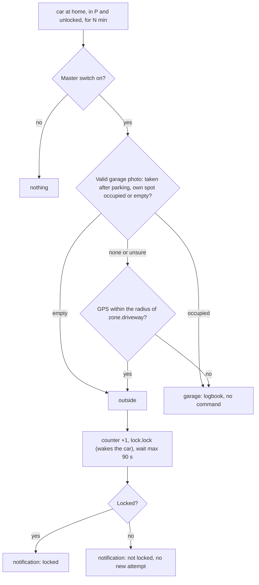
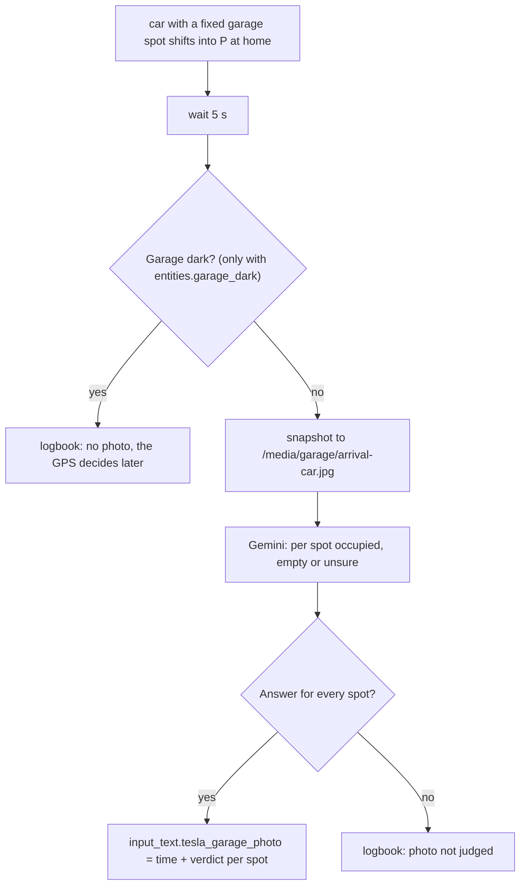

# Logic: <@ module.name @>

<!-- Filled in by tools/fill.py: values for the examples below (kept in a comment so a markdown formatter leaves them alone).
<% from '_tesla_driveway_lock.jinja' import tdl, photo, car_list, minutes, radius with context %>
<% set a1 = car_list[0] %>
<% set p1 = a1.prefix %>
<% set name1 = a1.name %>
<% set lock1 = car_entity(a1, 'lock') %>
<% set loc1 = car_entity(a1, 'location') %>
<% set spot1 = a1.get('garage_spot') or 'left' %>
<% set photonote = '' if photo else ' In this house the garage photo is off (tesla_driveway_lock.garage_photo): only the GPS decides.' %>
-->

## In one sentence

A Tesla left unlocked at home gets locked after <@ minutes @> min when it stands **outside on the driveway**; when it is **in the garage**, everything stays as it was.

Why: with "Walk-Away Door Lock" and "Exclude Home" in the car, a Tesla stays unlocked at home, on the driveway too. In the garage that is no problem, outside it is. The hard part is telling garage and driveway apart: they lie a few metres from each other, within the GPS error. So a **garage photo on arrival** (optional) decides first and only then the **GPS** with a small zone `zone.driveway`.<@ photonote @>

The texts quoted below (notifications, logbook) are the English ones; with `house.language: nl` they are the Dutch texts from `strings.yaml`.

## Flow chart

### Lock (`automation.tesla_driveway_lock`)

### Garage photo on arrival (`automation.tesla_garage_arrival_photo`, optional)

## Triggers

| Automation                   | Trigger                                                                                           | Why                                                                                                       |
| ---------------------------- | ------------------------------------------------------------------------------------------------- | --------------------------------------------------------------------------------------------------------- |
| `tesla_driveway_lock`        | `binary_sensor.tesla_driveway_<car>_home_unlocked` is on for `tesla_driveway_lock_minutes`        | Whoever quickly fetches something from the car is not disturbed. Fires once per parking                   |
| `tesla_garage_arrival_photo` | `teslemetry.shift_state` of a car with `garage_spot` goes to `p`, and the car is at home         | On arrival the garage light is usually on (gate open, car just in); later the image is often black        |

`binary_sensor.tesla_driveway_<car>_home_unlocked` (in `templates/tesla_driveway_lock.yaml`) = shift state `p` **and** lock `unlocked` **and** (tracker `home` **or** `located_at_home` on). The tracker alone is not enough: in the source it sometimes said `not_home` while the car was parked at home.

## Conditions and decisions

### Outside or garage

| Garage photo (taken after parking)       | GPS to the middle of `zone.driveway` | Decision | Reason in the logbook                        |
| ---------------------------------------- | ------------------------------------ | -------- | -------------------------------------------- |
| own spot **empty**                       | does not matter                      | outside  | "garage photo: spot … empty"                 |
| own spot **occupied**                    | does not matter                      | garage   | "garage photo: spot … occupied"              |
| unsure, no photo, too old, no spot       | ≤ radius                             | outside  | "GPS … m from the middle of zone.driveway"   |
| same                                     | > radius or unknown                  | garage   | same                                         |

A valid photo always goes before the GPS. A photo is valid when it was taken **after** the last change of this car's shift state (the parking); a photo of an earlier arrival does not count. The verdicts are stored as fixed values `occupied`, `empty`, `unsure`; any other value (e.g. a photo in the old Dutch format) counts as unsure.

### What happens

| Situation                                                 | What happens                                                                                     |
| --------------------------------------------------------- | ------------------------------------------------------------------------------------------------ |
| Master switch off                                         | nothing                                                                                          |
| Garage                                                    | logbook "stays unlocked: it is in the garage", no command, no notification                       |
| Outside                                                   | `counter.tesla_commands_today` +1, one `lock.lock`; a sleeping car is woken for it               |
| Locked within 90 s                                        | notification "🔒 … locked", logbook "locked … (reason), woken"                                   |
| Not locked within 90 s (offline, no credits)              | notification "⚠️ … not locked", logbook "NOT locked … No new attempt"                            |

### Who gets the notification

The usual driver of the car (`cars[].driver`) and the admin(s) (`people[].admin`; nobody = the first person), each with `notify`. A new notification about the same car replaces the previous one (tag `tesla-driveway-<car>`).

## Settings

| Helper                                      | Default       | Unit | Effect                                                                                      |
| ------------------------------------------- | ------------- | ---- | ------------------------------------------------------------------------------------------- |
| `input_boolean.tesla_driveway_lock_enabled` | off           |      | Master switch. Off after the first install: turn it on after tests 1 to 4                    |
| `input_number.tesla_driveway_lock_minutes`  | <@ minutes @> | min  | How long the car must be unlocked in P at home. Shorter = locked sooner, woken more often    |
| `zone.driveway` (radius)                    | <@ radius @>  | m    | The spot on the driveway where a car stands outside. Place and radius in Settings > Zones   |
| `input_text.tesla_garage_photo`¹            | -             |      | Internal: last verdict of the garage photo (JSON). Do not fill it in yourself, except to test |

¹ only with `tesla_driveway_lock.garage_photo: true`.

`deploy.py` sets the defaults once, when the helper is new (from `module.yaml`, `defaults:`); `deploy.py --setup` creates the zone. After that your value stays.

Fixed values in the code (deliberately no helper):

| Value                            | Where                        | Why                                                                                 |
| -------------------------------- | ---------------------------- | ----------------------------------------------------------------------------------- |
| wait 90 s for `locked`           | `tesla_driveway_lock`        | waking and locking a sleeping car took up to 14 s in the source; ample margin       |
| 5 s after P                      | `tesla_garage_arrival_photo` | the car stands still and the lights are still on                                    |
| one attempt per parking          | `tesla_driveway_lock`        | a car that does not respond is not woken again and again                            |
| passive zone                     | `deploy.py --setup`          | the trackers stay `home`, `person` does not jump                                    |

## Edge cases

1. **`zone.driveway` starts at `house.lat/lon`.** That is usually the middle of the house or the gate, not the driveway. Drag the zone to where a car stands outside, and choose the radius so the garage spots fall **outside** it (test 2). In the source driveway and garage were 5 to 15 m apart; a circle of 10 m left ±2 m margin on both sides.
2. **GPS under a roof** is poor: a car in the garage can jump metres. That is why the photo goes first.
3. **Gemini said "empty" on a black image.** In the source a sleeping car in a dark garage gave a black image, and Gemini answered "empty": a car in the garage got locked (harmless, but wrong). Hence: the photo is taken on arrival (light on), the instruction explicitly asks for "unsure" on a black image, and with `entities.garage_dark` there is no photo in the dark.
4. **Wrong spot.** When someone parks a car on another car's spot, the photo is wrong: a car outside may stay unlocked, or a car in the garage gets locked (harmless).
5. **Light off too early.** When a car drives in only after the garage light went off, it is dark: no photo or an unsure one, the GPS decides.
6. **After a restart** of Home Assistant the template sensor starts again; when a car is still unlocked, one new decision follows after <@ minutes @> min (safety net).
7. **Failed command** (car offline, command credits used up): no new attempt, the sensor stays on. Only when the car drives, locks or leaves home can the automation fire again.
8. **Someone unlocks again later** and leaves the car unlocked: that is a new round, locked again after <@ minutes @> min (when it is outside).
9. **Teslemetry drops out briefly** (e.g. on a restart of the integration): the sensor goes off and on again, which can give one extra decision.
10. **Privacy.** The garage image goes to Google (Gemini). On the free tier Google may keep and use it. When someone gets out while the photo is taken, that person is in the image too.

## What it does not do

- **Opens or closes nothing** in the garage, and sends no command other than `lock.lock`.
- **No retries** and no second wake-up.
- **No cars without a Teslemetry lock** (`teslemetry.lock`).
- **Does not know who drove.** The notification goes to the usual driver and the admin(s).
- **Cleans up nothing.** A car that disappears from `house.yaml` keeps its sensor until you delete it yourself.

## Test plan

Start with the master switch **off**. Simulate states in Developer tools > States; **put the real state back afterwards**. The examples use the first car from `house.yaml` (`<@ p1 @>`).

| #   | Test                  | How                                                                                                                              | Expected                                                                                                     |
| --- | --------------------- | -------------------------------------------------------------------------------------------------------------------------------- | ------------------------------------------------------------------------------------------------------------ |
| 1   | Sensor                | Park the car at home and leave it unlocked                                                                                       | `binary_sensor.tesla_driveway_<@ p1 @>_home_unlocked` on; off as soon as it locks                           |
| 2   | Zone                  | Car on the driveway, then in the garage: each time read the attribute `driveway_distance_m` of that sensor                       | Driveway ≤ radius of `zone.driveway`, garage > radius. If not: move the zone or change the radius            |
| 3   | Garage photo¹         | Drive in with the garage light on and put the car in P                                                                           | Logbook "Tesla garage photo: … in P: …", `input_text.tesla_garage_photo` updated, image in Media > garage    |
| 4   | Simulate a decision   | Set `tesla_driveway_lock_minutes` to 1, master switch on, car unlocked in the garage                                             | After 1 min logbook "… stays unlocked: it is in the garage (…)", no command                                  |
| 5   | Live, driveway        | Car unlocked on the driveway, wait the set minutes                                                                               | `<@ lock1 @>` = `locked`, notification "🔒 <@ name1 @> locked", logbook with the reason; counter +1          |
| 6   | No repeat             | After 4 or 5: leave the car                                                                                                      | No new run (Traces) until the car drives, locks or is unlocked again                                         |
| 7   | Photo goes first¹     | Set `input_text.tesla_garage_photo` to `{"t": "<now, ISO>", "car": "<@ p1 @>", "<@ spot1 @>": "occupied"}` with the car unlocked on the driveway | Logbook "stays unlocked … garage photo: spot <@ spot1 @> occupied" (the photo wins over the GPS) |
| 8   | Switch                | Master switch off, repeat 5                                                                                                      | No run                                                                                                       |
| 9   | Failed command        | Only when it happens (car offline)                                                                                               | Notification "⚠️ … not locked", logbook "NOT locked … No new attempt"                                       |

¹ only with `tesla_driveway_lock.garage_photo: true`.

Troubleshooting: Automations > the automation `tesla_driveway_lock` > Traces. The variables `camera`, `gps_m`, `outside` and `reason` show why it decided.
