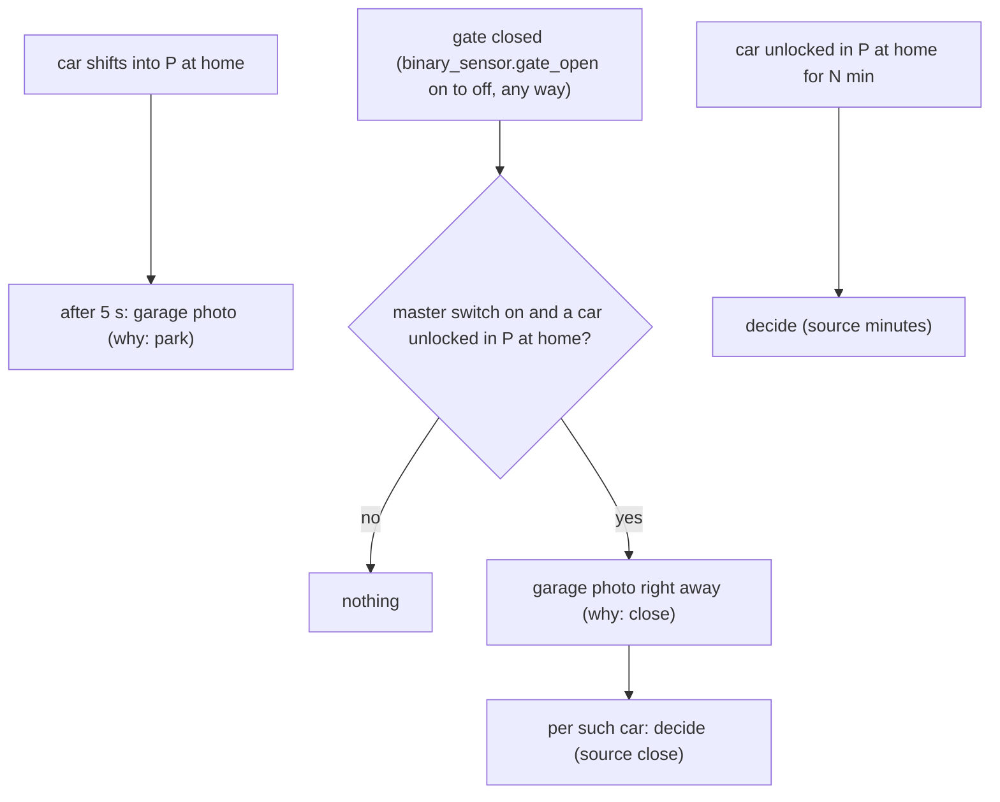
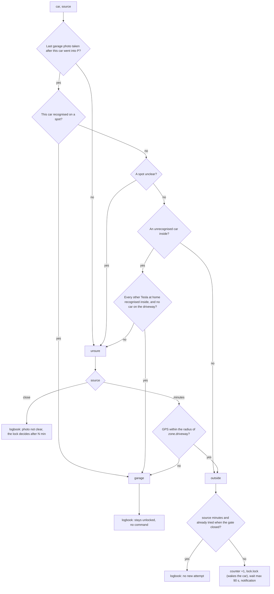
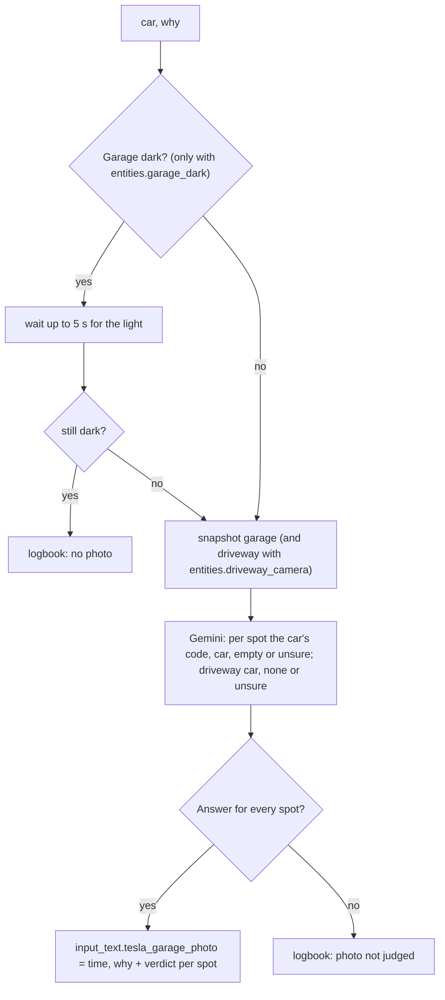

# Logic: <@ module.name @>

<!-- Filled in by tools/fill.py: values for the examples below (kept in a comment so a markdown formatter leaves them alone).
<% from '_tesla_driveway_lock.jinja' import tdl, photo, car_list, spots, on_close, minutes, radius with context %>
<% set a1 = car_list[0] %>
<% set p1 = a1.prefix %>
<% set name1 = a1.name %>
<% set lock1 = car_entity(a1, 'lock') %>
<% set spot1 = spots[0] if spots else 'left' %>
<% set spot2 = spots[1] if spots | count > 1 else spot1 %>
<% set photonote = '' if photo else ' In this house the garage photo is off (tesla_driveway_lock.garage_photo): only the GPS decides.' %>
<% set closenote = '' if on_close or not photo else ' In this house there is no gate sensor (entities.gate_sensor): no photo when the gate closes.' %>
-->

## In one sentence

A Tesla left unlocked at home gets locked when it stands **outside on the driveway**: right when the gate closes, or else after <@ minutes @> min; when it is **in the garage**, everything stays as it was.

Why: with "Walk-Away Door Lock" and "Exclude Home" in the car, a Tesla stays unlocked at home, on the driveway too. In the garage that is no problem, outside it is. The hard part is telling garage and driveway apart: they lie a few metres from each other, within the GPS error. So a **garage photo** (optional) decides first and only then the **GPS** with a small zone `zone.driveway`. The photo answers **which car** stands in the garage, not whether a fixed spot is taken: any car can stand on any spot.<@ photonote @><@ closenote @>

The texts quoted below (notifications, logbook) are the English ones; with `house.language: nl` they are the Dutch texts from `strings.yaml`.

## Flow chart

### When

### Decide (`script.tesla_driveway_lock_car`)

### Garage photo (`script.tesla_garage_photo`, optional)

## Triggers

| Automation                   | Trigger                                                                                    | Why                                                                                          |
| ---------------------------- | ------------------------------------------------------------------------------------------ | -------------------------------------------------------------------------------------------- |
| `tesla_driveway_lock`        | `binary_sensor.tesla_driveway_<car>_home_unlocked` is on for `tesla_driveway_lock_minutes` | Whoever quickly fetches something from the car is not disturbed. Fires once per parking      |
| `tesla_garage_arrival_photo` | `teslemetry.shift_state` of a car goes to `p`, and the car is at home                      | On arrival the garage light is usually on (gate open, car just in)                           |
| `tesla_driveway_gate_closed` | `binary_sensor.gate_open` (module gate) goes from `on` to `off`                            | Closing the gate (remote, wall button, app, automation) means: the car stays where it is now |

`binary_sensor.tesla_driveway_<car>_home_unlocked` (in `templates/tesla_driveway_lock.yaml`) = shift state `p` **and** lock `unlocked` **and** (tracker `home` **or** `located_at_home` on). The tracker alone is not enough: in the source it sometimes said `not_home` while the car was parked at home.

## Conditions and decisions

### What the garage photo says

Per spot (`tesla_driveway_lock.garage_spots`, else every `cars[].garage_spot`; here: <@ spots | join(', ') if spots else '-' @>) one fixed value:

| Value      | Meaning                                                                                                   |
| ---------- | --------------------------------------------------------------------------------------------------------- |
| car prefix | Gemini recognises that car (from `cars[].look`). A recognised car that is **not at home** counts as `car` |
| `car`      | a car Gemini cannot tell apart (also `occupied`, the value of earlier kit versions)                       |
| `empty`    | no car on that spot (bikes, boxes, people are not cars)                                                   |
| `unsure`   | black or unclear image; any other value counts as unsure too                                              |

With `entities.driveway_camera` also `drive`: `car`, `none` or `unsure` (a second image, the driveway). The verdict is stored with its time and `why` (`park` or `close`) in `input_text.tesla_garage_photo`. A photo only counts for a car when it was taken **after** the last change of that car's shift state (the parking).

### Outside or garage

| Photo (valid for this car)                                                           | Place   |
| ------------------------------------------------------------------------------------ | ------- |
| this car recognised on any spot                                                      | garage  |
| a spot `unsure`                                                                      | unsure  |
| no `car` on any spot (empty, or only other Teslas that are at home)                  | outside |
| a `car`, every other Tesla at home is recognised on a spot, and `drive` is not `car` | garage  |
| anything else, or no valid photo                                                     | unsure  |

| Place   | Source `close` (gate just closed)                       | Source `minutes` (N min unlocked)                        |
| ------- | ------------------------------------------------------- | -------------------------------------------------------- |
| garage  | logbook "stays unlocked: it is in the garage"           | same                                                     |
| outside | **locked right away**; the attempt is stored (`tried`)  | locked, unless it was already tried when the gate closed |
| unsure  | logbook "photo not clear, the lock decides after N min" | GPS: ≤ radius of `zone.driveway` = outside, else garage  |

### What happens when it locks

| Situation                                    | What happens                                                                       |
| -------------------------------------------- | ---------------------------------------------------------------------------------- |
| Master switch off                            | nothing (no photo when the gate closes either)                                     |
| Outside                                      | `counter.tesla_commands_today` +1, one `lock.lock`; a sleeping car is woken for it |
| Locked within 90 s                           | notification "🔒 … locked", logbook "locked … (reason)"                            |
| Not locked within 90 s (offline, no credits) | notification "⚠️ … not locked", logbook "NOT locked … No new attempt"              |

### Who gets the notification

The usual driver of the car (`cars[].driver`) and the admin(s) (`people[].admin`; nobody = the first person), each with `notify`. A new notification about the same car replaces the previous one (tag `tesla-driveway-<car>`).

## Settings

| Helper                                      | Default       | Unit | Effect                                                                                        |
| ------------------------------------------- | ------------- | ---- | --------------------------------------------------------------------------------------------- |
| `input_boolean.tesla_driveway_lock_enabled` | off           |      | Master switch. Off after the first install: turn it on after tests 1 to 4                     |
| `input_number.tesla_driveway_lock_minutes`  | <@ minutes @> | min  | How long the car must be unlocked in P at home. Shorter = locked sooner, woken more often     |
| `zone.driveway` (radius)                    | <@ radius @>  | m    | The spot on the driveway where a car stands outside. Place and radius in Settings > Zones     |
| `input_text.tesla_garage_photo`¹            | -             |      | Internal: last verdict of the garage photo (JSON). Do not fill it in yourself, except to test |

¹ only with `tesla_driveway_lock.garage_photo: true`.

`deploy.py` sets the defaults once, when the helper is new (from `module.yaml`, `defaults:`); `deploy.py --setup` creates the zone. After that your value stays.

Fixed values in the code (deliberately no helper):

| Value                        | Where                        | Why                                                                           |
| ---------------------------- | ---------------------------- | ----------------------------------------------------------------------------- |
| wait 90 s for `locked`       | `tesla_driveway_lock_car`    | waking and locking a sleeping car took up to 14 s in the source; ample margin |
| 5 s after P                  | `tesla_garage_arrival_photo` | the car stands still and the lights are still on                              |
| wait up to 5 s for the light | `tesla_garage_photo`         | the light goes on with movement; longer and the moment is gone                |
| one attempt per parking      | `tesla_driveway_lock_car`    | a car that does not respond is not woken again and again                      |
| passive zone                 | `deploy.py --setup`          | the trackers stay `home`, `person` does not jump                              |

## Edge cases

1. **`zone.driveway` starts at `house.lat/lon`.** That is usually the middle of the house or the gate, not the driveway. Drag the zone to where a car stands outside, and choose the radius so the garage spots fall **outside** it (test 2). In the source driveway and garage were 5 to 15 m apart; a circle of 10 m left ±2 m margin on both sides.
2. **GPS under a roof** is poor: a car in the garage can jump metres. That is why the photo goes first.
3. **Gemini said "empty" on a black image.** In the source a sleeping car in a dark garage gave a black image, and Gemini answered "empty": a car in the garage got locked (harmless, but wrong). Hence: the instruction asks for "unsure" on a black image, and with `entities.garage_dark` there is no photo in the dark (after waiting up to 5 s for the light).
4. **Any spot.** In the source the Model S stood on the spot of the Model Y (07-10, 12:30): the old rule ("own spot empty = outside") locked it in the garage. Now the photo looks for the car itself; when Gemini cannot tell the cars apart, a car inside still counts as this car when every other Tesla at home is accounted for.
5. **Gemini mixes up two cars at home.** When both Teslas are at home and Gemini names the wrong one, a car outside may stay unlocked (as before the module), or a car in the garage gets locked (harmless). A clear `cars[].look` (model, shape, colour) helps.
6. **A guest car.** An unrecognised car inside while a car stands on the driveway: unsure, the GPS decides after N min.
7. **Gate closes while the car still drives.** Only a car in P counts. A car that parks after the gate closed is decided after N min.
8. **After a restart** of Home Assistant the template sensor starts again; when a car is still unlocked, one new decision follows after <@ minutes @> min (safety net).
9. **Failed command** (car offline, command credits used up): no new attempt, the sensor stays on. Only when the car drives, locks or leaves home can the automation fire again. A failed attempt when the gate closed is stored in the photo verdict (`tried`), so the lock after N min does not try again.
10. **Someone unlocks again later** and leaves the car unlocked: that is a new round, locked again after <@ minutes @> min (when it is outside).
11. **Teslemetry drops out briefly** (e.g. on a restart of the integration): the sensor goes off and on again, which can give one extra decision.
12. **Privacy.** The garage image (and the driveway image) goes to Google (Gemini) on every parking and on every closing of the gate with a car unlocked at home. On the free tier Google may keep and use it. When someone stands in view, that person is in the image too.

## What it does not do

- **Opens or closes nothing** in the garage, and sends no command other than `lock.lock`.
- **No retries** and no second wake-up.
- **No cars without a Teslemetry lock** (`teslemetry.lock`).
- **Does not know who drove.** The notification goes to the usual driver and the admin(s).
- **Cleans up nothing.** A car that disappears from `house.yaml` keeps its sensor until you delete it yourself.

## Test plan

Start with the master switch **off**. Simulate states in Developer tools > States; **put the real state back afterwards**. The examples use the first car from `house.yaml` (`<@ p1 @>`).

| #   | Test                | How                                                                                                                                                                                                                                                   | Expected                                                                                                                  |
| --- | ------------------- | ----------------------------------------------------------------------------------------------------------------------------------------------------------------------------------------------------------------------------------------------------- | ------------------------------------------------------------------------------------------------------------------------- |
| 1   | Sensor              | Park the car at home and leave it unlocked                                                                                                                                                                                                            | `binary_sensor.tesla_driveway_<@ p1 @>_home_unlocked` on; off as soon as it locks                                         |
| 2   | Zone                | Car on the driveway, then in the garage: each time read the attribute `driveway_distance_m` of that sensor                                                                                                                                            | Driveway ≤ radius of `zone.driveway`, garage > radius. If not: move the zone or change the radius                         |
| 3   | Garage photo¹       | Developer tools > Actions: `script.tesla_garage_photo` with `car: <@ p1 @>`, `why: park`                                                                                                                                                              | Logbook "Tesla garage photo: parked (…): <@ spot1 @> …", `input_text.tesla_garage_photo` updated, image in Media > garage |
| 4   | Simulate a decision | Set `input_text.tesla_garage_photo` to `{"t": "<now, ISO>", "car": "<@ p1 @>", "why": "park", "<@ spot1 @>": "empty", "<@ spot2 @>": "<@ p1 @>"}` with the car unlocked; run `script.tesla_driveway_lock_car` with `car: <@ p1 @>`, `source: minutes` | Logbook "… stays unlocked: it is in the garage (garage photo: … in the garage)", no command (another spot than usual)     |
| 5   | Live, gate closes²  | Master switch on. Park the car unlocked on the driveway, close the gate with the remote or the wall button                                                                                                                                            | Within ±30 s: `<@ lock1 @>` = `locked`, notification "🔒 <@ name1 @> locked … when the gate closed"                       |
| 6   | Live, garage, gate² | Park the car unlocked in the garage (any spot), close the gate                                                                                                                                                                                        | Logbook "… stays unlocked: it is in the garage", no command                                                               |
| 7   | Live, driveway      | Car unlocked on the driveway, gate stays open, wait the set minutes                                                                                                                                                                                   | `<@ lock1 @>` = `locked`, notification "🔒 <@ name1 @> locked", logbook with the reason; counter +1                       |
| 8   | No repeat           | After 5, 6 or 7: leave the car                                                                                                                                                                                                                        | No new run (Traces) until the car drives, locks or is unlocked again                                                      |
| 9   | Switch              | Master switch off, repeat 5                                                                                                                                                                                                                           | No photo, no run                                                                                                          |
| 10  | Failed command      | Only when it happens (car offline)                                                                                                                                                                                                                    | Notification "⚠️ … not locked", logbook "NOT locked … No new attempt"                                                     |

¹ only with `tesla_driveway_lock.garage_photo: true`. ² only with the garage photo and a gate sensor (`entities.gate_sensor`).

Troubleshooting: Settings > Automations & scenes > Scripts > `tesla_driveway_lock_car` > Traces. The variables `seen`, `place`, `gps_m`, `outside` and `reason` show why it decided.
