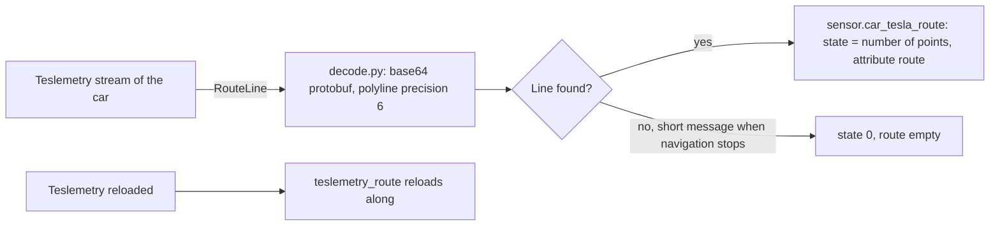
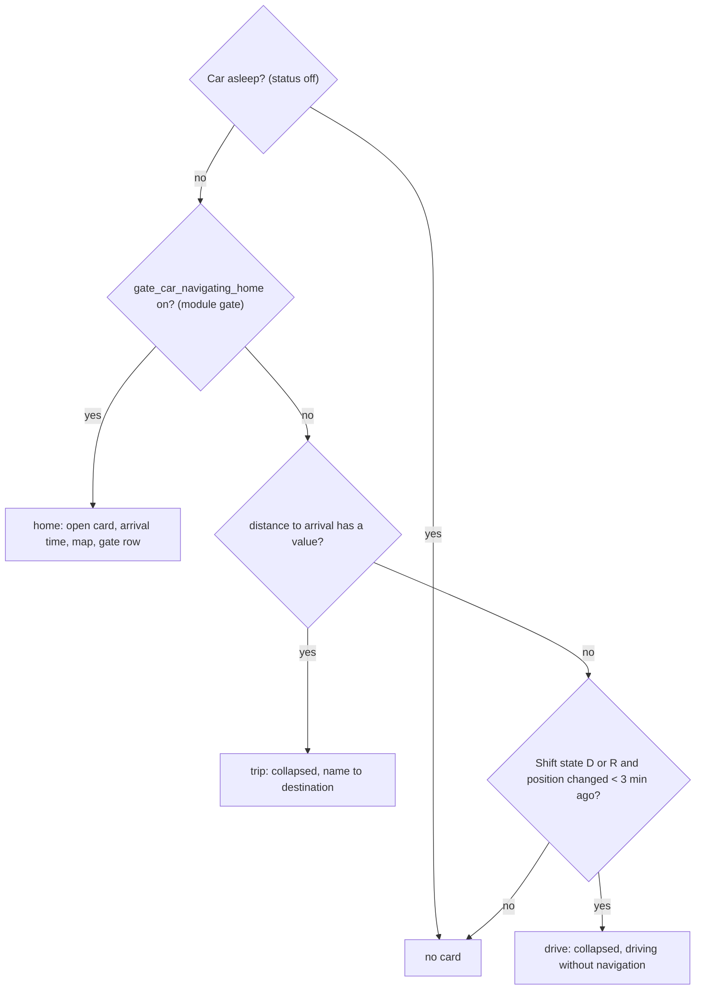
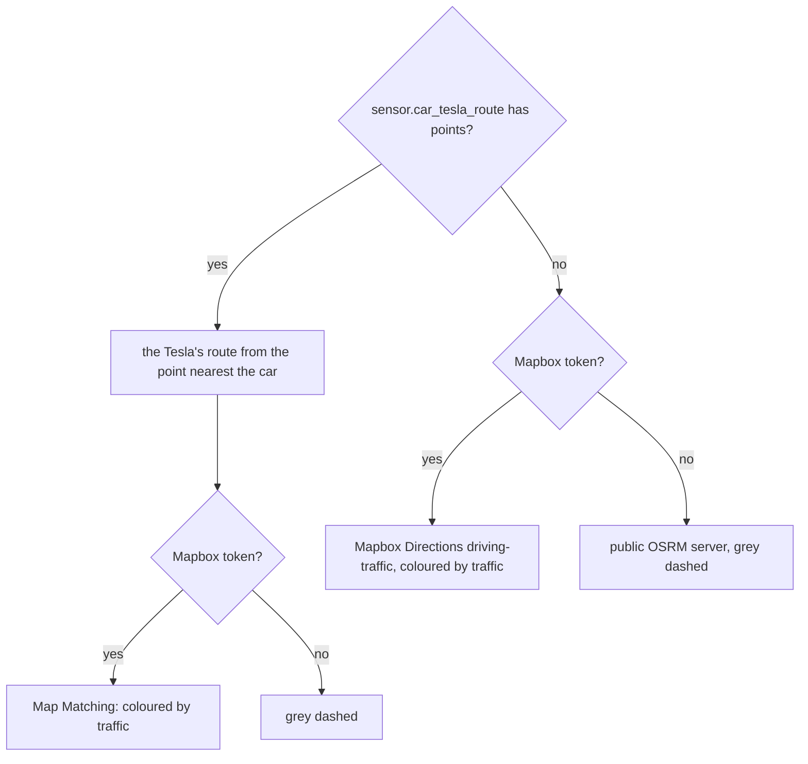

# Logic: <@ module.name @>

<!-- Filled in by tools/fill.py: values for the examples below (kept in a comment so a markdown formatter leaves them alone).
<% set a1 = cars[0] %>
<% set p1 = a1.prefix %>
<% set name1 = a1.name %>
<% set route1 = car_entity(a1, 'tesla_route') %>
<% set dest1 = car_entity(a1, 'route') %>
<% set dist1 = car_entity(a1, 'distance_to_arrival') %>
<% set eta1 = car_entity(a1, 'time_to_arrival') %>
<% set shift1 = car_entity(a1, 'shift_state') %>
<% set status1 = car_entity(a1, 'status') %>
<% set destname1 = car_entity(a1, 'destination') %>
-->

## In one sentence

Whoever is at home sees on the dashboard where every Tesla is, and as soon as one is on the road: who is in it, when it arrives, along which route and (with module gate) whether the gate opens by itself.

The card texts quoted below are the English ones; with `house.language: nl` they are the Dutch texts from `strings.yaml`, and numbers and times use the format of that language (`locale` in `strings.yaml`).

## Flow chart

### Route of the Tesla (`custom_components/teslemetry_route`)

### Arrival card: which card per car (`carMode`)

No car on the road: the arrival card takes no space on the dashboard.

### Expected route on the arrival card

## Triggers

| Part               | When                                                                                                             | Why                                                                                  |
| ------------------ | ---------------------------------------------------------------------------------------------------------------- | ------------------------------------------------------------------------------------ |
| `teslemetry_route` | every `RouteLine` message on the stream of a car                                                                 | Teslemetry sends it on a new or changed route; streaming costs no credits            |
|                    | Teslemetry is reloaded                                                                                           | a reloaded Teslemetry creates a new stream object: the listeners must follow         |
| Arrival card       | a watched entity changes (navigation, arrival, distance, traffic, destination, shift state, speed, status, gate) | the card redraws at most every 5 s; after a tap immediately for 10 s                 |
|                    | every minute                                                                                                     | "in 12 min" counts down, also without a new state                                   |
|                    | positions of car and phones, only while that car is on the road                                                  | otherwise every position update of a parked car would redraw the card               |
|                    | driven trail: from the recorder, at most every 5 min                                                             | the recorder history is heavy; in between the trail grows with the live positions    |
|                    | expected route: when the Tesla sends a new route, otherwise at most every 2 min                                  | traffic changes; limits Mapbox requests                                              |
| Map card           | position, battery or "home" of a car changes, or the theme                                                       |                                                                                      |

## Conditions and decisions

### Arrival card

| Situation                                         | What the card shows                                                                                                        |
| ------------------------------------------------- | -------------------------------------------------------------------------------------------------------------------------- |
| Car asleep (`status` = off)                       | nothing, also when old navigation values came back after a restart                                                         |
| Navigating home (module gate)                     | "Jan is home in 9 min", arrival time, km to go, departure time, traffic, battery at arrival, speed, map, gate row          |
| Navigating to another destination                 | collapsed "Jan is driving to Work" (or "Rode X → Work" without a phone in the car); tap for the map                         |
| Driving without navigation (D/R, position < 3 min old) | collapsed "Jan is driving, without navigation" with the speed                                                        |
| Several cars heading home                         | cards side by side; on a phone (< 600 px) more compact                                                                     |
| Destination name "Home" / "Work"                  | the words `dest_home` / `dest_work` in `house.language` ("Home"/"Thuis"); ", Belgium" is dropped                           |
| No destination name, but a Mapbox token           | place name through Mapbox reverse geocoding in `house.language` (remembered per coordinate)                                |
| No name and no token                              | "a destination"                                                                                                            |

### Who is in it

- A phone counts when its last position lay within **300 m** of where the car was **at that moment** (looked up in the driven trail), and is not older than 20 min. So phones that only send something every few minutes are compared fairly.
- A phone that reports `home` is never in a car on the road (an arriving car passes close to the house).
- No phone in the car: the usual driver (`driver`) with "(usual driver)", unless that person's phone gave a position in the last 20 min (then that person is somewhere else).
- Measured in the source: phone and car were 2 to 71 m apart at the same moment; a phone sends a position every 1 to 5 min, a driving Tesla every ±10 s.

### Gate row (only with `gate:` in the card config)

The title is the state: "Gate is closed", "Gate is open", "Gate moving" (relay `on`), "Gate state unreachable", or "Gate" without a sensor. The line below says what happens on arrival, the first that applies:

| Order | Situation                                       | Text                                                                                     |
| ----- | ----------------------------------------------- | ---------------------------------------------------------------------------------------- |
| 1     | already handled in the last 10 min              | "Handled on arrival at HH:MM"                                                            |
| 2     | gate is open                                    | "Already open: no automatic pulse"                                                       |
| 3     | master switch off                               | "Automatic opening is off"                                                               |
| 4     | test mode on                                    | "Test mode: you only get a notification, no pulse"                                       |
| 5     | car not far away long enough yet (A)            | "Will not open by itself: the … has not been further than 1.5 km from home for 5 min yet" |
| 6     | otherwise                                       | "Opens by itself at 400 m from home" (radius of the zone)                                |

The button is **Open** (`script.gate_open_manual`) or, when the gate is open, **Close** (`script.gate_close_manual` with `reason` "close from arrival card"), each with a confirmation. It disappears while the gate is moving.

## Settings

The module has no helpers. Everything is in the card config (see README, "Card config").

Entity per role in `cars[].entities` (the kit fills them in from `teslemetry:`):

| Role       | Card     | Entity (first car)                                            |
| ---------- | -------- | ------------------------------------------------------------- |
| `loc`      | both     | position                                                      |
| `soc`      | map      | battery %                                                     |
| `home`     | map      | "located at home"                                             |
| `dest`     | arrival  | `<@ dest1 @>` (coordinates of the destination)                |
| `destName` | arrival  | `<@ destname1 @>`                                             |
| `eta`      | arrival  | `<@ eta1 @>`                                                  |
| `dist`     | arrival  | `<@ dist1 @>`                                                 |
| `delay`    | arrival  | traffic delay in min                                          |
| `socArr`   | arrival  | battery at arrival                                            |
| `shift`    | arrival  | `<@ shift1 @>`                                                |
| `speed`    | arrival  | speed                                                         |
| `online`   | arrival  | `<@ status1 @>` (awake)                                       |
| `route`    | arrival  | `<@ route1 @>`                                                |
| `nav`      | arrival  | `binary_sensor.gate_<@ p1 @>_navigating_home` (module gate)   |
| `away`     | arrival  | `binary_sensor.gate_<@ p1 @>_away_long_enough` (module gate)  |

Attributes of `sensor.<car>_tesla_route`: `route` (list of points, not recorded), `format` (how the line was decoded), `updated`, `raw_length`, `raw_start` (not recorded). The unit of the state is "points" in `house.language`.

Fixed values in the code:

| Value                           | Where              | Why                                                                   |
| ------------------------------- | ------------------ | --------------------------------------------------------------------- |
| 5 s                             | arrival card       | draw at most once per 5 s; a driving car reports every 10 s           |
| 10 min standstill               | driven trail       | a pause in the positions longer than this is the start of the trip    |
| 2 min, 5 min                    | route, trail       | limit Mapbox requests and recorder queries                            |
| 100 points                      | Map Matching       | Mapbox's maximum per request; the route is sampled evenly             |
| 2000 points, rounded to ±1 m    | `teslemetry_route` | the route is an attribute; it is not stored in the recorder           |

## Edge cases

1. **A sleeping car** restored its old navigation after an HA restart (a trip from that morning): a ghost card "→ a destination". So a car with `status` = off gets no card.
2. **The route tracker keeps the last destination** after the trip. Only the distance to arrival with a value means "navigation active". In mode "drive" the card ignores the destination.
3. **Charging stop on the route.** Teslemetry then gives the **next stop** as destination ("Supercharger …"), with the Supercharger's coordinates. Not tested: whether `RouteLine` then runs to home or to the Supercharger.
4. **Leaflet and a collapsed card.** A map that starts at size 0 loses its layers. A collapsed trip only builds its map when it is opened, and every map gets a start view right away (without one, Leaflet crashes when drawing lines). When you change the card, keep those two rules.
5. **A Mapbox token with URL restriction** is refused: Home Assistant sends `referrer: same-origin`. Create the token without URL restriction (it is public, `pk.`): a separate token for these cards only, with a usage alert, rotated when abused (README, "Privacy").
6. **Browser cache.** The resource is called `/local/<file>?v=VERSION`. Without a higher `VERSION` the app shows the old card after a change.
7. **Reloading Teslemetry** creates a new stream object; `teslemetry_route` therefore reloads along. After an HA update, first check that the route sensors still exist.
8. **Format of `RouteLine`** (established in the source): base64 protobuf with a Google polyline of precision 6 in field 1. When navigation stops a short message without a line comes: the sensor goes to 0. `decode.py` tries other variants too and picks the line that passes by the car.
9. **A phone at "home"** was seen as a passenger of a car driving right past the house. A phone at `home` never counts now.
10. **Theme later than the card.** The view's theme sometimes only arrives after the first `hass`. The cards retry the `--cw-*` colours for up to ±10 s, and then also switch the map tiles (day or night).

## What it does not do

- **No commands** to the cars. No waking up either: a sleeping car just shows its last position.
- **No trip history.** The trail comes from the recorder of the last 6 hours; the route itself is not stored.
- **Does not know who drives.** Only which phones move along with the car.
- **No token or connection of its own to Tesla**: the integration rides along on Teslemetry.
- **Not tested with a Model X.** Teslemetry's entities are the same per model; nothing was tested specifically for the Model X.

## Test plan

Without driving, with simulated states (Developer tools > States). **Put the real state back afterwards.** Examples with the first car, <@ name1 @> (`<@ p1 @>`).

| #   | Test                       | How                                                                          | Expected                                                                                              |
| --- | -------------------------- | ---------------------------------------------------------------------------- | ----------------------------------------------------------------------------------------------------- |
| 1   | Integration                | After `deploy.py --integration`: Settings > Devices > <@ name1 @>            | `<@ route1 @>` exists, state `0`                                                                      |
| 2   | Route                      | Start navigation in the car (standing still is fine)                         | Within seconds: state = number of points, attribute `format` filled. Stop navigation: back to 0       |
| 3   | Map card                   | Open the dashboard with `custom:tesla-map-card`                              | Every car with badge, battery and "home"; little house on `zone.home`                                 |
| 4   | Trip elsewhere             | Set `<@ dist1 @>` to `12.3` and `<@ eta1 @>` to a time within 20 min (ISO)   | Arrival card: collapsed card "… → destination"; tap: map                                              |
| 5   | Sleeping car               | Same, with `<@ status1 @>` set to `off`                                      | No card                                                                                               |
| 6   | Driving without navigation | Distance to `unknown`, `<@ shift1 @>` to `D`, position just changed          | Card "… is driving, without navigation"                                                               |
| 7   | Heading home               | With module gate: `binary_sensor.gate_<@ p1 @>_navigating_home` to `on`      | Open card with arrival time and gate row. Test mode on: "Test mode: you only get a notification, no pulse" |
| 8   | Gate button                | With a gate sensor: `binary_sensor.gate_open` to `on`                        | Button becomes **Close**. Do not press outside a real test: that gives a pulse                        |
| 9   | Who is in it               | Put a phone (not `home`) on the car's position                               | Title "<name> is home in …"; without a phone: the usual driver with "(usual driver)"                  |
| 10  | Light and dark             | Profile > theme Organic, switch between light and dark                       | Cards and map tiles switch along (Mapbox day/night, OpenStreetMap dimmed in dark)                     |
| 11  | Without Mapbox token       | Remove `mapbox_token` from the card config                                   | OpenStreetMap, the Tesla's route grey dashed or OSRM; the legend names the source                     |
| 12  | Language                   | Fill in with `house.language: nl`, deploy, reload the browser                | Dutch texts, `km/u`, numbers with a decimal comma                                                     |
