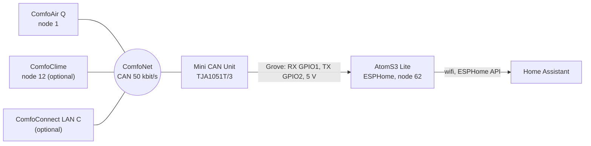

# Logic: <@ module.name @>

<!-- Filled in by tools/fill.py: values for the examples below (kept in a comment so a markdown formatter leaves them alone).
<% from '_ventilation.jinja' import device_name, clime, sniffer, friendly, entity_prefix with context %>
<% set clime_note = '' if clime else ' (not applicable: ventilation.comfoclime is off)' %>
<% set action_prefix = device_name | replace('-', '_') %>
-->

## In one sentence

An ESP32 listens on the ComfoNet bus of the ComfoAir Q and passes every reading on to Home Assistant; the other way round it sends HA's commands (fan speed, boost, bypass, away, profile) as the same bus messages the Zehnder control panel sends.

## Flow chart

Power: the 12 V of the ComfoNet connector feeds the Mini CAN Unit, which gives 5 V to the AtomS3. Pins: README, "Connecting".

## Triggers

No automations. The firmware reacts to bus traffic and to commands from HA:

- **PDOs from the ComfoAir.** The ComfoAir publishes its values as **PDOs** (numbered messages). The firmware requests a fixed list (`request_ids` in `esphome/ventilation.yaml`); after that the ComfoAir sends them by itself on every change.
<% if clime %>
- **PDOs from the ComfoClime** (node 12): broadcast on every change and roughly every 2 minutes in full, without anyone asking.
- **RMI polling** of the ComfoClime every 60 s, at boot, and when PDO 4148 or 4149 changes.
<% endif %>
- **A command from HA** (fan, select, switch, button, number): sent once as a bus message.

### What it reads

| Group | PDOs | Examples of entities |
| --- | --- | --- |
| Fans | 54, 55, 65, 117–122 | speed, duty, airflow (m³/h), rpm of supply and exhaust |
| Mode | 16, 49, 66, 67, 81, 82, 225 | away, operating mode, bypass mode, temperature profile, time until the next change |
| Energy | 128–130, 213–218 | power, energy this year, avoided heating and cooling |
| Temperature and humidity | 209, 212, 220, 221, 274–278, 290–294 | outdoor, supply, extract, exhaust, pre-heater; humidity of the four air streams; running mean outdoor temperature |
| Bypass, season, filter | 192, 210, 211, 227 | bypass in %, heating and cooling season, days until the filter change |
| ComfoCool | 85, 784, 785, 802 | disabled sensors, only useful with a ComfoCool |

<% if clime %>
#### ComfoClime (node 12)

The ComfoClime broadcasts its own PDOs. The decoder reads them; they were compared byte for byte with the LAN API of the ComfoClime.

| Certainty | PDOs | Meaning |
| --- | --- | --- |
| certain | 4145, 4146, 4148, 4149, 4151, 4154, 4192, 4193, 4201 | own running mean outdoor temp., uptime, target temperature, mode (0 off, 1 heating, 2 cooling), comfort temperature, indoor temperature, heat pump status, supply temperature, heat pump power (W) |
| probable | 4194–4198 | exhaust air, coil temperatures, compressor temperature, modulation (%); disabled |
| unknown | 4152, 4153, 4202, 4203, 4205–4208, 4211 | raw values, disabled |

On top of that the RMI client reads fourteen settings of the ComfoClime (unit 22 TEMPCONFIG, see below).
<% endif %>

## Conditions and decisions

### What it controls

Everything the yoziru firmware controls goes to the ComfoAir (node 1), with the same messages as the control panel:

| Entity | What |
| --- | --- |
| `fan` and select "Fan Speed" | fan speed 0–3 (away, low, medium, high) |
| buttons "Boost (15 min)" to "Boost (12h)", "Boost off" | temporary boost |
| buttons "Bypass On (1h/12h)", "Bypass Off (1h)", "Bypass Auto" | force the bypass or back to automatic |
| switches "Auto Ventilation", "Away Mode" | automatic speed, away |
| selects "Temperature Profile", "Temperature Passive", "Humidity Comfort", "Humidity Protection", "Balance mode" | settings of the ComfoAir |
| `climate` | temperature profile (comfort, home, sleep) |

<% if clime %>
### ComfoClime (RMI to node 12)

Settings are written with **RMI messages** (GET `01 unit sub 10 prop`, SET `03 unit sub prop value`) to node 12. The client in `components/comfoclime/comfoclime_rmi.h` is hard-limited: only to node 12, only GET and SET, SET only on unit 22 subunit 1 (TEMPCONFIG), one request at a time, 60 ms between requests, timeout 1.5 s, a read-back after every SET. **Writing only happens while the switch "ComfoClime: allow writes" is on** (off by default, keeps its state after a restart).

| Entity | Property | Type | Certainty |
| --- | --- | --- | --- |
| select "ComfoClime Season" | 22/1/3 | 0 transition, 1 heating, 2 cooling | source (LAN API) |
| switch "ComfoClime Automatic Season" | 22/1/2 | on/off | source |
| switch "ComfoClime Automatic Comfort Temperature" | 22/1/8 | on = profile, off = manual temperature | source |
| select "ComfoClime Temperature Profile" | 22/1/29 | comfort, power, eco | source |
| number "ComfoClime Manual Temperature" | 22/1/13 | °C × 10 | source |
| numbers "Heating/Cooling Comfort Temperature" | 22/1/9, 22/1/10 | °C × 10 | source |
| number "Cooling Temperature Limit" | 22/1/11 | °C × 10 | source |
| number "Heating Reduction Delta" | 22/1/12 | °C × 10 | source |
| numbers "Heating/Cooling Knee Point" | 22/1/4, 22/1/5 | °C × 10 | source |
| numbers "Heating/Cooling Threshold" | 22/1/16, 22/1/15 | °C × 10 | derived from the description |
| switch "ComfoClime Heat Pump" | 22/1/21 | 0 = on, 1 = off | **hypothesis** |

The `climate` "ComfoClime" combines them like the wifi integration (HACS `msfuture/comfoclime`): mode `off` = 22/1/21 to 1; `heat`/`cool`/`fan_only` = heat pump on, automatic season off, season 1/2/0. Preset `none` = manual temperature; `comfort`/`boost`/`eco` = profile 0/1/2 with automatic comfort temperature. Setting a target temperature switches to manual. The action (heating/cooling) comes from PDO 4192.

For tests: API actions `esphome.<@ action_prefix @>_comfoclime_get` (unit, subunit, prop; result in the log, tag `ccdump`) and `..._comfoclime_set` (prop, value, size; only 22/1/x and only with "allow writes" on).
<% endif %>

Apart from that the firmware sends nothing on the bus<% if sniffer %>; the sniffer only listens<% endif %>.

### Entity names

All entity names are English, in every `house.language`. Most come from the yoziru packages at the pinned commit; translating them would mean forking those packages. The entities this module adds follow the same English names, so the device has one language and the entity ids never depend on `house.language` (an `nl` build is identical to an `en` build). The filter sensor that `notifications` reads is therefore `sensor.<@ entity_prefix @>_filter_replacement_remaining_days` in both languages.

## Settings

| Setting | Where | Default | Why |
| --- | --- | --- | --- |
| `ventilation.name` | `house.yaml` | (required) | device and file name |
| `ventilation.display_name` | `house.yaml` | name with a capital | friendly name, start of the entity ids |
| `ventilation.mac_suffix` | `house.yaml` | false | true only when the device is already in HA with yoziru's stock name |
| `ventilation.comfoclime` | `house.yaml` | false | decoder, RMI client and entities of the ComfoClime |
| `ventilation.sniffer` | `house.yaml` | false | diagnosis on an unknown bus |
| yoziru commit | `esphome/ventilation.yaml` (`ref:` twice) and `module.yaml` (`pins:`) | `ce62828…` | `main` changed in September 2026 (no API in the dashboard YAML any more); change only after a test build |
| "ComfoClime: allow writes" | HA, switch | off | read first, write later |
| "Sniff: log unknown frames" | HA, switch | on at boot | max. 50 lines, rearm with the button "reset log budget" |

## Edge cases

1. **Pinned commit.** yoziru's default install follows `main`. Since September 2026 `main` lacks the API, wifi and OTA settings in the dashboard YAML: whoever presses "Install" on it gets a device HA no longer sees. This module rebuilds base.yml and canbus.yml locally (canbus has no `id` and cannot be extended) and takes the rest at the pinned commit.
2. **Entity ids and the MAC suffix.** yoziru sets `name_add_mac_suffix: true` by default: the device is then called `<@ device_name @>-a1b2c3` and the entity ids `sensor.<@ entity_prefix @>_a1b2c3_...`. The kit turns it off by default for predictable names. When your device is already in HA like that, set `mac_suffix: true`; otherwise you get new entities and lose the link with the history.
3. **Wifi after a new build.** ESPHome stores wifi set through the hotspot under a key that depends on the configuration. After a new build only the built-in wifi counts. When that fails: after ± 1 min the hotspot opens (password `wifi_hotspot_password`).
4. **Another API key.** HA keeps the key in the integration. With a new key: Settings > Devices > ESPHome > the device > reconfigure. The entities stay. Renaming the secret (`ventilatie_api_encryption_key` became `ventilation_api_encryption_key`) is not a new key as long as the value stays the same.
5. **Bootloop or broken build.** After 10 failed boots ESPHome enters safe mode (OTA stays possible). Otherwise: AtomS3 off the bus, USB-C to the computer, flash through https://web.esphome.io with the "Factory" download.
6. **No original to restore.** You cannot read the firmware that is already on a device back out. Keep your own working YAML before you change anything.
<% if clime %>
7. **Node 12 is an assumption.** At the source the ComfoClime is node 12 and the LAN C node 16. When your ComfoClime does not answer (sensor "ComfoClime RMI Status" shows timeouts, the PDO sensors stay empty), set `sniffer: true` and look in the log which nodes are alive (`sniffsum ... per node:`).
8. **22/1/21 (heat pump on/off) is a hypothesis**, taken from the description "force comfoclime off?" of the LAN API (`hpStandby`). Test 9 below checks it. When it is wrong, turn the heat pump back on right away and do not use the `climate` mode `off` until it is solved.
9. **No fake values after a restart.** Selects and numbers of the ComfoClime only publish after the first answer of the ComfoClime, and the switches do nothing at boot (`restore_mode: DISABLED`).
10. **Bus load.** ± 14 GETs per minute (± 28 frames). The wifi integration of the ComfoClime asks far more through its LAN module.
11. **Wifi integration of the ComfoClime.** May stay as a backup. Two systems writing at the same time overwrite each other: pick one controller per setting.
<% endif %>
<% if sniffer %>
<@ 12 if clime else 7 @>. **Sniffer.** Logs at INFO with tag `sniff`, max. 50 lines (button "Sniff: reset log budget" rearms), plus a summary every 60 s (tag `sniffsum`). Known PDOs are not logged.
<% endif %>

## What it does not do

- **No automations.** Ventilation high at night, cooling with the bypass or the ComfoClime, boost on bathroom humidity: that belongs to the module `climate` (planned), which uses these entities.
- **No installer settings.** Airflow per speed, minimum and maximum temperature of the heat pump (unit 23) and other RMI units are never written.
- **No firmware updates of the ComfoAir.** Commands from 0x80 up (factory, update) are never sent.
- **No translated entity names** (see "Entity names").
- **Changes nothing in Home Assistant.** `deploy.py` only puts files in `/config/esphome/`.

## Test plan

The entity ids follow the friendly name "<@ friendly @>" (example: `sensor.<@ entity_prefix @>_supply_air_temperature`). Steps with ComfoClime only when `ventilation.comfoclime` is on<@ clime_note @>. Status: base firmware running at the source; ComfoClime writes not flashed yet; not tested on HA as a kit module.

| # | Test | How | Expected |
| --- | --- | --- | --- |
| 1 | Validation | Device Builder: card of the device > **Validate** | "Configuration is valid" |
| 2 | First flash | USB, **Install** > **Plug into this computer** | Log shows `wifi: Connected` |
| 3 | Bus | Connect to the ComfoAir, open the log | No `canbus` errors; within 1 min values for temperatures and airflow |
| 4 | Compare | Put the values next to the display or the Zehnder app | Fan speed, outdoor temperature, filter days equal |
| 5 | Speed | `fan` to speed 3, then back | Display of the ComfoAir follows; airflow rises |
| 6 | Boost | Button "Boost (15 min)", then "Boost off" | Boost on and off on the display |
| 7 | Reading ComfoClime | Writes **off**; wait 2 min | The 14 settings and the PDO sensors have a value, equal to the panel or the app; "RMI Status" without timeouts |
| 8 | First write test | "allow writes" on; "Manual Temperature" +0.5 °C | "RMI Status" = `SET 22/1/13 ... OK`, the number follows after the read-back, target temperature (PDO 4148) follows within ± 2 min. Set it back afterwards |
| 9 | Heat pump (hypothesis) | Switch "ComfoClime Heat Pump" off | Heat pump status 0 and power 0 W within a few minutes; ventilation keeps running. If not: back on right away (see Edge cases) |
| 10 | Season and profile | "Season" to transition and back; change the profile and back | Mode (PDO 4149) and settings follow |
| 11 | Wireless | Small change, deploy again, **Install** > **Wirelessly** | Flashes without USB; the entities stay the same |
| 12 | Filter contract | Developer tools > States: `sensor.<@ entity_prefix @>_filter_replacement_remaining_days` | Exists and shows the days of the display (notifications reads it) |
